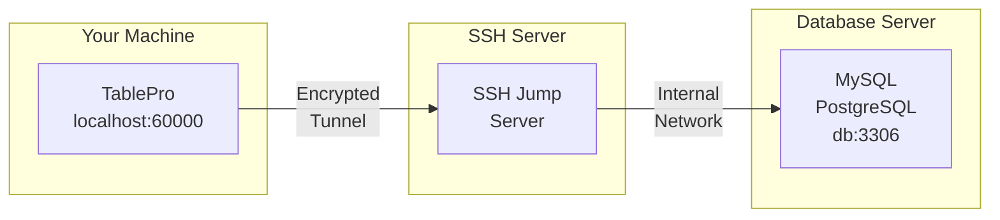

# SSH Tunneling

SSH tunneling routes your database connection through an encrypted tunnel to reach servers that aren't directly accessible from your machine. TablePro connects via a built-in SSH client (`russh`) — no external `ssh` binary or OpenSSH install required.

<Tip>
If you connect to multiple databases through the same SSH server, add it to `~/.ssh/config` — TablePro reads it and lets you pick the host from a dropdown instead of re-entering the same details. See [Using SSH Config](#using-ssh-config) below.
</Tip>

## How SSH Tunneling Works



1. TablePro opens an SSH connection to your jump server
2. A local port (e.g., 60000) forwards through the tunnel
3. All traffic between your machine and the SSH server is encrypted
4. The SSH server connects to the database on your behalf

## When to Use SSH Tunneling

- Database in private network
- Database accepts local connections only
- Need to encrypt database connection
- Access via bastion/jump host

## Setting Up

Open connection form, toggle **SSH Tunnel** ON, enter SSH server details and auth, click **Test Connection**.

## SSH Configuration Options

### SSH Server Settings

| Field | Description | Default |
|-------|-------------|---------|
| **SSH Host** | SSH server hostname or IP | - |
| **SSH Port** | SSH server port | `22` |
| **SSH User** | SSH username | - |

### Authentication Methods

TablePro supports two SSH authentication methods:

<Tabs>
  <Tab title="Password">
    Simple password authentication:

    | Field | Description |
    |-------|-------------|
    | **SSH Pass** | Your SSH password |

    <Warning>
    Password authentication is less secure than key-based authentication. Use SSH keys for production servers.
    </Warning>
  </Tab>
  <Tab title="Private Key">
    Key-based authentication (more secure):

    | Field | Description |
    |-------|-------------|
    | **Key File** | Path to your private key (e.g., `~/.ssh/id_rsa`) |
    | **Passphrase** | Key passphrase (if encrypted) |

    <Tip>
    Click **Browse** to select your private key file. TablePro looks in `~/.ssh/` by default.
    </Tip>
  </Tab>
</Tabs>

### Host Key Verification

TablePro verifies SSH host keys to protect against man-in-the-middle attacks. On first connection to a server, you'll see the server's fingerprint and can choose to trust it. The key is then stored locally.

If a previously trusted server's host key changes, TablePro shows a warning. This could mean the server was reinstalled, or it could indicate a security issue. You can choose to accept the new key or abort the connection.

### Using SSH Config

If you have entries in `~/.ssh/config`, TablePro reads them automatically:

1. TablePro reads your SSH config on launch
2. Select a host from the **SSH Host** dropdown
3. Settings are auto-filled from your config

Example SSH config entry:

```
# ~/.ssh/config
Host production-jump
    HostName jump.example.com
    User deploy
    Port 22
    IdentityFile ~/.ssh/production_key
```

This appears as "production-jump" in the SSH Host dropdown. If the entry has a `ProxyJump` directive, an informational badge shows the jump chain — TablePro displays this for reference but does not itself establish multi-hop tunnels.

## Database Connection Settings

When using SSH tunneling, the database host is relative to the SSH server:

| Field | Value | Description |
|-------|-------|-------------|
| **Host** | `localhost` or `127.0.0.1` | Database is on the SSH server itself |
| **Host** | `db.internal` | Database is on internal network |
| **Port** | `3306`, `5432`, etc. | Database port (unchanged) |

<Note>
The database host should be what the SSH server uses to reach the database, not what your machine would use.
</Note>

### Common Scenarios

#### Database on SSH Server

The database runs on the same machine as your SSH server:

```
SSH Host:       jump.example.com
SSH User:       deploy

Database Host:  localhost
Database Port:  3306
```

#### Database on Internal Network

The database is on a different server, only accessible from the SSH server:

```
SSH Host:       jump.example.com
SSH User:       deploy

Database Host:  db.internal.example.com
Database Port:  5432
```

#### AWS RDS via Bastion

Connecting to RDS through an EC2 bastion host:

```
SSH Host:       bastion.example.com
SSH User:       ec2-user
Key File:       ~/.ssh/aws-key.pem

Database Host:  mydb.abc123.us-east-1.rds.amazonaws.com
Database Port:  5432
```

## SSH Key Setup

### Generating SSH Keys

If you don't have SSH keys:

```bash
# Generate a new key pair
ssh-keygen -t ed25519 -C "your_email@example.com"

# Or use RSA for broader compatibility
ssh-keygen -t rsa -b 4096 -C "your_email@example.com"
```

### Key Locations

Default key locations:

| Key Type | Private Key | Public Key |
|----------|-------------|------------|
| Ed25519 | `~/.ssh/id_ed25519` | `~/.ssh/id_ed25519.pub` |
| RSA | `~/.ssh/id_rsa` | `~/.ssh/id_rsa.pub` |
| ECDSA | `~/.ssh/id_ecdsa` | `~/.ssh/id_ecdsa.pub` |

### Adding Key to Server

Copy your public key to the SSH server:

```bash
# Using ssh-copy-id
ssh-copy-id -i ~/.ssh/id_ed25519.pub user@server

# Or manually
cat ~/.ssh/id_ed25519.pub | ssh user@server "mkdir -p ~/.ssh && cat >> ~/.ssh/authorized_keys"
```

### Key Permissions

SSH keys must have correct permissions:

```bash
# Fix permissions
chmod 700 ~/.ssh
chmod 600 ~/.ssh/id_*
chmod 644 ~/.ssh/id_*.pub
chmod 644 ~/.ssh/config
```

## Troubleshooting

<Tip>
Click **Test Connection** on the connection form to verify SSH connectivity independently from the database connection. This helps isolate whether the problem is SSH or database-level.
</Tip>

### Connection Refused

**Symptoms**: "Connection refused" when testing SSH tunnel

**Causes and Solutions**:

1. **SSH server not running**
   ```bash
   # Test SSH connection directly
   ssh -v user@server
   ```

2. **Wrong port**
   - Verify SSH port (some servers use non-standard ports)
   - Check with server administrator

3. **Firewall blocking connection**
   - Ensure port 22 (or custom port) is open
   - Check both local and server firewalls

### Authentication Failed

**Symptoms**: "SSH authentication failed" or "Permission denied"

**For Password Authentication**:
1. Verify username and password
2. Check if password auth is enabled on server
3. Try connecting via terminal: `ssh user@server`

**For Key Authentication**:
1. Verify key file path is correct
2. Check key permissions (`chmod 600`)
3. Ensure public key is in server's `authorized_keys`
4. Verify passphrase (if key is encrypted)
5. Try connecting via terminal:
   ```bash
   ssh -i ~/.ssh/your_key user@server
   ```

### Private Key Errors

**"Private key file not found"**:
- Verify the path exists
- Use the Browse button to select the file

**"Private key file is not readable"**:
```bash
chmod 600 ~/.ssh/your_key
```

**"Wrong passphrase"**:
- Re-enter the passphrase
- Test key manually: `ssh-keygen -y -f ~/.ssh/your_key`

### Tunnel Established but Database Fails

If the SSH tunnel connects but the database connection fails:

1. **Verify database host is correct** (relative to SSH server)
   ```bash
   # From SSH server, test database connection
   ssh user@server "mysql -h localhost -u dbuser -p"
   ```

2. **Check database port**
   - Ensure port matches the database server's actual port

3. **Verify database credentials**
   - Username/password might be different from SSH credentials

### Tunnel Drops Periodically

TablePro uses keep-alive settings to maintain tunnels:

- `ServerAliveInterval=60`: send keep-alive every 60 seconds
- `ServerAliveCountMax=3`: disconnect after 3 missed responses

If tunnels still drop:
1. Check network stability
2. Verify server's `ClientAliveInterval` setting
3. Check for idle timeout settings on firewalls

## Security Best Practices

Use key-based authentication with Ed25519 or RSA 4096+ bits, protect keys with a passphrase, and never expose database ports directly to the internet.
