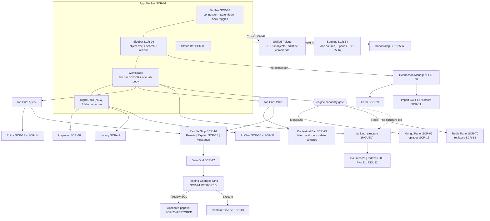
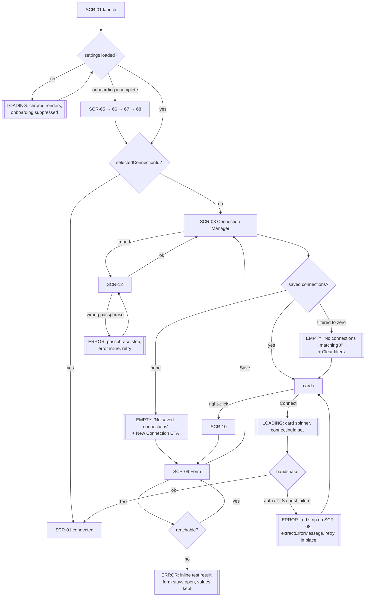
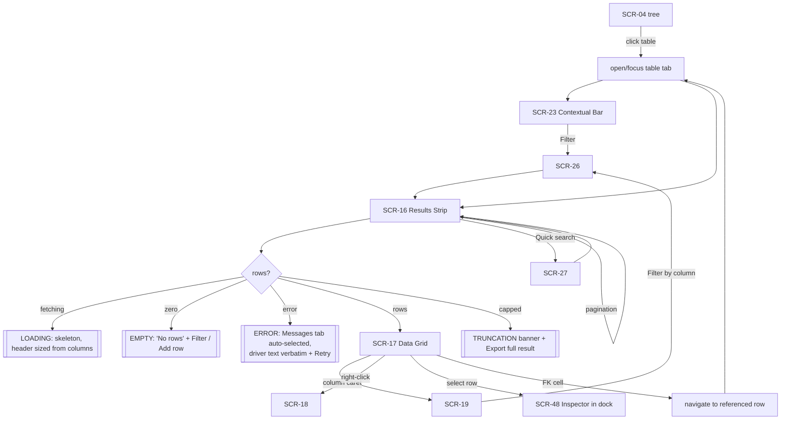
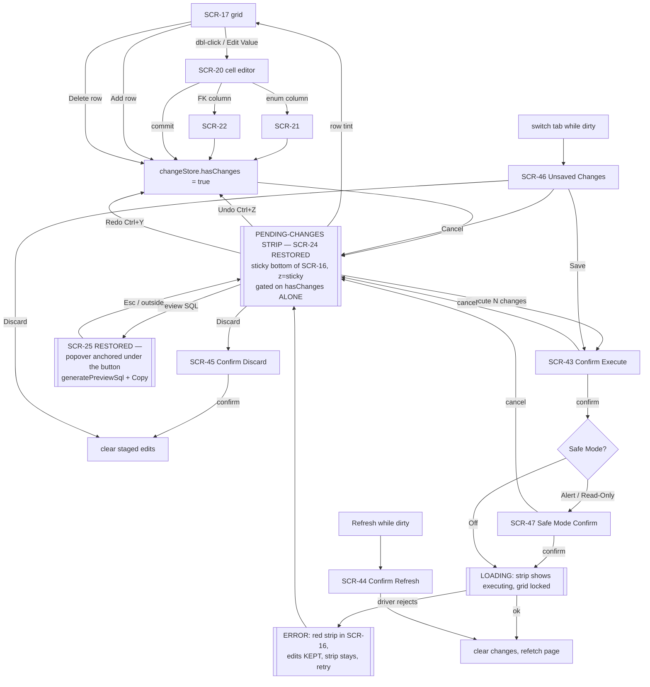
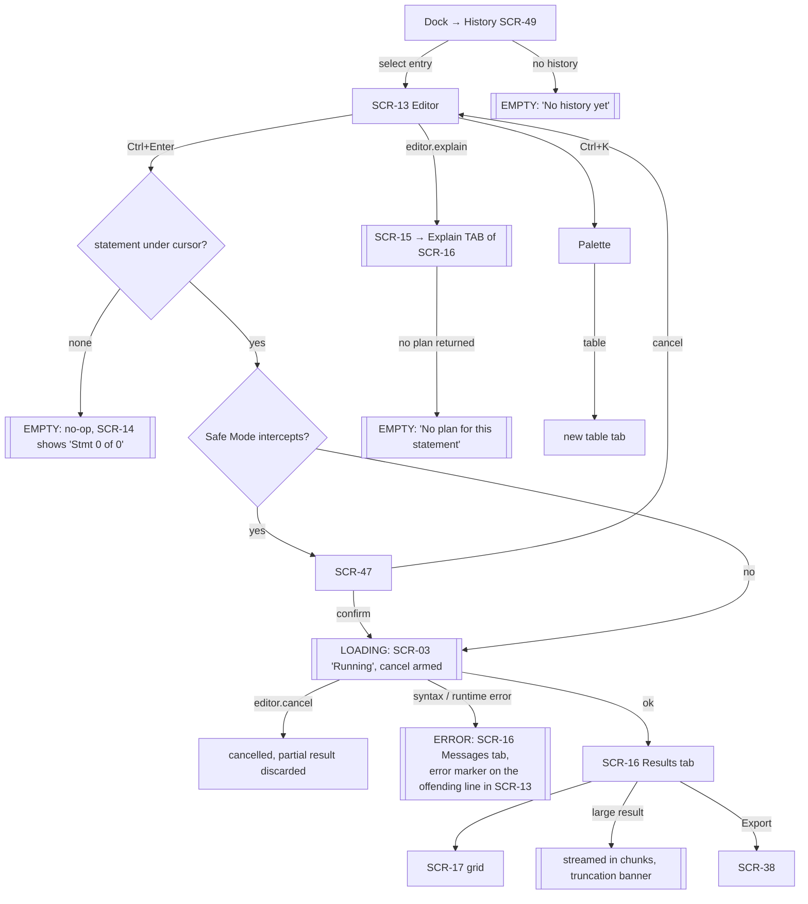
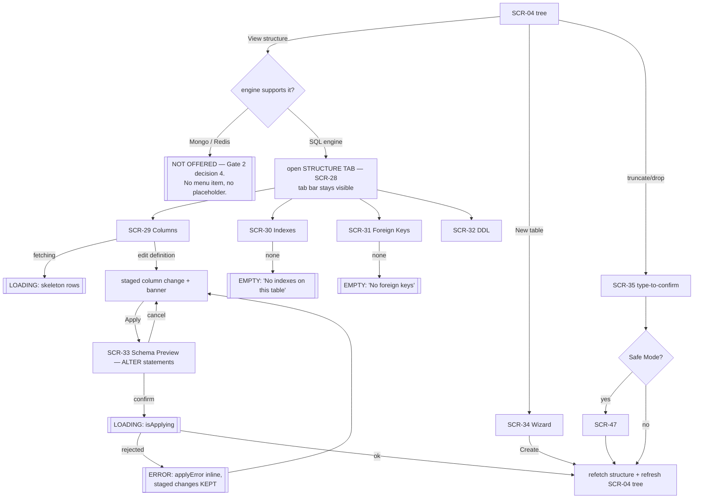
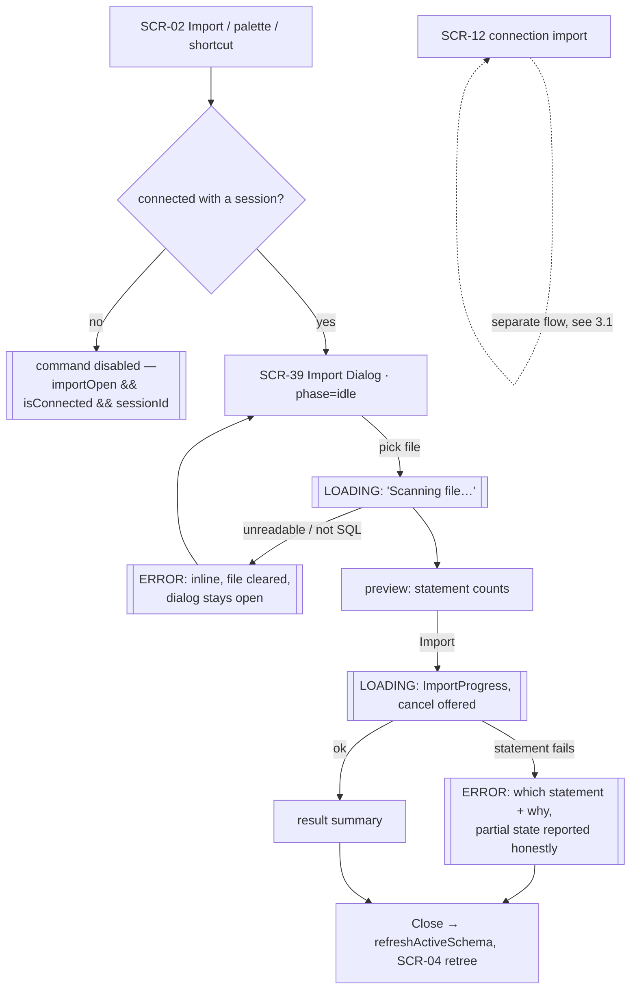
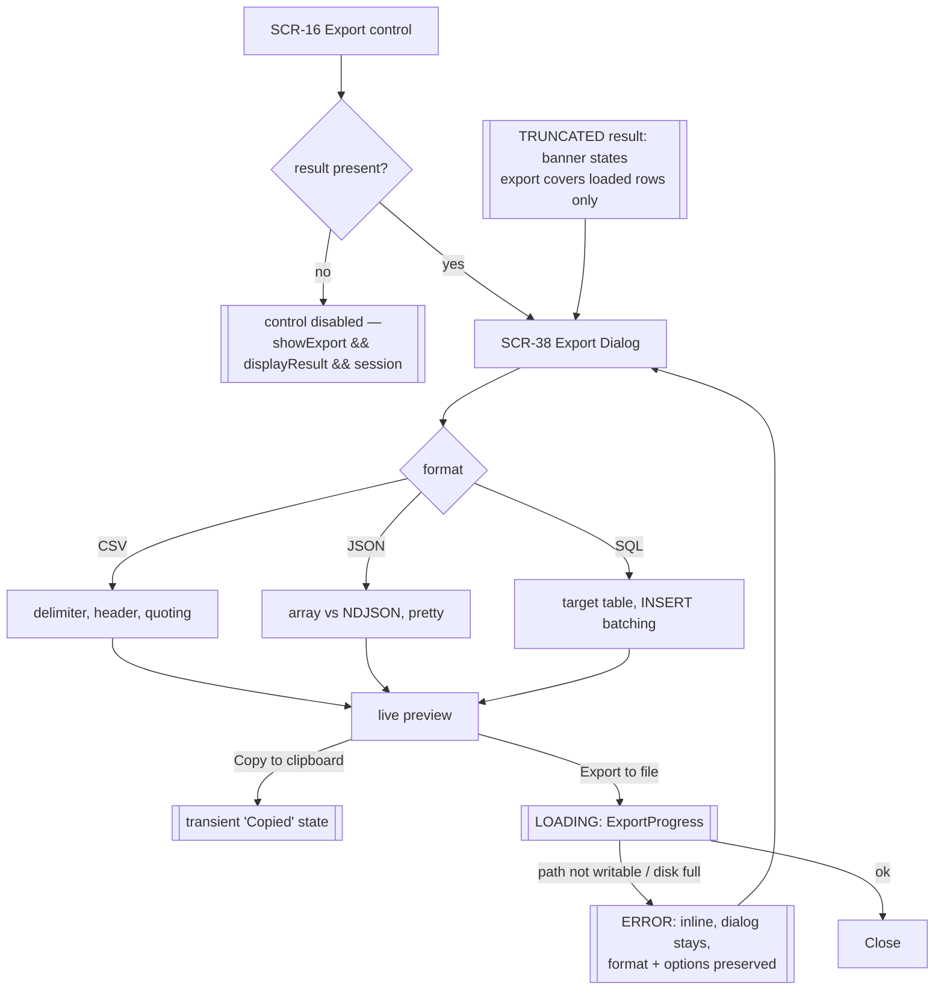

# TablePro — UI/UX Design Spec

> Gate 1 record: mode=codebase | decision=rebuild IA | scope=all 71 screens |
> non-goals=no new features | date=2026-08-28

> Gate 2 record (user-approved 2026-08-28, binding):
> (1) Inventory frozen at `94a061a0`; SCR IDs are permanent.
> (2) SCR-24 / SCR-25 are dead code — **restore the affordance**, do not delete.
> (3) No screenshots. **Code-only, unverified visuals.**
> (4) MongoDB and Redis keep having no structure surface — deliberate boundary.

> Stage 4 freeze re-verification (2026-08-28, re-confirmed at final
> consolidation): `git rev-parse HEAD` =
> `94a061a04414dbd727db65348f4475df720cae32`. **The repo has not moved since the
> inventory was frozen** — not during Stage 3 fan-out, and not during the audit
> remediation — so every `file:line` anchor in `screens.md` is still
> valid as written. Re-run this check at implementation dispatch.

> Authority note: this file changes by decision, never by regeneration.
> `tokens.css` is the machine source for section 5; if the two disagree, the
> CSS wins and this document is the bug.

---

## 1. Product Context

**What it is.** TablePro is a personal, non-profit, **Windows-only desktop
database client**. Tauri v2 (Rust) + React/TypeScript. Six engines, each a
separate statically-linked Rust crate behind one `DatabaseDriver` trait:
PostgreSQL, MySQL/MariaDB, SQL Server, SQLite, MongoDB, Redis. Per-engine UI
gating comes from capability sidecars, not from UI guesswork.

**Who uses it.** One developer or DBA at a keyboard, on one machine, with
credentials to production. Sessions are long, windows are large, and the
expensive operations are destructive and irreversible. There is no multi-user
surface, no sharing, no account, no telemetry.

**Platform constraints that bind the design.**

| Constraint | Consequence for this spec |
|---|---|
| Windows desktop only, single window | No responsive breakpoints. No mobile layout. No safe areas. |
| Mouse + keyboard, no touch | Hit targets sized for a cursor (20–32px), not a thumb (44px). |
| Keyboard-first — a global dispatcher owns every shortcut | Every action needs a command id, and every command needs a discoverable surface. |
| Long sessions, dense data | Vertical pixels are the scarce resource. 24px grid rows, 12px default text. |
| Light **and** dark both ship (Settings → Appearance, SCR-57) | Every colour token carries both values. Neither is "the" theme. |
| Destructive operations are one click from the tree | Confirmation, preview-before-execute, and Safe Mode are load-bearing UI, not polish. |

**Non-goals (Gate 1).** No new features. No pricing, licensing, activation, or
telemetry surfaces. No charts or dashboards — TablePro has no chart component
and this rebuild does not add one. No macOS/Linux affordances.

**The one exception to "no new features."** SCR-24 and SCR-25 are *shipped*
code that no render path can reach (proven in `screens.md`). Giving them a
reachable home is a repair, not an addition. Gate 2 decision 2.

---

## 2. Information Architecture

### 2.1 The problem with the current shape

From `screens.md` at `94a061a0`, four structural faults:

**F1 — Two sources of truth for "what am I looking at."** `editorStore.tabs`
carries tab identity (`type: "query" | "table"`), while `layoutStore.viewMode`
+ `activeTableContext` separately decide what the content region renders.
`MainLayout` hand-syncs them in three near-identical callbacks
(`performTabSwitch`, `handleTabActivated`, `handleAfterClose`), each repeating
the same `if (tab.type === "query") … else if (tab.type === "table") …`. Every
new view kind means a fourth copy.

**F2 — Structure is a full-screen takeover.** `structureTarget` is checked
*before* the tab branches, so SCR-28 replaces the entire content region
**including SCR-06, the tab bar**. Opening a table's structure visually
destroys your tab context; closing it restores it. Structure is the only
first-class view that is not a tab.

**F3 — Three mutually-unaware right-side surfaces.** Inspector (SCR-48) is an
inline resizable column. History (SCR-49, 360px) and AI Chat (SCR-50, 400px)
are absolute-positioned slide-overs, each with its own `bg-black/20` scrim.
So the two panels you most want *while* writing SQL are the two that dim the
SQL. They cannot be open together, and none of them knows the others exist.

**F4 — Pending changes have two homes, one of them unreachable.** SCR-23
(ContextualBar) carries undo/redo/discard/execute and is reachable. SCR-24
(ChangeToolbar) carries save + **the only SQL-preview affordance in the app**
(SCR-25) and is unreachable: its guard needs `tableName && !hideChangeToolbar`,
but the single `<ResultPanel>` call site that passes `tableName`
(`ConnectedLayout.tsx:181`) also passes `hideChangeToolbar` (`:195`), and the
other three call sites pass no `tableName` at all.

### 2.2 The rebuilt navigation model



### 2.3 What moves, and why

**M1 — The tab is the only view state. Structure becomes a tab kind.**
`layoutStore.viewMode`, `activeTableContext` and `structureTarget` stop being
independent globals; tab kind (`query | table | structure`) is the single
switch. SCR-28 opens as a `structure` tab beside your others instead of
replacing the screen, so SCR-06 never disappears. Fixes **F1** and **F2**, and
collapses the three duplicated sync callbacks into one.
*Grounding:* ref 2 (Replit) layers breadcrumb + sub-tabs over one grid without
a second sidebar; ref 4 (Supabase) runs a tabbed editor as the primary surface.

**M2 — One right dock with three tabs, no scrim.** SCR-48 / SCR-49 / SCR-50
stop being one inline column plus two dimming overlays and become three tabs of
one persistent, resizable dock (`--w-dock-min/default/max`). The scrim and the
click-away close are removed: a dock is a column, not a modal. You can read a
row in the Inspector while writing the SQL that produced it. Fixes **F3**.
*Grounding:* ref 3 (Snowflake worksheet) puts grid, query details, and query
history side by side as three columns — no overlay, nothing dimmed.

**M3 — The results strip owns everything under the editor.** SCR-16's tab row
grows from `Results | Messages` to **`Results | Explain | Messages`**, with
Refresh / Export / Query-Editor controls right-aligned on the same strip.
SCR-15 stops being a stacked band capped at `max-h-[40%]` above the results and
becomes the Explain tab; `explainResult` selects the tab instead of injecting a
sibling. Reclaims up to 40% of result height.
*Grounding:* ref 4 (Supabase) — `Results / Explain / Chart / Export` tabs on the
strip's left, run control on its right. TablePro drops Chart (no chart feature)
and keeps Export as a right-side control rather than a tab, because export is an
action, not a view.

**M4 — SCR-24 and SCR-25 get a real home (Gate 2 decision 2).**
A **persistent pending-changes strip** pins to the bottom of the grid inside
SCR-16, at `--z-sticky`. It is gated on `changeStore.hasChanges` **alone** —
the `hideChangeToolbar` prop and the `tableName` requirement are both deleted,
which is precisely what made it unreachable. Because it lives inside SCR-16, it
appears in *both* the `table` tab and a `query` tab that has editable results,
which the old prop pair could never do.

The strip carries: change count (`3 changes`), **Undo**, **Redo**, **Discard**,
**Preview SQL**, **Execute**. Undo/Redo/Discard/Execute *move here* from SCR-23,
so there is exactly one place where pending changes live. Per the binding Q2
resolution, SCR-23 is slimmed to **row actions only**: add row, delete selected,
deselect all. The filter toggle it used to own is not lost — SCR-03 already
ships one (`StatusBar.tsx:129`), which becomes the single filter entry point.

**Preview SQL** opens SCR-25 as a **popover anchored beneath that button** —
not a floating toolbar, not a modal — showing the generated INSERT / UPDATE /
DELETE from `generatePreviewSql`, with a copy control. Execute still routes
through SCR-43 (Confirm Execute), so the preview is a *cheap look* and the
confirm is the *commitment*; they are not redundant.
*Grounding:* ref 5 (Rows) — the persistent bottom aggregate strip
(Sum/Avg/Min/Max/Count) is the precedent for a permanent per-selection strip
under a sheet. Ref 6 (Canva sheets) — an actions popover anchored under a
toolbar button is the exact shape for the restored preview.

**M5 — One palette, two modes.** SCR-52 (objects) and SCR-53 (commands) are two
centered overlays with near-identical chrome and two separate shortcuts. They
merge into one overlay: bare query searches objects (tables, schemas, databases,
recent queries), a `>` prefix searches commands. Both SCR IDs stay alive as
modes; both shortcuts stay bound and simply pre-seed the mode. Results are
sectioned, each row carries its shortcut in a right-edge chip, and a persistent
footer legend shows navigate/select hints plus a result count.
*Grounding:* ref 7 (Fey) — per-row shortcut chip rather than a legend-only hint.
Ref 8 (Vapi) — sectioned results (Actions / Recent / All) with a footer legend
and count. **This is the one move that removes a distinct surface; it is
reversible and is logged as open question Q1.**

**M6 — Sidebar promotes its hidden actions.** SCR-04 already holds tree-filter
state (`Sidebar.tsx:73`) and already has Refresh Tables / Refresh Databases —
but only behind a right-click (SCR-05). The tree gets a visible search field
and a visible refresh control in its own header. SCR-05 survives for the
remaining per-node actions. No new capability: existing actions made findable.
*Grounding:* ref 1 (Snowflake) — the object-tree column carries its own search
field and refresh icon in its header.

**M7 — Grid header prints the column type; NULL stays a token.** SCR-19's header
shows `user_id  text` / `created_at  timestamp`, and NULL renders as the
existing dimmed `NullBadge`, never as an empty cell or the string "null".
Primary keys keep a key glyph in `--color-grid-pk-fg`.
*Grounding:* ref 2 (Replit grid), per the chief's editorial note — type beside
name in the header, NULL as a distinct dimmed token.

**M8 — Connection manager keeps cards, gains anatomy.** SCR-08 cards read:
engine icon + name, status dot, environment badge, then a meta line. Search
input left, split button right. Groups render as the low-density variant.
*Grounding:* ref 11 (PlanetScale) — card anatomy of identity + live status +
meta + last-touched, with search left and a "New" split button right. Ref 12
(Replit Overview) — the sparse grid form for grouped items.
*Note:* TablePro has no per-connection metrics, so the PlanetScale sparkline is
**not** adopted — see rejection R7.

**M9 — Settings stays one column.** SCR-54 keeps a single category column with
grouped headers; every pane row is `label + description` with the control
right-aligned; SCR-57's theme picker is a row of radio cards (Light / Dark /
System, matching the three shipped values).
*Grounding:* ref 9 (Perplexity). Ref 10 (Evernote, two nav levels) is explicitly
**not** adopted — 8 panes fit one column.

### 2.4 Modality rules

| Surface class | Rule | Screens |
|---|---|---|
| Tab body | Fills the workspace. Never overlays. Always beside SCR-06. | SCR-13, SCR-16, SCR-23, SCR-28–32, SCR-69, SCR-70 |
| Dock pane | Persistent right column. **No scrim.** Resizable. Survives tab switches. | SCR-48, SCR-49, SCR-50, SCR-51 |
| Anchored popover | Attached to its trigger, `--z-popover`, dismiss on Esc or outside click. | SCR-05, SCR-07, SCR-10, SCR-18, SCR-19, SCR-25 |
| Centered overlay | Palette only. `--z-popover`, no scrim, Esc closes. | SCR-52, SCR-53 |
| Modal | Scrim at `--color-scrim`, `--z-modal`, focus trapped, Esc closes unless destructive-confirm. | SCR-09, SCR-11, SCR-12, SCR-33–47, SCR-54, SCR-63–68 |
| Inline strip | Sticky within its parent at `--z-sticky`. Never floats. | pending-changes strip (SCR-24), SCR-27, truncation banner |

### 2.5 Engine boundary (Gate 2 decision 4)

MongoDB and Redis **keep having no structure surface.** SCR-28 and its four tabs
(SCR-29–32) stay gated on `!isDocumentDb && !isKeyValueDb`, which is the shipped
behaviour. The `structure` tab kind from **M1** is simply never offered for those
engines — the sidebar shows no "View structure" action, and no placeholder or
empty state is designed for it. This is deliberate: a document store has no fixed
column schema to render, and a key-value store has no table to inspect.
Concretely, for those two engines:

- SCR-13 is replaced by SCR-69 (Mongo) or SCR-70 (Redis) — never both, never
  alongside.
- SCR-04 labels the object group **Collections** (Mongo) or **Keys** (Redis)
  instead of Tables; Views, Functions and Procedures groups do not render.
- SCR-26 Filter Panel and SCR-23's row-mutation controls stay hidden, matching
  the shipped `isDocumentDb` / `isKeyValueDb` gates.
- The pending-changes strip (M4) never appears: neither engine stages row edits.

---

## 3. User Flows

### 3.1 Connect



**Edge cases.** *Empty:* no saved connections → EmptyState + primary CTA; every
filter excluded → "no matches" + Clear filters. *Loading:* settings not yet
loaded suppresses onboarding so it cannot flash; per-card connect spinner.
*Error:* connect failure is a red strip on SCR-08 (not a modal) so the card list
stays actionable. *Permission:* auth rejection is an ordinary connect error —
TablePro has no in-app permission model; server-side denial surfaces as the
driver's message, verbatim.

### 3.2 Browse a table



**Edge cases.** *Empty:* zero rows offers the two actions that change it
(clear filter, add row) rather than a bare message. *Loading:* the grid keeps
its header and column widths while rows stream, so nothing reflows. *Error:*
the Messages tab is auto-selected — an error is a message, and silently
returning an empty grid is the failure mode to avoid. *Truncation:* a capped
result must say so and offer Export, or the user reads a partial answer as a
whole one.

### 3.3 Edit rows and save — **the SCR-24 / SCR-25 restore path**



**Why this is reachable and the old one was not.** Old guard:
`hasChanges && tableName && !hideChangeToolbar` — unsatisfiable, since the only
caller passing `tableName` also passes `hideChangeToolbar`. New guard:
`hasChanges`. The strip is inside SCR-16, so it renders for a `table` tab and
for a `query` tab whose result is editable, which the prop pair could not express.

**Edge cases.** *Empty:* no staged changes → no strip at all; it must not
occupy vertical space when idle. *Loading:* during execute the grid is
read-only and the strip reports progress — a second Execute must be impossible.
*Error:* **staged edits survive a failed execute.** Discarding a user's work
because the server rejected one statement is the worst available outcome; the
strip stays, the error shows, retry is one click. *Permission:* a read-only
grant surfaces as a driver rejection at execute time, handled by the same error
path — TablePro does not pre-check privileges. Safe Mode is the app-side gate
and is orthogonal to server permissions.

### 3.4 Run a query



**Edge cases.** *Empty:* an empty editor is a no-op, not an error dialog.
*Loading:* the status bar owns "Running" and cancel stays armed for the whole
run — a query you cannot cancel is a hung app. *Error:* the message goes to the
Messages tab **and** marks the offending line in the editor; one without the
other makes the user hunt. *Permission:* denied statements return the driver's
own message unchanged.

### 3.5 Inspect structure



**Edge cases.** *Empty:* Indexes and Foreign Keys are legitimately empty on many
tables — say so, do not render a blank pane. *Loading:* each tab fetches
independently; switching tabs must not refetch the ones already loaded.
*Error:* a rejected ALTER keeps the staged edits, same principle as 3.3.
*Permission:* DDL denial is a driver error shown inline; SCR-35 additionally
requires typing the table name, which is app-side and independent of grants.

### 3.6 Import



**Edge cases.** *Empty:* no file selected renders "No file selected" in italic
and Import stays disabled. *Loading:* scanning and importing are two distinct
progress states — conflating them hides where a large file is stuck. *Error:* a
partial import must report **what actually ran**; claiming clean failure after
half the statements committed is a lie the user will act on. *Permission:* DDL
denial mid-import lands in the same partial-state report.

### 3.7 Export



**Edge cases.** *Empty:* no result → the control is disabled, not a dialog that
opens onto nothing. *Loading:* large exports show progress; the dialog must not
be dismissible mid-write. *Error:* a failed write keeps every chosen option so
retry is one click. *Truncation:* if the grid is showing a capped result, the
export dialog must say the export covers loaded rows only — the most damaging
silent failure in a DB client is a "complete" export that is not.

---

## 4. Screen Specs

See **[screens.md](./screens.md)** — the anchor-verified inventory, 71 entries
(SCR-01 … SCR-71), frozen at `94a061a0`, every entry carrying a `file:line`
anchor.

This section is a pointer by design. Screen-level detail is **not** duplicated
here; where this spec needs to talk about a screen it references the stable ID
only. Re-verify anchors against HEAD before implementation dispatch.

### 4.1 Mockups index

29 files in [`mockups/`](./mockups/). Every one links the shared `../tokens.css`
and defines zero local token values. Together they cover **all 71 SCR IDs, with
none missing**. Full-window pages show a real view at working density; sheets
group menus, dialogs, popovers and small panels on a neutral board with each
surface labelled by its SCR ID.

Coverage below lists the IDs a file **demonstrates as its subject**. Most files
also render surrounding chrome (toolbar, sidebar, status bar) that belongs to
other IDs; that incidental context is not re-listed here.

| File | Covers | What it shows |
|---|---|---|
| `scr-01-app-shell.html` | SCR-01, 02, 03, 04, 05, 06 | The shell at rest — toolbar, sidebar tree with its own search and refresh (M6), tab bar, status bar. |
| `scr-08-connection-manager.html` | SCR-08, SCR-10 | The hub: search left, New Connection right, tag filters, groups, M8 card anatomy, card context menu open. Plus the four other states flow 3.1 names — empty, no-search-results, connecting, connect-error. |
| `scr-09-connection-form.html` | SCR-09 | Create/edit a connection: engine fields, SSH section, SSL mode, URL import, colour picker, test result. |
| `scr-13-query-workspace.html` | SCR-13, 14, 15, 16 | **Pilot.** Editor + results strip owning Results / Explain / Messages (M3), and the one right dock with three tabs and no scrim (M2). Plus the running state with the cancel armed (flow 3.4). |
| `scr-17-table-browse.html` | SCR-17, 16, 19, 23, 24, 25 | **Pilot.** The grid with type-in-header (M7), slimmed row-action bar (Q2), restored pending-changes strip and SQL-preview popover open (M4, Gate 2 decision 2). |
| `scr-26-filter-panel.html` | SCR-26 | Three conditions applied, preset dropdown, `IS NULL` with a disabled-not-hidden value field, generated WHERE shown before Apply. |
| `scr-27-quick-search.html` | SCR-27 | Active term with every match marked in place, and match count reported separately from the filter count. |
| `scr-28-table-structure.html` | SCR-28, 29, 30, 31, 32 | Structure as a **tab kind** (M1) — tab bar stays visible — with all four sub-tabs. |
| `scr-33-schema-preview.html` | SCR-33 | The generated ALTER statements before they run, with staged changes preserved on rejection. |
| `scr-34-create-table-wizard.html` | SCR-34 | Table name, schema, column definition rows, live DDL preview. |
| `scr-35-table-operation-dialog.html` | SCR-35 | Type-to-confirm for truncate / delete-all / drop, on top of Safe Mode. |
| `scr-38-export-dialog.html` | SCR-38 | CSV / JSON / SQL formats, per-format options, live preview, truncation warning. |
| `scr-39-sql-import-dialog.html` | SCR-39 | The five phases: idle, scanning, preview, importing, result. |
| `scr-54-settings.html` | SCR-54, 55–62 | One category column, label+description rows, all eight panes. |
| `scr-63-shortcuts-help.html` | SCR-63 | The keyboard reference overlay, grouped as in SCR-62. |
| `scr-64-about.html` | SCR-64 | App identity, version, platform line. |
| `scr-65-onboarding.html` | SCR-65, 66, 67, 68 | The three-step first-run flow. |
| `scr-71-error-boundary.html` | SCR-71 | The contained-crash fallback, with and without a hint. |
| `sheet-bulk-dialogs.html` | SCR-40, 41, 42 | Bulk insert, update-column and delete. |
| `sheet-cell-editors.html` | SCR-20, 21, 22 | Inline, enum (ENUM and SET) and foreign-key editors, each drawn in a grid. |
| `sheet-confirm-dialogs.html` | SCR-43, 44, 45, 46, 47 | The confirmation ladder, ending at Safe Mode. |
| `sheet-connection-transfer.html` | SCR-11, SCR-12 | Connection export and import, including the passphrase and conflict steps. |
| `sheet-context-menus.html` | SCR-05, 07, 10 | Sidebar database, editor tab and connection card menus. |
| `sheet-engine-panels.html` | SCR-69, SCR-70 | MongoDB find() panel and Redis CLI panel, each replacing SCR-13. |
| `sheet-grid-menus.html` | SCR-18, SCR-19 | Grid context menu in three states, and the column menu on the resolved M7 header. |
| `sheet-palette.html` | SCR-52, SCR-53 | The merged palette (Q1) in both modes, with the mode switch. |
| `sheet-results-states.html` | SCR-14, 15, 16 | SCR-16 loading / empty / error / truncated, Explain as a tab, editor status bar variants. |
| `sheet-routines.html` | SCR-36, SCR-37 | Procedure execute and source panels. |
| `sheet-side-panels.html` | SCR-48, 49, 50, 51 | The three dock panes and the AI conversation list. |

---

## 5. Design System

Rebuild scope note: TablePro already ships a coherent, GitHub-Primer-derived
token layer in `src/styles/globals.css` and `tailwind.config.js`. This rebuild
**keeps** that layer and extends it. Below, **[K]** = kept unchanged from
source, **[N]** = newly proposed here.

Theme mechanism is the shipped one: **dark is the `:root` default, `.light` on
`<html>` overrides** (`src/hooks/useTheme.ts`). Neither theme is secondary.

> Mirrors `tokens.css` exactly. **60 theme-varying colour tokens × 2 themes,
> plus 10 theme-invariant connection swatches = 130 colour values.**
> `tokens.css` holds **154 token names** in total.

### 5.1 Colour — Surface (6)

| Token | Dark | Light | Usage | |
|---|---|---|---|---|
| `--color-bg-base` | `#0f1419` | `#ffffff` | App background | [K] |
| `--color-bg-surface` | `#151b23` | `#f6f8fa` | Toolbar, status bar, tree | [K] |
| `--color-bg-elevated` | `#1c2431` | `#ffffff` | Dialogs, popovers, cards | [K] |
| `--color-bg-muted` | `#252d3a` | `#f0f2f5` | Inset wells, active chip | [K] |
| `--color-bg-hover` | `#2a3344` | `#e8ecf0` | Hover state layer | [K] |
| `--color-scrim` | `rgba(0,0,0,0.60)` | `rgba(15,20,25,0.40)` | Modal backdrop **only** | [N] |

### 5.2 Colour — Text (4)

| Token | Dark | Light | Usage | |
|---|---|---|---|---|
| `--color-text-primary` | `#e6edf3` | `#1f2328` | Body, grid cells | [K] |
| `--color-text-secondary` | `#8b949e` | `#656d76` | Labels, descriptions | [K] |
| `--color-text-muted` | `#6e7681` | `#8c959f` | **Non-text only** — disabled text/glyphs, decorative icons | [K] |

**AUDIT B2 — `--color-text-muted` is demoted, not re-picked.** It failed AA on
every surface in both themes (dark 4.03 base → 2.76 hover; light 3.04 → 2.56).
Re-picking was rejected on arithmetic: `--color-text-secondary` already sits
**at** the floor (4.51 dark on `bg-muted`, 4.68 light), so any third tier dim
enough to read as "muted" fails AA, and any tier that passes is *more*
contrasty than secondary — inverting the hierarchy. **There is no room in this
palette for a third text tier.** The token survives for the two things WCAG
exempts: disabled controls (1.4.3) and purely decorative glyphs. Every content
use — status bar, placeholders, counts, meta lines, the NULL token — moves to
`--color-text-secondary`, which clears AA on all four resting surfaces
(6.02 / 5.63 / 5.07 / 4.51 dark; 5.25 / 4.93 / 5.25 / 4.68 light).

`bg-hover` is deliberately absent from that list: **no text may rest on
`--color-bg-hover` at secondary weight** — secondary is 4.12 dark / 4.42 light
there. Every hover rule that sets `background:var(--color-bg-hover)` must also
set `color:var(--color-text-primary)` (audit M10). That is a binding rule, not
a preference.
| `--color-text-inverse` | `#ffffff` | `#ffffff` | Text on `*-fill` surfaces | [N] |

### 5.3 Colour — Border (3) + Focus (1)

| Token | Dark | Light | Usage | |
|---|---|---|---|---|
| `--color-border-subtle` | `#2d3848` | `#d8dee4` | Hairlines, dividers | [K] |
| `--color-border` | `#3d4a5c` | `#c8d0d8` | Inputs, cards, popovers | [K] |
| `--color-border-strong` | `#4d5b6e` | `#afb8c1` | Resizers, drag handles | [N] |
| `--color-focus-ring` | `#58a6ff` | `#0969da` | Focus outline | [K] value / [N] token |

### 5.4 Colour — Accent, foreground use (6)

| Token | Dark | Light | Usage | |
|---|---|---|---|---|
| `--color-accent-blue` | `#58a6ff` | `#0969da` | Links, active tab, icons | [K] |
| `--color-accent-green` | `#3fb950` | `#1a7f37` | Success text/icon | [K] |
| `--color-accent-yellow` | `#d29922` | `#9a6700` | Warning text/icon, PK | [K] |
| `--color-accent-red` | `#f85149` | `#d1242f` | Error text/icon | [K] |
| `--color-accent-orange` | `#fb923c` | `#bc4c00` | Safe Mode levels 3-4 (Alert+ / Safe) | [K] |
| `--color-accent-indigo` | `#818cf8` | `#4f46e5` | AI surfaces (SCR-50/51) | [K] |

### 5.5 Colour — Accent fills & tints (8)

**Finding this rebuild fixes:** the shipped `.button-primary` is
`bg-accent-blue text-white`. In dark theme that is `#ffffff` on `#58a6ff` =
**2.55:1**, which fails WCAG AA. `--color-accent-blue` is a *foreground* colour
(7.17:1 on `#0f1419`) and must never back white text. Filled controls use the
`-fill` tokens instead.

| Token | Dark | Light | Usage | |
|---|---|---|---|---|
| `--color-accent-blue-fill` | `#1f6feb` | `#0969da` | Primary button bg — 4.63 / 5.27:1 vs white | [N] |
| `--color-accent-blue-fill-hover` | `#388bfd` | `#0860ca` | Primary button hover | [N] |
| `--color-accent-blue-subtle` | `#172d4d` | `#ddf4ff` | Selected row / active tab tint | [N] |
| `--color-accent-green-fill` | `#238636` | `#1a7f37` | Success button — 4.57 / 5.02:1 | [N] |
| `--color-accent-red-fill` | `#da3633` | `#cf222e` | Destructive button — 4.69 / 5.44:1 | [N] |
| `--color-accent-red-fill-hover` | `#f85149` | `#a40e26` | Destructive hover | [N] |
| `--color-accent-red-subtle` | `#2d1618` | `#ffebe9` | Destructive row hover | [N] |
| `--color-accent-yellow-subtle` | `#2a2410` | `#fff8c5` | Pending-change tint | [N] |

### 5.6 Colour — State strips (10)

Replaces the runtime `color-mix()` in `.state-strip-*` with resolved values, so
contrast is auditable rather than computed.

| Token | Dark | Light | Usage | |
|---|---|---|---|---|
| `--color-state-success-bg` | `#122117` | `#e8f5ec` | Success strip bg | [N] |
| `--color-state-success-fg` | `#3fb950` | `#1a7f37` | Success strip text | [N] |
| `--color-state-warning-bg` | `#221a09` | `#fdf5e3` | Warning strip bg | [N] |
| `--color-state-warning-fg` | `#d29922` | `#9a6700` | Warning strip text | [N] |
| `--color-state-danger-bg` | `#251314` | `#fdeceb` | Error strip bg | [N] |
| `--color-state-danger-fg` | `#f85149` | `#d1242f` | Error strip text | [N] |
| `--color-state-info-bg` | `#0f1d2e` | `#e8f1fc` | Info / truncation bg | [N] |
| `--color-state-info-fg` | `#58a6ff` | `#0969da` | Info strip text | [N] |
| `--color-state-severe-bg` | `#251806` | `#fff1e5` | Severe strip bg | [N] |
| `--color-state-severe-fg` | `#fb923c` | `#bc4c00` | Severe strip text — 7.60 / 4.55:1 on severe-bg | [N] |

**Why a fifth tier.** Source has no orange background/foreground pair — only a
bare `--color-accent-orange` with nothing to sit on. That left Safe Mode's six
levels collapsing onto four tints, and SCR-47 (the most consequential dialog in
the set) unable to look more severe than an ordinary warning. `Toolbar.tsx`
`LEVEL_NAMES` / `LEVEL_COLORS` define the real scale; the tiers now map onto it
one-to-one:

| Level | Name | Tier |
|---|---|---|
| 0 | Off | `--color-state-success-*` |
| 1 | Silent | `--color-state-info-*` |
| 2 | Alert | `--color-state-warning-*` |
| 3 | Alert+ | `--color-state-severe-*` |
| 4 | Safe | `--color-state-severe-*` |
| 5 | Read-Only | `--color-state-danger-*` |

Only levels 0, 2 and 5 are reachable from the toolbar quick-cycle
(`CYCLE = {0:2, 2:5, 5:0}`); 1, 3 and 4 are set from SCR-58. All six still need
a colour. **Alert is yellow, not orange** — the pilot mockups had this wrong
and were corrected.

### 5.7 Colour — Environment tags (4) and connection swatches (10)

| Token | Dark | Light | Usage | |
|---|---|---|---|---|
| `--color-env-prod` | `#f85149` | `#d1242f` | `prod` badge | [K] |
| `--color-env-staging` | `#d29922` | `#9a6700` | `staging` badge | [K] |
| `--color-env-dev` | `#3fb950` | `#1a7f37` | `dev` badge | [K] |
| `--color-env-local` | `#58a6ff` | `#0969da` | `local` badge | [K] |

The ten fixed presets in `connection-color-picker.tsx:6-17`, tokenised. These
are **user data, not theme chrome**: a connection the user painted red must stay
that red in both themes, so they are theme-invariant by design — one value, not
a light/dark pair.

| Token | Value | | Token | Value | |
|---|---|---|---|---|---|
| `--color-conn-red` | `#ef4444` | [N] | `--color-conn-emerald` | `#10b981` | [N] |
| `--color-conn-orange` | `#f97316` | [N] | `--color-conn-blue` | `#3b82f6` | [N] |
| `--color-conn-amber` | `#f59e0b` | [N] | `--color-conn-indigo` | `#6366f1` | [N] |
| `--color-conn-yellow` | `#eab308` | [N] | `--color-conn-purple` | `#a855f7` | [N] |
| `--color-conn-green` | `#22c55e` | [N] | `--color-conn-pink` | `#ec4899` | [N] |

**Contrast.** These are decorative identity swatches — never text, and never the
sole carrier of meaning, since every swatch is paired with the connection name,
so `color-not-only` (6.4) holds. They are held to the >=3:1 UI-glyph floor rather
than the 4.5:1 text floor, and no foreground pairing is defined for them:
nothing is ever printed on top of a swatch.

### 5.8 Colour — Data grid (10)

| Token | Dark | Light | Usage | |
|---|---|---|---|---|
| `--color-grid-header-bg` | `#1c2431` | `#f0f2f5` | Sticky header row | [N] |
| `--color-grid-row-alt` | `#141a22` | `#fbfcfd` | Zebra stripe | [N] |
| `--color-grid-row-hover` | `#1f2833` | `#f2f5f8` | Row hover | [N] |
| `--color-grid-row-selected` | `#1b3a5c` | `#dbeafe` | Row selection | [N] |
| `--color-grid-cell-editing` | `#1e3a5f` | `#e0edff` | SCR-20 active cell | [N] |
| `--color-grid-row-inserted` | `#12261a` | `#e6f4ea` | Staged INSERT | [N] |
| `--color-grid-row-updated` | `#2a2410` | `#fdf6e3` | Staged UPDATE | [N] |
| `--color-grid-row-deleted` | `#2d1618` | `#fdecec` | Staged DELETE | [N] |
| `--color-grid-null-fg` | `#6e7681` | `#8c959f` | NULL token | [N] |
| `--color-grid-pk-fg` | `#d29922` | `#9a6700` | Primary-key glyph | [N] |

Staged-row tints carry a **left border and a row glyph** as well as colour —
`color-not-only`, and the three tints are close in luminance by necessity.

### 5.9 Colour — CodeMirror editor (8)

| Token | Dark | Light | Usage | |
|---|---|---|---|---|
| `--editor-bg` | `#1e1e1e` | `#ffffff` | Editor canvas | [K] |
| `--editor-fg` | `#d4d4d4` | `#1e1e1e` | Editor text | [K] |
| `--gutter-bg` | `#252526` | `#f5f5f5` | Line-number gutter | [K] |
| `--gutter-fg` | `#858585` | `#999999` | Line numbers | [K] |
| `--active-line-bg` | `#2a2d2e` | `#f0f0f0` | Cursor line | [K] |
| `--selection-match-bg` | `#264f7880` | `#add6ff80` | Match highlight | [K] |
| `--active-statement-bg` | `#58a6ff10` | `#0969da08` | Statement under cursor | [K] |
| `--active-statement-border` | `#58a6ff30` | `#0969da20` | Its left rule | [K] |

### 5.10 Typography

Font families are kept from `tailwind.config.js`.

| Token | Value | |
|---|---|---|
| `--font-sans` | `'Inter', ui-sans-serif, system-ui, -apple-system, BlinkMacSystemFont, 'Segoe UI', sans-serif` | [K] |
| `--font-mono` | `'JetBrains Mono', 'Fira Code', 'Consolas', 'Cascadia Code', ui-monospace, monospace` | [K] |

Scale — 7 steps, tuned for desktop density. Body default is **12px**, not 16px;
see rejection R3.

| Token | Size | Line-height | Usage | |
|---|---|---|---|---|
| `--font-size-2xs` / `--line-height-2xs` | 10px | 14px | SCR-03 status bar, badges, counts | [N] |
| `--font-size-xs` / `--line-height-xs` | 11px | 15px | Dense chrome labels, tree meta | [N] |
| `--font-size-sm` / `--line-height-sm` | 12px | 16px | **Default UI text** — grid cells, tree, menus | [N] |
| `--font-size-md` / `--line-height-md` | 13px | 18px | Body copy, form inputs, dialog text | [N] |
| `--font-size-lg` / `--line-height-lg` | 14px | 20px | Panel and section titles | [N] |
| `--font-size-xl` / `--line-height-xl` | 16px | 22px | Dialog titles | [N] |
| `--font-size-2xl` / `--line-height-2xl` | 20px | 28px | SCR-08 / SCR-65 headline | [N] |
| `--editor-font-size` | 13px | — | Editor default; user-owned via SCR-56 | [K] |

| Token | Value | Usage | |
|---|---|---|---|
| `--font-weight-regular` | 400 | Body, grid cells | [N] |
| `--font-weight-medium` | 500 | Labels, active tab, buttons | [N] |
| `--font-weight-semibold` | 600 | Panel and dialog titles | [N] |
| `--font-numeric-tabular` | `tabular-nums` | Grid numerics, row counts, durations, pagination | [N] |

### 5.11 Spacing (9)

2px base. Steps below 8px exist because desktop chrome needs them; the 8dp-only
rhythm is a mobile constraint (rejection R4).

| Token | Value | Usage | |
|---|---|---|---|
| `--space-0` | 0px | Reset | [N] |
| `--space-2xs` | 2px | Icon-to-label, chip inset | [N] |
| `--space-xs` | 4px | Dense control padding | [N] |
| `--space-sm` | 6px | Grid cell padding, menu item inset | [N] |
| `--space-md` | 8px | Default gap | [N] |
| `--space-lg` | 12px | Toolbar / strip padding | [N] |
| `--space-xl` | 16px | Panel padding, form row gap | [N] |
| `--space-2xl` | 24px | Dialog padding, section gap | [N] |
| `--space-3xl` | 32px | SCR-08 / SCR-65 outer padding | [N] |

### 5.12 Radius (5)

| Token | Value | Usage | |
|---|---|---|---|
| `--radius-xs` | 2px | Chips, badges, scrollbar thumb | [N] |
| `--radius-sm` | 4px | Buttons, inputs, menu items | [N] |
| `--radius-md` | 6px | Popovers, cards | [N] |
| `--radius-lg` | 8px | Dialogs, docked panels | [N] |
| `--radius-full` | 9999px | Status dots, pills, tag chips | [N] |

### 5.13 Elevation (10 × 2 themes)

Kept verbatim. Dark shadows are heavier because a dark surface separates by
shadow far less than a light one does.

| Token | Dark | Light | Usage | |
|---|---|---|---|---|
| `--shadow-sm` | `0 1px 2px 0 rgba(0,0,0,.4)` | `0 1px 2px 0 rgba(0,0,0,.06)` | Chips, inputs | [K] |
| `--shadow-base` | `0 1px 3px 0 rgba(0,0,0,.5), 0 1px 2px -1px rgba(0,0,0,.4)` | `0 1px 3px 0 rgba(0,0,0,.1), 0 1px 2px -1px rgba(0,0,0,.06)` | Cards | [K] |
| `--shadow-md` | `0 4px 6px -1px rgba(0,0,0,.5), 0 2px 4px -2px rgba(0,0,0,.4)` | `0 4px 6px -1px rgba(0,0,0,.1), 0 2px 4px -2px rgba(0,0,0,.06)` | Raised cards | [K] |
| `--shadow-lg` | `0 10px 15px -3px rgba(0,0,0,.5), 0 4px 6px -4px rgba(0,0,0,.3)` | `0 10px 15px -3px rgba(0,0,0,.1), 0 4px 6px -4px rgba(0,0,0,.05)` | Large surfaces | [K] |
| `--shadow-xl` | `0 20px 25px -5px rgba(0,0,0,.5), 0 8px 10px -6px rgba(0,0,0,.4)` | `0 20px 25px -5px rgba(0,0,0,.1), 0 8px 10px -6px rgba(0,0,0,.04)` | Rare | [K] |
| `--shadow-2xl` | `0 25px 50px -12px rgba(0,0,0,.7)` | `0 25px 50px -12px rgba(0,0,0,.25)` | Rare | [K] |
| `--shadow-panel` | `0 4px 16px rgba(0,0,0,.6)` | `0 4px 16px rgba(0,0,0,.12)` | Right dock | [K] |
| `--shadow-modal` | `0 8px 32px rgba(0,0,0,.7)` | `0 8px 32px rgba(0,0,0,.18)` | Modals | [K] |
| `--shadow-popup` | `0 2px 8px rgba(0,0,0,.5)` | `0 2px 8px rgba(0,0,0,.1)` | Menus, SCR-25 popover | [K] |
| `--shadow-inset` | `inset 0 1px 2px rgba(0,0,0,.4)` | `inset 0 1px 2px rgba(0,0,0,.08)` | Wells | [K] |

### 5.14 Density, layout and z-index

Control and row heights. **The 44×44px mobile touch minimum is deliberately not
applied** — rejection R2.

| Token | Value | Usage | |
|---|---|---|---|
| `--control-h-xs` | 20px | Status-bar toggles, inline chips | [N] |
| `--control-h-sm` | 24px | Toolbar icon buttons, editor tabs | [N] |
| `--control-h-md` | 28px | Inputs, selects, menu items | [N] |
| `--control-h-lg` | 32px | Primary dialog buttons | [N] |
| `--row-h-grid` | 24px | SCR-17 data grid row | [N] |
| `--row-h-tree` | 22px | SCR-04 tree node | [N] |
| `--h-toolbar` | 40px | SCR-02 | [N] |
| `--h-tabbar` | 32px | SCR-06 | [N] |
| `--h-statusbar` | 24px | SCR-03 — source: `StatusBar.tsx` `h-6` | [K] |
| `--h-resizer` | 6px | Splitters — source: `w-1.5` / `h-1.5` | [K] |
| `--w-popover-max` | 560px | Anchored popover max width (SCR-25) | [N] |
| `--h-popover-max` | 320px | Anchored popover max height, then scroll | [N] |

Resizable regions. The sidebar and inspector values mirror
`src/stores/layoutStore.ts:8-14` exactly.

| Token | Value | | Token | Value | |
|---|---|---|---|---|---|
| `--w-sidebar-min` | 160px | [K] | `--w-inspector-min` | 200px | [K] |
| `--w-sidebar-default` | 240px | [K] | `--w-inspector-default` | 280px | [K] |
| `--w-sidebar-max` | 480px | [K] | `--w-inspector-max` | 500px | [K] |
| `--w-dock-min` | 280px | [N] | `--w-dock-max` | 520px | [N] |
| `--w-dock-default` | 360px | [K] value | `--h-editor-min` | 20% | [K] |

Z-index — replaces the ad-hoc `z-20` / `z-21` / `z-50` in source.

| Token | Value | Layer | |
|---|---|---|---|
| `--z-base` | 0 | Tab body | [N] |
| `--z-sticky` | 10 | Grid header, pending-changes strip | [N] |
| `--z-dock` | 20 | Right dock column | [N] |
| `--z-dock-content` | 21 | Dock pane content | [N] |
| `--z-popover` | 50 | Menus, SCR-25, palette | [N] |
| `--z-modal-scrim` | 100 | Modal backdrop | [N] |
| `--z-modal` | 101 | Modal surface | [N] |

### 5.15 Motion tokens (8) and focus geometry (2)

| Token | Value | Usage | |
|---|---|---|---|
| `--duration-fast` | 100ms | Hover, press | [K] |
| `--duration-normal` | 150ms | Menus, popovers, dock slide | [K] |
| `--duration-moderate` | 200ms | Tab change, panel expand | [K] |
| `--duration-slow` | 300ms | Modal enter, onboarding step | [K] |
| `--ease-snappy` | `cubic-bezier(.2,0,0,1)` | Default UI | [K] |
| `--ease-spring` | `cubic-bezier(.34,1.56,.64,1)` | Slide-down/up | [K] |
| `--ease-out` | `cubic-bezier(0,0,.2,1)` | Enter | [K] |
| `--ease-in` | `cubic-bezier(.4,0,1,1)` | Exit | [K] |
| `--focus-ring-width` | 2px | Focus outline — source: `globals.css` | [K] |
| `--focus-ring-offset` | 2px | Focus outline — source: `globals.css` | [K] |

### 5.16 Component styles

**Button** — height `--control-h-md` (dialogs use `--control-h-lg`), radius
`--radius-sm`, padding `--space-lg` horizontal, `--font-size-sm` /
`--font-weight-medium`.

| Variant | Rest | Hover | Active | Disabled |
|---|---|---|---|---|
| Primary | bg `--color-accent-blue-fill`, fg `--color-text-inverse` | bg `--color-accent-blue-fill-hover` | bg `--color-accent-blue-fill`, `--shadow-inset` | opacity `.45`, `cursor: not-allowed` |
| Secondary | bg transparent, border `--color-border`, fg `--color-text-primary` | bg `--color-bg-hover` | bg `--color-bg-muted` | opacity `.45` |
| Ghost | transparent, fg `--color-text-secondary` | bg `--color-bg-hover`, fg `--color-text-primary` | bg `--color-bg-muted` | opacity `.45` |
| Destructive (`.btn.danger`) | bg `--color-accent-red-fill`, fg `--color-text-inverse` | bg `--color-accent-red-fill-hover` | + `--shadow-inset` | opacity `.45` |
| Destructive ghost (`.btn.danger-ghost`) | transparent, fg `--color-accent-red` | bg `--color-accent-red-subtle`, fg `--color-accent-red` | bg `--color-accent-red-subtle`, `--shadow-inset` | opacity `.45` |
| Icon-only (`.iconbtn`) | `--control-h-sm` square, ghost colours | as ghost | as ghost | opacity `.45` |

All variants: focus = `--focus-ring-width` solid `--color-focus-ring` at
`--focus-ring-offset`. Loading = spinner replaces the leading icon, label stays,
control disabled. Icon-only **requires** `aria-label`.

#### `.btn.danger` vs `.btn.danger-ghost` — AUDIT M5

Red fill is a **safety signal**, and it stopped meaning anything when half the
destructive controls in the set were filled and half were text-only under the
same class name. The two renderings are both wanted; they are now two names.

| | Weight | Meaning | Takes it |
|---|---|---|---|
| `.btn.danger` | Filled red | **This commits an irreversible destructive write.** | The confirming button inside a destructive dialog: SCR-35 Drop/Truncate, SCR-42 Bulk Delete, SCR-45 Discard, SCR-37 Drop routine, and the destructive item of SCR-43 when the staged set contains deletes. |
| `.btn.danger-ghost` | Text-only red | **This stages or selects a destructive intent; nothing is written yet.** | Row and toolbar actions that only mark state: SCR-23 Delete selected, SCR-18 Delete Row, SCR-08 card Delete (which opens a confirm), SCR-26 remove-condition. |

The rule a user can actually learn: **a filled red button writes; a red label
does not.** A control that opens a confirmation dialog is therefore *always*
ghost — the fill belongs to the button inside that dialog. Menu items keep
`--color-accent-red` text on `--color-accent-red-subtle` hover and are ghost by
construction.

#### Canonical `.btn` — AUDIT consistency #6

Seven variants across 24 files, differing only in trailing declarations. One rule:

```
display:inline-flex; align-items:center; gap:var(--space-sm);
height:var(--control-h-md); padding:0 var(--space-lg);
border-radius:var(--radius-sm); font-size:var(--font-size-sm);
font-weight:var(--font-weight-medium); white-space:nowrap;
transition:background var(--duration-fast) var(--ease-snappy),
           color var(--duration-fast) var(--ease-snappy);
```

`.btn.lg` raises height to `--control-h-lg`; `.btn.sm` drops to
`--control-h-xs` with `padding:0 var(--space-md)` and `--font-size-2xs`.
Nothing else varies. `[disabled]` is always `opacity:.45; cursor:not-allowed`.

#### Canonical `.iconbtn` — AUDIT consistency #5

Five variants; the split was the hover `transition` (present in 9 files, absent
in 6) and one file using `--color-text-muted`, which B2 now forbids. One rule:

```
height:var(--control-h-sm); width:var(--control-h-sm);
display:grid; place-items:center; flex:none;
border-radius:var(--radius-sm); color:var(--color-text-secondary);
transition:background var(--duration-fast) var(--ease-snappy),
           color var(--duration-fast) var(--ease-snappy);
```

Hover `background:var(--color-bg-hover); color:var(--color-text-primary)` — the
colour change is required by M10, not optional. `.iconbtn.on` is
`background:var(--color-bg-muted); color:var(--color-accent-blue)`. Every
`.iconbtn` carries `aria-label`.

**Input / Select** — height `--control-h-md`, radius `--radius-sm`, bg
`--color-bg-base` (never `--color-bg-elevated`; audit m14), border
`--color-border`, fg `--color-text-primary`, `--font-size-md`. Focus: border →
`--color-focus-ring` **plus** the ring — **never `outline:none`** (audit B1).
Invalid: border `--color-accent-red`, message below the field in
`--color-state-danger-fg` at `--font-size-xs`, `role="alert"`. Read-only: bg
`--color-bg-muted`, full-contrast text — visually distinct from disabled, which
is opacity `.45`. Placeholders use `--color-text-secondary`, not
`--color-text-muted` (audit B2).

#### `.field` was two components — AUDIT consistency #1, renamed

One class name carried two opposite box models: an inline bordered search
wrapper (flex **row**) in 10 files, and a label-over-control **stack** (flex
column, unbordered) in 3. Anyone lifting CSS between the two got a broken
control. Drift, not intent — so one keeps the name and the other is renamed.

**`.field` — the inline control wrapper (keeps the name; 10 files, the majority).**
A bordered box that *contains* a control plus its adornments:

```
display:flex; align-items:center; gap:var(--space-sm);
height:var(--control-h-md); padding:0 var(--space-md);
border-radius:var(--radius-sm); background:var(--color-bg-base);
border:1px solid var(--color-border); color:var(--color-text-secondary);
```

The inner `input` is `flex:1; min-width:0; background:none; border:0;
font-size:var(--font-size-sm); color:var(--color-text-primary)` — and
**carries no `outline:none`**. Because the ring on a bare inner input would
draw inside the wrapper's border, the focus indicator moves to the wrapper:
`.field:focus-within{outline:var(--focus-ring-width) solid
var(--color-focus-ring); outline-offset:var(--focus-ring-offset)}`. That is
the B1 fix, and it is the only sanctioned way to move a ring — never delete it.

**`.formrow` — the label-over-control stack (renamed from `.field`; 3 files:
SCR-09, SCR-34, SCR-35).** Not a box; a layout:

```
display:flex; flex-direction:column; gap:var(--space-2xs);
```

with a `<label>` at `--font-size-xs` / `--color-text-secondary` and a real
`.ctl` control beneath. No border, no height, no background — the control
inside owns all of that. The `<label>` uses `for`, or the control uses
`aria-labelledby` where the layout forbids nesting (audit B4).

**Card (SCR-08)** — bg `--color-bg-elevated`, border `--color-border-subtle`,
radius `--radius-md`, padding `--space-xl`, `--shadow-sm`. Hover: border
`--color-border`, `--shadow-base`. Contains status dot (`--radius-full`, 6px),
engine icon 16px, name `--font-size-md`/`--font-weight-medium`, meta row
`--font-size-xs`/`--color-text-secondary`, environment badge in the matching
`--color-env-*`.

**Data grid (SCR-17)** — row `--row-h-grid`, cell padding `--space-sm`
horizontal, `--font-size-sm`, `--font-numeric-tabular` on numeric columns.
Header: bg `--color-grid-header-bg`, sticky at `--z-sticky`, `--font-size-xs` /
`--font-weight-medium`, column name then type in `--color-text-secondary` (M7).
The type is **content**, not decoration — Q6 resolved "always show" precisely
because it is the one fact a reader cannot infer from the values — so it carries
text contrast duty and cannot use the demoted `--color-text-muted`. Corrected
2026-08-28; this sentence survived the B2 demotion by one edit and is the
contradiction phase 2 flagged. All six mockups that render `.coltype` use
`--color-text-secondary`.

| Row state | Background | Additional signal |
|---|---|---|
| Default | `--color-bg-base` | — |
| Alternate | `--color-grid-row-alt` | — |
| Hover | `--color-grid-row-hover` | — |
| Selected | `--color-grid-row-selected` | 2px left border `--color-accent-blue` |
| Inserted | `--color-grid-row-inserted` | `+` glyph, left border `--color-accent-green` |
| Updated | `--color-grid-row-updated` | `~` glyph, left border `--color-accent-yellow` |
| Deleted | `--color-grid-row-deleted` | strikethrough, left border `--color-accent-red` |
| Editing cell | `--color-grid-cell-editing` | 1px inset `--color-focus-ring` |

NULL: the `NULL` token in `--color-grid-null-fg`, `--font-size-xs`, italic —
never an empty cell, never the string `null` in cell colour. Primary key: key
glyph in `--color-grid-pk-fg` in the header.

**Pending-changes strip (SCR-24, restored)** — sticky bottom of SCR-16 at
`--z-sticky`, height `--control-h-lg`, bg `--color-accent-yellow-subtle`, top
border `--color-accent-yellow`, padding `--space-lg`. Left: count at
`--font-size-sm`/`--font-weight-medium`. Right: Undo · Redo · Discard (ghost) ·
**Preview SQL** (secondary) · **Execute N changes** (primary). Renders **only**
when `changeStore.hasChanges` — zero height when idle.

**Anchored popover (SCR-25, restored)** — bg `--color-bg-elevated`, border
`--color-border`, radius `--radius-md`, `--shadow-popup`, `--z-popover`,
max-width `--w-popover-max`, max-height `--h-popover-max` with internal scroll.
Body is `--font-mono` at
`--font-size-sm`. Anchored below-start of its trigger, flipping above when it
would clip. Header carries a Copy control. Esc or outside click closes; focus
returns to the trigger.

**Tab (SCR-06, SCR-16, SCR-28, SCR-54, dock)** — height `--h-tabbar` (workspace)
or `--control-h-sm` (nested strips), `--font-size-sm`. Inactive fg
`--color-text-secondary`; active fg `--color-text-primary` with a 2px bottom
border `--color-accent-blue`; hover bg `--color-bg-hover`. Dirty tabs carry a
6px dot in `--color-accent-yellow` in place of the close control until hover.

#### Canonical `.dialog` — AUDIT consistency #3

12 files produced 12 variants, because the old entry named only bg, radius,
shadow and padding. It never said whether a dialog has a border, so half the
set grew one. Settled, in full:

| Property | Value | Note |
|---|---|---|
| Background | `--color-bg-elevated` | |
| **Border** | **none** | Settled. `--shadow-modal` over `--color-scrim` already separates the surface; a border on top reads as a second frame. The 6 files that have one drop it. |
| Radius | `--radius-lg` | |
| Shadow | `--shadow-modal` | |
| Backdrop | `--color-scrim` at `--z-modal-scrim`; dialog at `--z-modal` | |
| **Structure** | **Banded** — header / body / footer, never one padding block | Settled. A single block cannot pin a footer or scroll a long body, which is why the 7 single-block files had to invent per-file workarounds. |
| Header | `padding:var(--space-xl) var(--space-2xl)`, `border-bottom:1px solid var(--color-border-subtle)` | Holds the `<h1>`. |
| Body | `padding:var(--space-2xl)`, `overflow:auto`, `flex:1` | The only scrolling region. |
| Footer | `padding:var(--space-lg) var(--space-2xl)`, `border-top:1px solid var(--color-border-subtle)`, actions right-aligned, `gap:var(--space-md)` | Cancel left of the commit button. |
| Title | `--font-size-xl` / `--font-weight-semibold`, one `<h1>` per dialog | |

**Width scale** — three sizes, nothing between them. Widths are `width:100%` +
`max-width`, so a narrow window shrinks the dialog instead of clipping it:

| Class | max-width | Use |
|---|---|---|
| `.dialog.sm` | `420px` | Confirmations: SCR-43, 44, 45, 46, 47. |
| `.dialog.md` | `560px` | Single-purpose forms: SCR-33, 35, 38, 40, 41, 42, 64. |
| `.dialog.lg` | `760px` | Multi-region: SCR-34, 39, 65, and the SCR-11/12 transfer flow. |

**Height** — `max-height:min(680px, calc(100vh - var(--space-3xl) * 2))`. One
rule for the whole set: never taller than the viewport less a `--space-3xl`
gutter top and bottom, and never taller than 680px on a large display, because
a 1400px-tall dialog is not a dialog. The body band takes the overflow.

**Behaviour** — `role="dialog"` **plus `aria-modal="true"`** (audit M2). Focus
trapped; Esc closes; on open focus lands on the first field, or on **Cancel**
for a destructive confirm — never on the destructive action. On close focus
returns to the trigger.

#### Is the palette modal? — AUDIT M2, settled

**Yes. SCR-52 / SCR-53 is modal: `role="dialog" aria-modal="true"`.**

Section 2.4 files it under "centered overlay, no scrim", and the absence of a
scrim is what made this ambiguous. It is not the test. The palette takes **all**
keyboard input while open — arrows, Enter, Esc, and every printable character —
so nothing behind it is operable. An AT user allowed to explore the background
would be exploring a surface they cannot use. The scrim is a *visual* choice
(a dense utility does not need to dim itself to show focus); modality is a
*behavioural* fact, and behaviourally the palette is as modal as any dialog.

So the rule is: **modality follows keyboard capture, not the presence of a
scrim.** That also keeps SCR-25 correctly exempt — the anchored SQL-preview
popover does not capture typing, so it stays `role="dialog"` without
`aria-modal`, as does the SCR-22 candidate list.

**Menu / context menu** — bg `--color-bg-elevated`, border `--color-border`,
radius `--radius-md`, `--shadow-popup`, `min-width:220px`, item height
`--control-h-md`, padding `--space-lg` horizontal, `--font-size-sm`.
Destructive items use `--color-accent-red` on `--color-accent-red-subtle` hover
(they are `.btn.danger-ghost` by construction) and sit below a
`--color-border-subtle` divider. An item that is *absent* and an item that is
*disabled* mean different things: absent = the capability does not exist in
this context (mutation items in query mode); disabled = it exists but is
blocked right now (a staged-deleted row). Never render one as the other.

**`kbd`** — AUDIT consistency #7, five variants across seven files. One rule:
`font-family:var(--font-mono); font-size:var(--font-size-2xs);
padding:0 var(--space-xs); border:1px solid var(--color-border);
border-radius:var(--radius-xs); color:var(--color-text-secondary)`. No
background — the border alone reads as a key cap at this size.

#### Canonical `.board` — AUDIT consistency #4 and m5

**Mockup scaffolding, not a product surface.** Boards exist only in the
`sheet-*` review files; no shipped screen has one. 15 files produced 9 variants
across three incompatible models and three different "neutral" backgrounds.
One model:

```
max-width:1400px; margin:0 auto;
padding:var(--space-3xl) var(--space-xl);
display:flex; flex-direction:column; gap:var(--space-3xl);
background:var(--color-bg-base);
```

- **`max-width`, never `width`.** `sheet-routines` pins `width:1400px`, which
  forces a horizontal scrollbar on any window narrower than that (audit m5). A
  review board scrolling sideways is a defect; a *data grid* scrolling sideways
  is correct (rejection R5) — they are not the same case.
- **The neutral is `--color-bg-base`.** Specimens sit on `--color-bg-surface`
  frames, and elevated surfaces (`--color-bg-elevated`) inside those. That
  ordering reads correctly in both themes; `bg-muted` as a board background
  inverts it in dark, where muted is *lighter* than elevated.
- **Rows of specimens wrap:** any horizontal group inside a board is
  `display:flex; flex-wrap:wrap; gap:var(--space-xl)` with each specimen
  `flex:1 1 380px`. No board may produce a horizontal scrollbar at any width.
- Each specimen carries its SCR ID in a `.scr` chip; boards are review
  artefacts and are exempt from the `<main>` landmark rule (audit M9).

---

## 6. Interaction & Motion

### 6.1 Motion rules

| Movement | Duration | Easing |
|---|---|---|
| Hover, press, focus | `--duration-fast` | `--ease-snappy` |
| Menu, popover, palette open | `--duration-normal` | `--ease-out` |
| Menu, popover, palette close | `--duration-fast` | `--ease-in` |
| Right dock open/close, tab change | `--duration-moderate` | `--ease-snappy` |
| Modal enter, onboarding step | `--duration-slow` | `--ease-spring` |

Exit is faster than enter, roughly 60–70%. Only `transform` and `opacity` are
animated. Nothing animates during a query run — a moving UI while data streams
reads as instability. `prefers-reduced-motion: reduce` collapses every duration
to `0.01ms`; the block already exists in `globals.css` and is kept verbatim.

The shipped `slide-in-right` (150ms `ease-out`) is retired with the slide-overs:
the dock is a column that resizes, not a panel that flies in.

### 6.2 State feedback

| Duration | Feedback |
|---|---|
| < 100ms | None. Just show the result. |
| 100ms – 1s | Inline spinner on the control that started it. |
| > 1s | Skeleton in the destination region; grid keeps header and column widths so nothing reflows. |
| Indeterminate | SCR-03 shows "Running" and **cancel stays armed for the whole run.** |

Success is the result appearing plus the SCR-03 summary (`142 rows · 38ms`);
there is no toast layer and this rebuild does not add one. Failure puts the
driver's own message in the Messages tab, verbatim, plus an editor marker on the
offending line where a position is known. Errors never auto-dismiss.

**Destructive operations** escalate in three tiers: reversible → act, offer
Undo in the pending-changes strip; irreversible → SCR-43 / SCR-44 / SCR-45 /
SCR-46 confirm; catastrophic (truncate, drop, delete-all) → SCR-35, which
requires typing the object name, on top of Safe Mode (SCR-47) when armed.

### 6.3 Keyboard

Keyboard is the primary input, not an accessibility afterthought. Every command
is registered in `useMainLayoutCommands` and dispatched by
`useMainLayoutShortcuts`, so every command is reachable three ways: its
shortcut, the palette, and a visible control. A command with no visible control
is a bug.

- Tab order follows visual order. Focus is never removed, only restyled.
- `--focus-ring-width` / `--focus-ring-offset` render on **every** interactive
  element, both themes. `:focus-visible` keeps the ring off mouse clicks.
- Esc closes the topmost layer only: popover → palette → dialog → dock pane.
- Grid: arrows move the cell cursor, `Enter` edits, `Esc` reverts,
  `Tab` commits and advances, `Ctrl+C` copies the selection.
- Modal focus is trapped and returns to the trigger on close. Popovers do the
  same.
- Every shortcut is rebindable in SCR-62; the palette (M5) prints the live
  binding per row, so a rebound key is never stale in the UI.

### 6.4 Accessibility baseline

> Corrected 2026-08-28 after the mockup audit
> (`plans/reports/audit-260828-1120-tablepro-mockup-guidelines.md`). Several
> sentences below previously asserted as fact what was only an intention. Each
> is now split into **what the tokens guarantee** (true as of this file) and
> **what phase 2 must make true in the 29 mockups**. A claim with a
> "phase 2 owes" line is not yet true.

- **Contrast — text.** Every *content* text token clears 4.5:1 on all four
  resting surfaces in both themes. `--color-text-secondary` is the dimmest
  tier permitted for content (6.02 / 5.63 / 5.07 / 4.51 dark; 5.25 / 4.93 /
  5.25 / 4.68 light). `--color-text-muted` is **not** a content token — see 5.2.
  **No text rests on `--color-bg-hover`**: every hover rule that sets that
  background also sets `color:var(--color-text-primary)`.
  *Done 2026-08-28:* every `--color-text-muted` text rule re-pointed at
  `--color-text-secondary` across all 29 files, and the hover colour switch
  added (audit M10), including descendants that set their own colour.
- **Contrast — fills.** Every `*-fill` **and every `*-fill-hover`** token is
  verified against `--color-text-inverse` with the ratio recorded in 5.5.
  Hover states were previously unannotated, which is exactly how two of them
  shipped at 3.34:1 and 3.35:1 (audit B3). Rest **and** hover are now both
  recorded; an unannotated fill token is a bug.
- **Contrast — borders.** The 3:1 UI-component floor (WCAG 1.4.11) binds
  **`--color-border`** — the boundary of inputs, selects, cards and popovers —
  which now clears 3:1 on all four resting surfaces in both themes
  (4.24 / 3.96 / 3.57 / 3.17 dark; 3.45 / 3.24 / 3.45 / 3.08 light). It does
  **not** bind `--color-border-subtle`: that token draws hairline dividers and
  table rules, which are decorative separators carrying no state and no
  boundary information, and 1.4.11 exempts purely decorative graphics. If a
  divider ever becomes the only indicator of something, it must move to
  `--color-border`. This sentence previously said "borders ≥ 3:1" without
  qualification, which was false for both tokens (audit M4).
- **Focus.** The global `:focus-visible` rule renders
  `--focus-ring-width` solid `--color-focus-ring` at `--focus-ring-offset`.
  **`outline:none` is forbidden on any interactive element** — it beats the
  global rule on specificity and silently deletes the indicator, which is how
  20 rules across 15 files lost their ring while every file still contained the
  global rule (audit B1). Where a ring inside a bordered wrapper is unwanted,
  move it to the wrapper with `:focus-within` (see `.field` in 5.16); never
  zero it. *Done 2026-08-28:* all 20 `outline:none`
  declarations deleted; the bordered wrappers (`.field`, `.qsearch`,
  `.ovsearch`) carry the ring via `:focus-within`.
- **Never colour alone.** Staged row states carry a glyph and a left border.
  Environment badges carry their label. Connection status carries text as well
  as a dot. Safe Mode prints its level name, not just a hue. *(Verified by the
  audit — this one held.)*
- **Icon-only controls** carry `aria-label`. *Done 2026-08-28:* the two unlabelled
  buttons in the SCR-48 view switch are named (audit m7), and every decorative
  `<svg>` instance carries `aria-hidden="true"` (audit m8).
- **Names and roles.** Every form control has an accessible name, via `for`/`id`
  or `aria-labelledby` where the right-aligned layout forbids nesting. Controls
  that behave like switches are `<button role="switch" aria-checked>`, never a
  `<span>`. *Done 2026-08-28:* SCR-54's 16 controls carry
  `aria-labelledby` and its 4 switches are real buttons (audit B4); SCR-28's 27
  tab and option elements are real buttons with roving tabindex (audit M3).
- **Modality.** A surface that captures all keyboard input is modal and carries
  `role="dialog" aria-modal="true"` — including the palette (see 5.16). An
  anchored popover that does not capture typing does not. *Done 2026-08-28:* `aria-modal="true"` added to
  the 11 modal dialogs; SCR-25's anchored popover and SCR-22's candidate list
  stay correctly exempt.
- **Live regions.** The shell renders `#sr-announcer` (`aria-live="polite"`) for
  query completion and row counts; errors use `role="alert"`. This describes
  the shipped app, **not the mockups** — no mockup renders it, so a reviewer
  implementing from them would not build it. *Done 2026-08-28:* rendered in `scr-01-app-shell`
  and referenced from the result and status surfaces (audit M1).
- **Structure.** One `<h1>` per screen and per modal, sequential headings,
  `<main>` on the workspace region, and a skip link as the first focusable
  element of the shell. Review boards (`sheet-*`) are exempt from `<main>` and
  the skip link — they are not screens. This described the shipped app and was
  read as describing the set: six full-window mockups have no heading at all,
  seven have no `<main>`, and the skip link appears in none of the 29.
  *Done 2026-08-28:* every full-window screen now has exactly one `<main>` and
  one `<h1>`, and the shell renders the skip link (audit M7, M8, M9).
- **Motion.** `prefers-reduced-motion` honoured globally. *(Verified — present
  and identical in all 29 files.)*
- **Density is not an excuse.** The 12px default sits above the 11px legibility
  floor. The compensation clause in rejection R3 — "every pairing is
  contrast-verified at ≥ 4.5:1" — was **not** true when written; B2, B3, m1, m3
  and m4 all falsified it. It is true of the token layer as of this file, and
  became true of the rendered set when phase 2 landed on 2026-08-28. Small text still has to
  pass, and now the ratios are recorded rather than asserted.

---

## 7. References

### 7.1 Mobbin patterns used

Each entry below was actually used; refs collected but not used are omitted.

1. **Snowflake** — https://mobbin.com/screens/701d5b58-0d11-46c2-9974-05b17a5021cf
   Object-tree column with its own search field and refresh icon in its header →
   **M6**, SCR-04 promotes tree search and refresh out of the right-click menu.
2. **Replit Database studio** — https://mobbin.com/screens/f0a77bbd-2ec7-4066-99f8-d74385940642
   Sub-tabs layered above one grid without a second sidebar → **M1**, structure
   becomes a tab kind instead of a full-screen takeover. Its grid also prints the
   column type beside the name and renders NULL as a dimmed token → **M7**.
3. **Snowflake worksheet** — https://mobbin.com/screens/a7f887f3-915e-41b0-ba0f-31b02b079adc
   Grid, query details, and query history as three side-by-side columns with no
   overlay → **M2**, the unified right dock replaces two dimming slide-overs.
4. **Supabase SQL editor** — https://mobbin.com/screens/61b54fd0-2ff2-41b0-8719-1dad0937ca7a
   Results-strip tab row (`Results / Explain / Chart / Export`) with the run
   control right-aligned → **M3**, SCR-16 gains an Explain tab and SCR-15 stops
   being a stacked band. Chart is dropped: TablePro has no chart feature.
5. **Rows** — https://mobbin.com/screens/b42d9d4d-cb45-433d-ae89-b6c6d6b4b908
   Persistent bottom aggregate strip under the sheet, and a real header dropdown
   popover → **M4**, precedent for the always-available pending-changes strip;
   and SCR-19's header menu shape.
6. **Canva sheets** — https://mobbin.com/screens/e000bb0b-212f-49aa-8369-b7c82eb57d12
   Actions popover anchored under a toolbar button → **M4**, the exact shape for
   restoring SCR-25 as an anchored SQL-preview popover rather than the dead
   floating toolbar. Named by Gate 2 decision 2.
7. **Fey** — https://mobbin.com/screens/ff52ac90-4d18-4765-98da-df1e362a5ee1
   Per-row shortcut chip on the right edge of each palette row → **M5**, live
   bindings render per row, not in a legend only.
8. **Vapi** — https://mobbin.com/screens/593d7acd-2e16-4365-bcd6-02ce52f48f3b
   Sectioned results plus a footer legend with navigate/select hints and a count
   → **M5**, the unified palette's section and footer structure.
9. **Perplexity** — https://mobbin.com/screens/27ad8f42-8906-4552-a56d-01c4c15e69dd
   Single category column, `label + description` rows with the control
   right-aligned, theme picker as radio cards → **M9**, SCR-54 and all eight
   panes SCR-55…SCR-62; SCR-57's Light / Dark / System cards.
10. **PlanetScale** — https://mobbin.com/screens/af36c671-2639-4948-9c01-e921bd9a4fe4
    Card anatomy of identity + live status + meta, search left and split button
    right → **M8**, SCR-08 card and header layout. The sparkline is not adopted
    (rejection R7).
11. **Replit Overview** — https://mobbin.com/screens/1dd37321-fb29-43cd-a216-6beee998734d
    Sparse card grid, name + count + chevron only → **M8**, the low-density form
    for grouped connections in SCR-08.

**Collected but not used:** ref 10 in the source list, **Evernote**
(https://mobbin.com/screens/f1f04077-f8e0-4655-a716-c5605b43438d) — the
two-level settings nav was explicitly a fallback, and eight panes fit one
column, so **M9** takes Perplexity instead.

### 7.2 ak-ui-ux-pro-max — adopted

Run once, globally, after the Mobbin refs were absorbed:
`search.py "developer tool database client dense desktop utility dark mode" --design-system`.

| Adopted | Applied as |
|---|---|
| Inter for both heading and body | Confirms `--font-sans`; the app already shipped it. Kept, not changed. |
| Blue primary (`#2563EB` family) | Directionally confirms `--color-accent-blue-fill`; the exact values stay in the app's Primer-derived palette, which is already contrast-tuned for both themes. |
| Semantic colour tokens, never raw hex in components | Enforced — 5.1–5.9 are all semantic; component styles in 5.16 reference tokens only. |
| Visible focus states, never removed | 6.3 + `--focus-ring-*`. |
| Contrast ≥ 4.5:1, audit light and dark separately | 6.4; drove the `-fill` token split in 5.5. |
| `prefers-reduced-motion` respected | 6.1, kept verbatim from `globals.css`. |
| Micro-interactions 150–300ms, `ease-out` in / `ease-in` out | 6.1 motion table. |
| Consistent elevation scale, no ad-hoc shadows | 5.13, ten tokens, both themes. |
| Tabular figures for data columns | `--font-numeric-tabular`. |
| Read-only visually distinct from disabled | 5.16 Input. |
| Error states state cause and recovery | 6.2, and every error edge case in section 3. |
| SVG icons only, one family, consistent stroke | Lucide, already the app's icon set. Kept. |

Everything rejected is logged in section 8.

### 7.3 Source grounding

Every "kept" token and every current-shape claim in section 2 was read from
source at `94a061a0`: `src/styles/globals.css`, `tailwind.config.js`,
`src/hooks/useTheme.ts`, `src/stores/layoutStore.ts`,
`src/components/layout/ConnectedLayout.tsx`, `src/components/grid/result-panel.tsx`.
**No claim in this document is sourced from `docs/`** — that tree has a verified
fabrication history and is not evidence.

---

## 8. Open Questions

### 8.1 Rejected ak-ui-ux-pro-max advice

Logged rather than silently dropped, per Gate 2 process.

| # | Advice | Rejected because |
|---|---|---|
| **R1** | Landing pattern **"Enterprise Gateway"** — hero video, Solutions by Industry / by Role, client logos, "Contact Sales" primary CTA, mega-menu nav | TablePro has no marketing surface, no sales motion, and no landing page. It is a single-window local utility. The entire pattern is inapplicable. |
| **R2** | Touch targets ≥ 44×44px, ≥ 8px between targets | Mouse-and-keyboard Windows desktop. A 44px toolbar button would cost roughly 40% of the vertical chrome budget and push grid rows off-screen. Controls are 20–32px (5.14). Compensation: hover targets extend to the full row/cell box, and every action has a keyboard route. |
| **R3** | Minimum 16px body text | A 16px body with 1.5 line-height gives a 24px line box; at that size the grid shows ~40% fewer rows per screen. Body is 12px (`--font-size-sm`) with a 10px floor for the status bar. Compensation: every pairing is contrast-verified at ≥ 4.5:1, the scale has 7 discrete steps for hierarchy, and editor size is user-controlled in SCR-56. |
| **R4** | 4/8dp-only spacing rhythm | Desktop chrome needs 2px and 6px steps (icon-to-label, grid cell padding). The scale keeps 8/12/16/24/32 for layout and adds 2/4/6 for controls (5.11). |
| **R5** | Mobile-first, breakpoints at 375/768/1024/1440, `min-h-dvh`, no horizontal scroll, orientation support, safe areas | Fixed desktop window; no viewport meta, no orientation, no notch. Horizontal scroll inside a data grid is the *correct* behaviour for wide result sets, not a defect. |
| **R6** | "Light mode default" listed as an anti-pattern; dark-first only | Gate: both themes are first-class. The app ships Settings → Appearance (SCR-57) with Light / Dark / System. Every colour token carries both values and both are contrast-audited. |
| **R7** | CTA colour `#F97316` (orange) | Orange is already load-bearing: `--color-accent-orange` is the Safe Mode "Alert" level. A second, decorative orange would make a safety signal ambiguous. Primary actions use `--color-accent-blue-fill`. |
| **R8** | "Minimal glow — `text-shadow: 0 0 10px`" | Decorative, and glow on 12px text in a dense grid reduces legibility. No text-shadow anywhere. |
| **R9** | Bottom nav ≤ 5 items, tab bar / top app bar, drawer for secondary nav, deep linking, predictive back, gesture navigation | Mobile navigation model. TablePro has no router, no URL space, no back stack, and no gestures — `screens.md` records this and the "Reached by" adaptation exists precisely because of it. |
| **R10** | Haptic feedback, press ripple / scale 0.95–1.05, swipe affordances, drag threshold | Touch-platform feedback. Desktop press feedback is a background and inset-shadow change (5.16), which does not shift layout. |
| **R11** | Charts guidance — 25 chart types, legends, tooltips, drill-down, CSV export of chart data | TablePro ships no chart component; `screens.md` has no chart screen. Adding one would violate the "no new features" non-goal. Also the reason Supabase's **Chart** tab is dropped in **M3**. |
| **R12** | Body line-height 1.5–1.75 | Correct for prose, wrong for tabular data. Grid and chrome run 1.28–1.38 (`--line-height-sm` 16px on 12px); the 1.4+ ratio is kept only for `--font-size-md` and above, which is where actual sentences live. |
| **R13** | Dynamic Type support | A Windows desktop app with no OS text-scaling contract of that kind. The equivalent user control already ships: editor font size in SCR-56. |
| **R14** | Progressive disclosure — "don't overwhelm upfront" | Partially rejected. Kept for SCR-09's Advanced section, which already collapses. Rejected as a general principle: hiding the schema tree or the results strip behind disclosure would make a power tool slower. Density *is* the feature. |
| **R15** | `--design-system` "Colors" block: Background `#F8FAFC`, Text `#1E293B` (single-theme slate pair) | Single-theme output, and TablePro already ships a two-theme Primer-derived palette that is contrast-tuned in both directions. Replacing a working audited palette with a lighter-weight one would be churn with no gain. |

### 8.2 Questions requiring the user's call

> **Read 8.5 first.** This section is the historical record: every question as
> it was raised, with its resolution inline where one was given. The ones still
> genuinely open are consolidated in **8.5**, which is the list to act on.

**Q1 — Merging SCR-52 and SCR-53 into one palette (M5).** This is the only move
that removes a distinct surface. Upside: one overlay, one mental model, one set
of chrome to maintain; both existing shortcuts still work and simply pre-seed
the mode. Downside: a user who thinks "quick switcher" and a user who thinks
"command palette" now land in the same box, and the object list and command list
have different result shapes. **Confirm the merge, or keep two overlays that
share one visual system?** The rest of the IA does not depend on the answer.

> **RESOLVED 2026-08-28 — MERGE.** SCR-52 and SCR-53 become one palette with
> two modes. Mode switch: a bare query searches objects (SCR-52 mode); a
> leading `>` switches to commands (SCR-53 mode). The mode is shown as a
> removable prefix chip in the input, and both shortcuts stay bound — the
> quick-switcher shortcut opens with no prefix, the command-palette shortcut
> opens with `>` pre-seeded. Backspace on an empty input drops the chip back
> to object mode. Piloted in `mockups/`? No — palette is not a Stage 3 pilot
> screen; M5 stands as specified.

**Q2 — Where Execute lives once the pending-changes strip exists (M4).** The
strip takes Undo / Redo / Discard / Execute from SCR-23 so there is exactly one
pending-changes home. That leaves SCR-23 with filter, add row, delete selected,
deselect all. **Is stripping SCR-23 down to row actions acceptable, or should
Execute stay duplicated in both bars for muscle memory?** Duplication is what
produced the SCR-24 dead-code split in the first place, so the recommendation is
the single home — but it is a visible behaviour change for existing users.

> **RESOLVED 2026-08-28 — SLIM SCR-23. No duplication.** SCR-23 keeps only
> row actions: add row, delete selected, deselect all. Undo, Redo, Discard,
> Preview SQL and Execute live **only** in the pending-changes strip. Piloted
> in `mockups/scr-17-table-browse.html`.

**STILL OPEN.** **Q3 — Dock default width and which pane opens first.** `--w-dock-default` is
360px, inherited from the History slide-over. AI Chat shipped at 400px and chat
reads better wide; Inspector is comfortable at 280px. **Should the dock remember
a per-pane width, or one width for all three?** Per-pane is friendlier and costs
three persisted numbers instead of one.

**STILL OPEN.** **Q4 — Retiring the legacy CSS aliases.** `globals.css` still defines
`--sidebar-bg` and a bare `--border` that duplicate `--color-bg-surface` and
`--color-border`; the CodeMirror theme reads them. `tokens.css` does not carry
them forward. **Retire them during the rebuild (requires touching the editor
theme), or keep them as aliases indefinitely?** Not blocking; it is cleanup
scope.

**STILL OPEN.** **Q5 — Structure as a tab kind and tab persistence (M1).** Tab state persists to
`%APPDATA%/TablePro/tab-state.json`. Once structure is a tab kind, **should a
structure tab survive an app restart** the way query and table tabs do? Persisting
it means restoring a schema fetch on launch; not persisting it means one tab kind
behaves differently from the other two.

**Q6 — Grid header column type (M7).** Printing `user_id  text` in the header
costs horizontal space in narrow columns. **Always show the type, show it only
when the column is wide enough, or make it a toggle in SCR-55?**

> **RESOLVED 2026-08-28 — ALWAYS SHOW.** The type renders under the column
> name on its own line in `--font-size-2xs` / `--color-text-secondary` (token
> corrected 2026-08-28 by B2; it read `--color-text-muted` when written), so a narrow
> column truncates the *name* and never loses the type. No setting, no width
> threshold. Piloted in `mockups/scr-17-table-browse.html`.

**Q7 — Does SCR-39 stay open after a partial import failure?** Section 3.6 says a
partial import must report what actually ran, which implies the dialog survives
the failure so the user can read the report and re-run the remainder. Section 3.7
says a write must not be dismissible mid-write. The two are compatible during the
write and contradictory after it: 3.7's rule is about *interrupting* a write, 3.6's
is about *surviving* one. **Confirm the reading: SCR-39 is non-dismissible while
importing, then stays open on failure showing the partial-state report with Retry
and Close?** If instead it should close and surface the report elsewhere, that
surface does not exist yet and would be new scope.

**Q8 — What should the filter shortcut actually be?** See defect D2 below. The
tooltip advertises `Ctrl+Shift+L`, which belongs to `nav.toggleAiChat`; a second
string advertises `Ctrl+Shift+F`; and no filter command exists in the registry at
all. M4 makes SCR-03 the **single** filter entry point, so this is now on a
primary path rather than a redundant one. **Register a real command and bind it —
to `Ctrl+Shift+F` as one string already claims, or to something else?** This is a
user decision because it spends a keybinding.

**Q9 — Where does SCR-26 mount now?** `screens.md` records two render sites, one
of them inside SCR-23 (`contextual-bar.tsx:145`). The binding Q2 resolution
slimmed SCR-23 to row actions and moved the filter toggle to SCR-03, so that host
no longer exists. `mockups/scr-26-filter-panel.html` draws the coherent
consequence — **one** panel, mounted under the row-action bar, driven by
`filterVisible`, toggled from SCR-03 in both modes — but section 2.3 M4 has not
been amended to say so. **Ratify the single mount point** and M4 gets one
sentence; reject it and the mockup needs redrawing.

### 8.3 Source defects found during design

These are **application bugs, not design questions**. This blueprint records them;
it does not fix them. Each was verified against source at `94a061a0`. A later
implementation job owns the repair.

**D1 — The Inspector shortcut is dead in release builds.**
`src/main.tsx:14-21` installs a `keydown` listener under `import.meta.env.PROD`
that calls `preventDefault()` on `F12` and on `Ctrl+Shift+` `I`/`J`/`C`, to block
DevTools. But `Ctrl+Shift+I` is also `nav.toggleInspector`
(`useCommandRegistry.ts:50`). In a packaged build the Inspector shortcut is
swallowed before the global dispatcher sees it; dev builds are unaffected, so this
does not reproduce during development. The Inspector remains reachable from the
status-bar toggle and the command palette, so the capability is not lost — only
its advertised key. Note the interaction with **Q8**: two of the three navigation
toggles have a broken key contract for opposite reasons.

**D2 — The filter tooltip advertises another command's shortcut, for a command
that does not exist.** `en.json:370` — `statusBar.toggleFilter` reads
`"Toggle Filter (Ctrl+Shift+L)"`. `Ctrl+Shift+L` is bound to `nav.toggleAiChat`
(`useCommandRegistry.ts:49`). There is **no filter command in the registry at
all**, so the advertised key cannot ever fire a filter, and pressing it opens the
AI panel instead. A second string compounds it: `en.json:308` —
`grid.contextualBar.toggleFilters` reads `"Toggle filters (Ctrl+Shift+F)"`, a
*different* non-existent binding for the same non-existent command. So the app
currently advertises two different wrong shortcuts for one missing feature.
Severity rises under this rebuild: **M4 makes SCR-03 the single filter entry
point**, so the one tooltip a user reads is the one that lies. The fix needs the
user decision in **Q8** before it can be made.

**D3 — SCR-24 and SCR-25 were unreachable dead code.** Recorded in full in
`screens.md` (both entries flagged `unreachable`) and repaired by design in
section 2.3 **M4** under Gate 2 decision 2. Cross-referenced here so all three
defects sit together. Summary: `result-panel.tsx:394` guards on
`hasChanges && tableName && !hideChangeToolbar`; the only `<ResultPanel>` call
site passing `tableName` (`ConnectedLayout.tsx:181`) also passes
`hideChangeToolbar` (`:195`), and the other three pass no `tableName`. The
condition is unsatisfiable, so the pending-changes toolbar and the only
generated-SQL preview in the app never rendered. The rebuild deletes the
`hideChangeToolbar` prop and gates on `hasChanges` alone.

**Not defects, recorded for the implementer's benefit.** Two things that look
like bugs and are not: (a) Safe Mode has **six** levels (`Toolbar.tsx`
`LEVEL_NAMES`) while the toolbar quick-cycle only reaches three — levels 1, 3 and
4 are set from SCR-58, which is deliberate; (b) `--sidebar-bg` and the bare
`--border` in `globals.css` duplicate semantic tokens but are still read by the
CodeMirror theme, which is why **Q4** exists rather than a silent cleanup.

### 8.4 Mockup audit — 2026-08-28

An independent read-only audit of all 29 files in `mockups/` against the
interface guidelines, judged as a dense desktop utility with rejections R1–R15
honoured. Static analysis only: no browser, no build, no run.

- **Report:** `plans/reports/audit-260828-1120-tablepro-mockup-guidelines.md`
- **Counts:** **4 blocker · 12 major · 14 minor**, plus 61 selectors shared by
  three or more files carrying more than one variant.
- **Verification:** every contrast figure was recomputed from `tokens.css` with
  the WCAG 2.x relative-luminance formula before being acted on. All reproduced
  exactly, including the two the chief re-checked independently (B2 light
  `text-muted` on `bg-surface` 2.855:1; B3 dark `blue-fill-hover` 3.344:1).
  The audit is treated as verified evidence, not as a report to be re-litigated.

**User decision, 2026-08-28:** fix all 4 blockers, all 12 majors, unify the
divergent components, take the cheap minors.

**Phase 1 — this file and `tokens.css` (done).** B2 demotion, B3 hover re-picks,
M4 border raise, M6 `color-scheme`, m1 gutter, m3 warning pair, m4 NULL token;
canonical `.btn`, `.btn.danger` / `.btn.danger-ghost`, `.iconbtn`, `.dialog`,
`.field` / `.formrow`, `.menu`, `kbd`, `.board`; the palette-modality ruling;
and the 6.4 corrections.

**Phase 2 — the 29 mockups (complete, 2026-08-28).** Applied across all 29
files by five workers, then chief-verified:

- **B1** — 20 `outline:none` declarations deleted. Zero remain in the set. The
  three bordered wrappers (`.field`, `.qsearch`, `.ovsearch`) carry the ring on
  the wrapper via `:focus-within` instead.
- **B2 follow-through** — every text use of `--color-text-muted` re-pointed at
  `--color-text-secondary`. What survives is only what WCAG exempts: decorative
  status dots, resizer-grip fills, empty-state illustration glyphs and disabled
  control text.
- **B4** — SCR-54's 16 unnamed controls carry `aria-labelledby`; its 4
  `<span role="switch">` are real `<button role="switch" aria-checked>`.
- **M1** — the `#sr-announcer` live region is rendered in the shell.
- **M2** — `aria-modal="true"` on the 11 modal dialogs, the palette included per
  the ruling in 5.16. SCR-25 and SCR-22 stay exempt.
- **M3** — SCR-28's 27 `<span role="tab">` / `role="option"` are real buttons
  with roving tabindex.
- **M5** — the destructive split applied: filled `.btn.danger` writes,
  `.btn.danger-ghost` only stages or selects.
- **M7, M8, M9** — skip link rendered; every full-window screen has exactly one
  `<main>` and one `<h1>`.
- **M10** — every `background:var(--color-bg-hover)` rule also sets
  `color:var(--color-text-primary)`, including descendants that set their own
  colour, which the original rule did not reach.
- **M11, M12** — `scope="col"` added; the missing states drawn (SCR-08's four,
  SCR-09's testing/saving/error, SCR-13's running-with-cancel, SCR-28's empty
  index and foreign-key tabs, SCR-49's no-history).
- **Canon compliance** — `.btn`, `.iconbtn`, `.dialog`, `.field`/`.formrow`,
  `.menu`, `kbd` and `.board` rewritten to the single definitions in 5.16. The
  61 divergent selectors are resolved.
- **Minors taken** — m2, m4 (verified after the phase 1 token change: the
  pending-strip breakdown is 5.03 dark / 4.87 light, the NULL token ≥ 4.88 on
  all eight row backgrounds), m5, m6, m7, m8, m9, m11, m12, m13, m14.

**Minors deliberately NOT taken.** Recorded by id so a later reader knows these
were seen and declined, not missed:

| id | What | Why declined |
|---|---|---|
| m1 | `--gutter-fg` contrast | **Superseded, not declined** — phase 1 fixed it in `tokens.css` (4.92 dark / 4.61 light). No mockup edit was needed. Listed here only because a reader scanning for "m1" in the phase 2 record would otherwise not find it. |
| m3 | warning fg/bg 4.48 light | Same: fixed in `tokens.css` by phase 1, not a mockup change. |
| m10 | show one focused control per screen | **Taken in 28 of 29.** `sheet-side-panels.html` has no `.demo-focus`. Left as the single known residual — see the open questions. |

**One consistency finding recorded and deliberately unfixed.** The naming
inconsistency in consistency-item 12 — four `scr-*` files are built as review
boards rather than full-window screens, so the `scr-` prefix does not predict a
file's frame — is cosmetic and costs more to churn than it returns. M12 was
listed alongside it as "scope, not a defect" pending a ruling on where missing
states should live; phase 2 settled it in practice by drawing each screen's
states inside that screen, in a delimited appendix below the live view, so the
primary view stays uncorrupted. That is now the convention; no ruling is
outstanding.

**One finding the audit did not raise, surfaced while fixing m4.** The selected
and cell-editing row tints are dark enough that `--color-text-secondary` fails
on them (3.78 / 3.74 dark; 4.30 / 4.43 light). `--color-text-primary` passes
comfortably (9.73 worst) and `--color-grid-null-fg` was re-picked to clear 4.5
on all eight row backgrounds, so **no shipped pairing fails today**. But any
future secondary-weight text placed inside a selected or editing row would.
Recorded here rather than fixed, because lightening those two tints changes the
grid's selection appearance and that is a design decision, not a defect repair.

### 8.5 Open questions — consolidated, final

Everything above that is still genuinely undecided, in one place. The blueprint
is otherwise complete: inventory frozen and verified, spec written, 29 mockups
built and audit-remediated. Nothing on this list blocks a reader from
understanding the design; each blocks one specific implementation choice.

| # | Question | Decision needed | From whom |
|---|---|---|---|
| **Q3** | Dock width. `--w-dock-default` is 360px, inherited from the old History slide-over. AI chat shipped at 400px and reads better wide; Inspector is comfortable at 280px. | Per-pane remembered width (three persisted numbers) or one width for all three panes? | User — it is a persistence and preference call, not a visual one. |
| **Q4** | Legacy CSS aliases. `globals.css` still defines `--sidebar-bg` and a bare `--border` that duplicate `--color-bg-surface` and `--color-border`; the CodeMirror theme still reads them. `tokens.css` does not carry them forward. | Retire them during the rebuild — which means touching the editor theme — or keep them as aliases indefinitely? | User, as a scope call. Not blocking; pure cleanup. |
| **Q5** | Structure-tab persistence. Tab state persists to `%APPDATA%/TablePro/tab-state.json`. Now that structure is a tab kind (M1), a structure tab could survive a restart the way query and table tabs do. | Persist it — which means restoring a schema fetch on launch — or not, accepting that one tab kind behaves differently from the other two? | User. |
| **Q7** | SQL-import partial-failure dismissibility. Flow 3.6 requires a partial import to report what actually ran, implying SCR-39 survives the failure. Flow 3.7 says a write must not be dismissible mid-write. The two are compatible *during* the write and contradictory *after* it. | Confirm the reading: SCR-39 is non-dismissible while importing, then stays open on failure showing the partial-state report with Retry and Close? | User. If it should instead close and surface the report elsewhere, that surface does not exist and is new scope. |
| **Q8** | The filter shortcut. Defect D2: the tooltip advertises `Ctrl+Shift+L`, which belongs to `nav.toggleAiChat`; a second string advertises `Ctrl+Shift+F`; and **no filter command exists in the registry at all**. M4 makes SCR-03 the single filter entry point, so the one tooltip a user reads is the one that lies. | Register a real command and bind it — to `Ctrl+Shift+F` as one string already claims, or to something else? | User. It spends a keybinding, so it is not a maintainer call. |
| **Q9** | SCR-26's mount point. `screens.md` records two render sites, one of them inside SCR-23 (`contextual-bar.tsx:145`). The binding Q2 resolution slimmed SCR-23 to row actions and moved the filter toggle to SCR-03, so that host no longer exists. `mockups/scr-26-filter-panel.html` draws the coherent consequence — one panel, mounted under the row-action bar, driven by `filterVisible`, toggled from SCR-03 in both modes — but section 2.3 M4 has not been amended to say so. | Ratify the single mount point (M4 gains one sentence) or reject it (the mockup needs redrawing). | User. |

**Not questions — two known residuals, recorded so they are not rediscovered as
surprises.** Neither needs a decision; both need an owner.

1. **`sheet-side-panels.html` has no `.demo-focus` control.** 28 of 29 files
   show one control in its focused state per minor m10; this one does not. A
   one-line fix in a file the final consolidation did not own.
2. **The selected and cell-editing row tints are dark enough that
   `--color-text-secondary` fails on them** (3.78 / 3.74 dark; 4.30 / 4.43
   light). Nothing ships broken today — `--color-text-primary` passes at 9.73
   worst and `--color-grid-null-fg` clears 4.5 on all eight row backgrounds —
   but any future secondary-weight text placed inside a selected or editing row
   would fail. Lightening those two tints changes the grid's selection
   appearance, which is a design decision rather than a defect repair.

**Canon gaps phase 2 hit and resolved by convention.** Recorded so the next
editor does not re-litigate them; all three are now settled practice, not open
questions. (a) Canon `.field` omits layout sizing, so `flex:1` lives on the
container (`.tree-head .field`, `.searchrow .field`), never on the component.
(b) M10's hover rule does not reach descendants that set their own colour, so
those get explicit `SEL:hover .child` rules. (c) A component whose menu is open
is an *active* state, not a hover, so it takes `--color-bg-muted` — matching
`.iconbtn.on` — where `--color-bg-hover` would fail the nested text.
