# TablePro — Screen Inventory

> mode=codebase | frozen-at=94a061a0 | verified=2026-08-28, checklist PASS
> (anchor rule: 71/71 entries anchored, 3 spot-checked; adversarial route-diff:
> N/A — no router, see Adaptation; reachability: 69 proven, 2 flagged
> `unreachable`) | scope=all
>
> **code-only, unverified visuals** — the app is Windows-only and was not run
> during this pass. No screenshots exist; every claim below comes from source.

## Adaptation: no router

TablePro is a Tauri v2 desktop app with no router and no URL space. The
template's `Route` field is replaced by **Reached by** — the concrete mechanism
that renders the view: a Zustand store flag, a local `useState` open flag, a
conditional branch in the shell, a tab kind, a registered command, or a
keyboard shortcut. `Anchor` is the `file:line` of the component definition or
of the render condition that mounts it.

Commands referenced below (`nav.*`, `app.*`, `data.*`, `editor.*`, `tabs.*`)
are registered in `src/hooks/useMainLayoutCommands.ts` and dispatched globally
by `src/hooks/useMainLayoutShortcuts.ts`; every one of them is also invocable
from the Command Palette (SCR-53).

## Flow graph

```mermaid
flowchart TD
  SCR01[SCR-01 App Shell]
  SCR01 --> SCR02[SCR-02 Toolbar]
  SCR01 --> SCR03[SCR-03 Status Bar]
  SCR01 --> SCR71[SCR-71 Error Boundary Fallback]
  SCR01 -->|settings not loaded / onboarding incomplete| SCR65[SCR-65 Onboarding Dialog]

  subgraph Onboarding
    SCR65 --> SCR66[SCR-66 Welcome Step]
    SCR66 --> SCR67[SCR-67 Add Connection Step]
    SCR67 --> SCR68[SCR-68 Quick Start Step]
  end

  SCR01 -->|no selectedConnectionId| SCR08[SCR-08 Connection Manager]
  subgraph Connections
    SCR08 -->|New Connection / Edit / Ctrl+N| SCR09[SCR-09 Connection Form]
    SCR08 -->|right-click card| SCR10[SCR-10 Connection Card Menu]
    SCR10 --> SCR09
    SCR10 -->|Export| SCR11[SCR-11 Connection Export Dialog]
    SCR08 -->|Import button| SCR12[SCR-12 Connection Import Dialog]
  end
  SCR08 -->|Connect| SCR01

  SCR01 -->|connected| SCR04[SCR-04 Sidebar]
  SCR01 -->|connected| SCR06[SCR-06 Editor Tab Bar]
  SCR06 -->|right-click tab| SCR07[SCR-07 Tab Context Menu]
  SCR06 -->|close dirty tab| SCR45[SCR-45 Confirm Discard]
  SCR01 -->|switch tab with unsaved rows| SCR46[SCR-46 Unsaved Changes]

  subgraph Sidebar tree
    SCR04 -->|right-click database node| SCR05[SCR-05 DB Context Menu]
    SCR04 -->|new table| SCR34[SCR-34 Create Table Wizard]
    SCR04 -->|routine Execute| SCR36[SCR-36 Procedure Execute]
    SCR04 -->|routine View source| SCR37[SCR-37 Procedure Source]
    SCR04 -->|truncate / delete-all / drop| SCR35[SCR-35 Table Operation]
    SCR04 -->|View structure| SCR28[SCR-28 Table Structure View]
  end

  subgraph Structure
    SCR28 --> SCR29[SCR-29 Columns Tab]
    SCR28 --> SCR30[SCR-30 Indexes Tab]
    SCR28 --> SCR31[SCR-31 Foreign Keys Tab]
    SCR28 --> SCR32[SCR-32 DDL Tab]
    SCR29 -->|Apply changes| SCR33[SCR-33 Schema Preview]
  end

  SCR01 -->|viewMode=query, SQL engine| SCR13[SCR-13 SQL Editor Pane]
  SCR13 --> SCR14[SCR-14 Editor Status Bar]
  SCR13 -->|editor.explain| SCR15[SCR-15 Explain Panel]
  SCR01 -->|Redis| SCR70[SCR-70 Redis Command Panel]
  SCR01 -->|MongoDB| SCR69[SCR-69 MongoDB Query Panel]
  SCR01 -->|viewMode=table-browse| SCR23[SCR-23 Contextual Bar]

  SCR13 --> SCR16[SCR-16 Result Panel]
  SCR69 --> SCR16
  SCR70 --> SCR16
  SCR23 --> SCR16
  SCR16 --> SCR17[SCR-17 Data Grid]
  SCR17 -->|right-click cell| SCR18[SCR-18 Grid Context Menu]
  SCR17 -->|column header caret| SCR19[SCR-19 Column Header Menu]
  SCR17 -->|double-click cell| SCR20[SCR-20 Inline Cell Editor]
  SCR20 --> SCR21[SCR-21 Enum Cell Editor]
  SCR20 --> SCR22[SCR-22 FK Cell Editor]
  SCR16 -->|Export button| SCR38[SCR-38 Export Dialog]
  SCR16 -->|Save changes| SCR43[SCR-43 Confirm Execute]
  SCR16 -->|Refresh with pending edits| SCR44[SCR-44 Confirm Refresh]
  SCR18 -->|Insert rows| SCR40[SCR-40 Bulk Insert]
  SCR18 -->|Update column| SCR41[SCR-41 Bulk Update]
  SCR18 -->|Delete rows| SCR42[SCR-42 Bulk Delete]
  SCR16 --> SCR27[SCR-27 Quick Search Bar]
  SCR23 -->|Filter toggle| SCR26[SCR-26 Filter Panel]
  SCR03 -->|Filter toggle| SCR26
  SCR23 -->|Discard| SCR45
  SCR16 -.->|unreachable| SCR24[SCR-24 Change Toolbar]
  SCR24 -.->|unreachable| SCR25[SCR-25 SQL Preview Popover]

  SCR02 -->|any destructive statement under Safe Mode| SCR47[SCR-47 Safe Mode Confirm]
  SCR02 -->|data.importSql| SCR39[SCR-39 SQL Import Dialog]
  SCR03 -->|Inspector toggle| SCR48[SCR-48 Inspector Panel]
  SCR02 -->|nav.toggleHistory| SCR49[SCR-49 History Panel]
  SCR02 -->|nav.toggleAiChat| SCR50[SCR-50 AI Chat Panel]
  SCR50 --> SCR51[SCR-51 AI Conversation List]
  SCR49 -->|select query| SCR13
  SCR01 -->|nav.quickSwitcher| SCR52[SCR-52 Quick Switcher]
  SCR52 --> SCR16
  SCR01 -->|nav.commandPalette| SCR53[SCR-53 Command Palette]
  SCR53 --> SCR52
  SCR53 --> SCR54
  SCR53 --> SCR63
  SCR53 --> SCR64
  SCR02 -->|app.settings| SCR54[SCR-54 Settings View]
  SCR01 -->|app.help| SCR63[SCR-63 Shortcuts Help]
  SCR01 -->|app.about| SCR64[SCR-64 About Dialog]

  subgraph Settings panes
    SCR54 --> SCR55[SCR-55 General]
    SCR54 --> SCR56[SCR-56 Editor]
    SCR54 --> SCR57[SCR-57 Appearance]
    SCR54 --> SCR58[SCR-58 Connection]
    SCR54 --> SCR59[SCR-59 AI]
    SCR54 --> SCR60[SCR-60 Performance]
    SCR54 --> SCR61[SCR-61 Diagnostics]
    SCR54 --> SCR62[SCR-62 Shortcuts]
  end
```

---

## Shell

### SCR-01 — App Shell
- **Reached by:** always; `App` renders `<MainLayout />` unconditionally.
- **Purpose:** full-window frame — toolbar, content region, status bar, overlays.
- **Data shown:** persisted tab state + settings loaded on mount (`initFromBackend`, `loadSettings`).
- **Actions:** [toggle sidebar → SCR-04] [open settings → SCR-54] [toggle history → SCR-49] [toggle AI chat → SCR-50] [run query → query mode]
- **States:** pre-settings-load (onboarding suppressed) / connected / disconnected.
- **Nav edges:** in: — | out: [SCR-02] [SCR-03] [SCR-04] [SCR-08] [SCR-65] [SCR-71]
- **Anchor:** `src/components/layout/MainLayout.tsx:17`
- **Screenshot:** none (code-only)

### SCR-02 — Toolbar
- **Reached by:** rendered by SCR-01 for every app state.
- **Purpose:** connection identity, connect/disconnect, Safe Mode, global panel toggles.
- **Data shown:** connection name + color dot, connection status, Safe Mode level name (Off/Alert/Read-Only).
- **Actions:** [toggle sidebar (Ctrl+Shift+E)] [reconnect] [disconnect] [cycle Safe Mode] [import SQL → SCR-39] [history (Ctrl+H) → SCR-49] [AI chat (Ctrl+Shift+L) → SCR-50] [settings (Ctrl+,) → SCR-54]
- **States:** no connection / connecting / connected; Safe Mode button hidden at level 0.
- **Nav edges:** in: [SCR-01] | out: [SCR-39] [SCR-47] [SCR-49] [SCR-50] [SCR-54]
- **Anchor:** `src/components/layout/Toolbar.tsx:51`
- **Screenshot:** none (code-only)

### SCR-03 — Status Bar
- **Reached by:** rendered by SCR-01 inside its own `ErrorBoundary`.
- **Purpose:** connection/driver/db summary, last-result summary, panel toggles.
- **Data shown:** connected/connecting/disconnected, driver type, selected database, table count, running/error/row-or-affected count, duration ms.
- **Actions:** [toggle inspector → SCR-48] [toggle filter → SCR-26]
- **States:** no connection / connecting / connected / running / error / success.
- **Nav edges:** in: [SCR-01] | out: [SCR-26] [SCR-48]
- **Anchor:** `src/components/layout/StatusBar.tsx:28`
- **Screenshot:** none (code-only)

### SCR-04 — Sidebar (schema tree)
- **Reached by:** `!sidebarCollapsed` in the shell content row.
- **Purpose:** browse databases, schemas, tables/collections/keys, views, functions, procedures.
- **Data shown:** database list, schema list, grouped Tables/Views/Functions/Procedures with counts, expandable column lists per table.
- **Actions:** [open table → SCR-16] [preview table] [view structure → SCR-28] [new table → SCR-34] [truncate/delete-all/drop → SCR-35] [execute routine → SCR-36] [view routine source → SCR-37] [filter tree by text]
- **States:** disconnected ("Connect to load schema") / loading / routines unsupported notice / populated.
- **Nav edges:** in: [SCR-01] | out: [SCR-05] [SCR-16] [SCR-28] [SCR-34] [SCR-35] [SCR-36] [SCR-37]
- **Anchor:** `src/components/layout/ConnectedLayout.tsx:126` (render condition); component `src/components/layout/Sidebar.tsx:47`
- **Screenshot:** none (code-only)

### SCR-05 — Sidebar Database Context Menu
- **Reached by:** local `dbContextMenu` state set on right-click of a database node.
- **Purpose:** refresh schema objects without reconnecting.
- **Data shown:** two items — Refresh Tables, Refresh Databases.
- **Actions:** [Refresh Tables → refetch schema] [Refresh Databases → refetch db list]
- **States:** open / closed only.
- **Nav edges:** in: [SCR-04] | out: [SCR-04]
- **Anchor:** `src/components/layout/Sidebar.tsx:604`
- **Screenshot:** none (code-only)

### SCR-06 — Editor Tab Bar
- **Reached by:** rendered in both non-structure shell branches (table-browse and query).
- **Purpose:** switch, create, rename, pin, and close query/table tabs.
- **Data shown:** tab title, tab kind icon, pin state, dirty indicator.
- **Actions:** [click tab → activate] [double-click → rename] [+ → new query tab] [right-click → SCR-07] [close dirty tab → SCR-45]
- **States:** single tab / many tabs / dirty tab / pinned tab.
- **Nav edges:** in: [SCR-01] | out: [SCR-07] [SCR-45] [SCR-13] [SCR-16]
- **Anchor:** `src/components/editor/EditorTabBar.tsx:23`
- **Screenshot:** none (code-only)

### SCR-07 — Tab Context Menu
- **Reached by:** `contextMenu` state in the tab bar, set on tab right-click.
- **Purpose:** per-tab lifecycle commands.
- **Data shown:** Pin/Unpin Tab, Close, Close Others, Close All, Close to the Right.
- **Actions:** [pin/unpin] [close] [close others] [close all] [close to right]
- **States:** pinned vs unpinned label swap.
- **Nav edges:** in: [SCR-06] | out: [SCR-06]
- **Anchor:** `src/components/editor/EditorTabBar.tsx:160` (render condition); component `src/components/editor/TabContextMenu.tsx:14`
- **Screenshot:** none (code-only)

---

## Connection management

### SCR-08 — Connection Manager / Welcome
- **Reached by:** shell branch `!isConnected` (no `selectedConnectionId`).
- **Purpose:** list, search, filter, group and open saved connections.
- **Data shown:** logo, app version (`__APP_VERSION__`), search box, groups + ungrouped connection cards with status, tag/group filters.
- **Actions:** [Connect → SCR-01 connected] [New Connection / Ctrl+N → SCR-09] [Import → SCR-12] [+ New Group] [right-click card → SCR-10]
- **States:** empty (no saved connections) / no search results / no filter matches / connecting / connect error strip.
- **Nav edges:** in: [SCR-01] | out: [SCR-09] [SCR-10] [SCR-11] [SCR-12]
- **Anchor:** `src/components/layout/ConnectedLayout.tsx:162` (render condition); component `src/components/connection/WelcomeView.tsx:18`
- **Screenshot:** none (code-only)

### SCR-09 — Connection Form
- **Reached by:** `showForm` state in SCR-08 — replaces the list with a full-pane form.
- **Purpose:** create or edit a saved connection.
- **Data shown:** name, group, color, tag, engine-specific config fields, SSH section, SSL mode, advanced/startup commands, connection-URL import row, test result.
- **Actions:** [import settings from connection URL] [Test connection] [Save] [Cancel / Esc → SCR-08]
- **States:** new vs editing / testing / saving / error.
- **Nav edges:** in: [SCR-08] [SCR-10] | out: [SCR-08]
- **Anchor:** `src/components/connection/WelcomeView.tsx:121` (render condition); component `src/components/connection/ConnectionForm.tsx:29`
- **Screenshot:** none (code-only)

### SCR-10 — Connection Card Context Menu
- **Reached by:** `menuPos` state in the connection card, set on right-click.
- **Purpose:** per-connection actions outside the card's primary button.
- **Data shown:** Connect, Edit Connection, Duplicate, Export, Copy import link, Delete.
- **Actions:** [Connect] [Edit → SCR-09] [Duplicate] [Export → SCR-11] [Copy import link → clipboard] [Delete]
- **States:** items conditional on optional handlers being supplied.
- **Nav edges:** in: [SCR-08] | out: [SCR-09] [SCR-11]
- **Anchor:** `src/components/connection/connection-card.tsx:102`
- **Screenshot:** none (code-only)

### SCR-11 — Connection Export Dialog
- **Reached by:** `exportIds` state in SCR-08, set by the card menu's Export.
- **Purpose:** export selected connections to an encrypted file.
- **Data shown:** connection checkbox list, "include credentials" toggle, passphrase + confirm passphrase.
- **Actions:** [toggle selection] [set passphrase] [Export → writes file] [Close]
- **States:** idle / exporting / passphrase mismatch.
- **Nav edges:** in: [SCR-10] | out: [SCR-08]
- **Anchor:** `src/components/connection/WelcomeView.tsx:223` (render condition); component `src/components/connection/connection-export-dialog.tsx:15`
- **Screenshot:** none (code-only)

### SCR-12 — Connection Import Dialog
- **Reached by:** `showImport` state in SCR-08, set by the Import button.
- **Purpose:** import connections from an exported file, resolving name conflicts.
- **Data shown:** file picker, passphrase field, preview list, per-entry conflict resolution.
- **Actions:** [pick file] [enter passphrase] [resolve conflicts] [Import → reloads connections] [Close]
- **States:** `file` / `file`+loading / `passphrase` (with error) / `preview` / importing.
- **Nav edges:** in: [SCR-08] | out: [SCR-08]
- **Anchor:** `src/components/connection/WelcomeView.tsx:231` (render condition); component `src/components/connection/connection-import-dialog.tsx:23`
- **Screenshot:** none (code-only)

---

## Query workspace

### SCR-13 — SQL Editor Pane
- **Reached by:** shell branch — connected, `viewMode !== "table-browse"`, engine is neither document nor key-value.
- **Purpose:** write and run SQL with completion, statement highlighting, optional vim mode.
- **Data shown:** CodeMirror document, placeholder `-- Write SQL here / -- Ctrl+Enter to execute`, SQL autocompletion, error markers.
- **Actions:** [Ctrl+Enter → run current statement] [editor.explain → SCR-15] [editor.cancel] [format SQL] [resize vs results]
- **States:** empty (placeholder) / typing / error-marked / vim mode on.
- **Nav edges:** in: [SCR-01] [SCR-06] [SCR-49] | out: [SCR-14] [SCR-15] [SCR-16] [SCR-47]
- **Anchor:** `src/components/layout/ConnectedLayout.tsx:238` (render condition); component `src/components/editor/sql-editor.tsx:106`
- **Screenshot:** none (code-only)

### SCR-14 — Editor Status Bar
- **Reached by:** rendered directly under SCR-13 in the same branch.
- **Purpose:** cursor/statement context for the editor.
- **Data shown:** statement index of total, line/column, selected-character count, "Ctrl+Enter to run" hint.
- **Actions:** none (read-only strip).
- **States:** no selection vs selection.
- **Nav edges:** in: [SCR-13] | out: —
- **Anchor:** `src/components/layout/ConnectedLayout.tsx:240` (render condition); component `src/components/editor/editor-status-bar.tsx:20`
- **Screenshot:** none (code-only)

### SCR-15 — Explain Panel
- **Reached by:** `explainResult !== null` in `queryStore`, set by the `editor.explain` command.
- **Purpose:** show the query plan above the results.
- **Data shown:** tree view of plan nodes; raw table with Operation / Detail / Cost / Rows columns.
- **Actions:** [tree view] [raw view] [expand all / collapse all] [Close → clears `explainResult`]
- **States:** tree / raw / no result.
- **Nav edges:** in: [SCR-13] | out: [SCR-13]
- **Anchor:** `src/components/layout/ConnectedLayout.tsx:253` (render condition); component `src/components/editor/explain-panel.tsx:17`
- **Screenshot:** none (code-only)

### SCR-16 — Result Panel
- **Reached by:** rendered in all four connected content branches (table-browse, Redis, MongoDB, SQL query).
- **Purpose:** results/messages tabs, grid host, pagination, truncation notice, export entry point.
- **Data shown:** Results tab (grid + pagination + truncation banner) and Messages tab (query log entries); row totals, page, page size, approximate count.
- **Actions:** [switch Results/Messages tab] [Refresh (F5) → SCR-44 when dirty] [Export → SCR-38] [Query Editor → query mode] [page / page-size change]
- **States:** loading / empty ("Run a query to see results") / results / messages / truncated / save-error strip.
- **Nav edges:** in: [SCR-13] [SCR-23] [SCR-52] [SCR-69] [SCR-70] | out: [SCR-17] [SCR-27] [SCR-38] [SCR-43] [SCR-44]
- **Anchor:** `src/components/grid/result-panel.tsx:57`
- **Screenshot:** none (code-only)

### SCR-17 — Data Grid
- **Reached by:** `!loading && activeTab === 'results' && displayResult` inside SCR-16.
- **Purpose:** virtualized tabular view with selection, sorting and inline editing.
- **Data shown:** result columns (name, type, primary-key flag) and rows; NULL badges, JSON/date/UUID cell formatting.
- **Actions:** [select rows] [sort by column] [double-click cell → SCR-20] [right-click → SCR-18] [column caret → SCR-19] [copy/paste via keyboard]
- **States:** empty result / populated / rows marked inserted-updated-deleted.
- **Nav edges:** in: [SCR-16] | out: [SCR-18] [SCR-19] [SCR-20]
- **Anchor:** `src/components/grid/result-panel.tsx:443` (render condition); component `src/components/grid/data-grid.tsx:10`
- **Screenshot:** none (code-only)

### SCR-18 — Grid Context Menu
- **Reached by:** `contextMenu` state in SCR-16, set by a cell right-click.
- **Purpose:** copy and row-mutation commands for the clicked cell/selection.
- **Data shown:** Copy Cell, Copy Selection, Copy Row (TSV), Copy Row (JSON), Copy as INSERT, Copy as UPDATE, Edit Value, Set NULL, Duplicate Row, Delete Row(s), bulk insert/update/delete entries.
- **Actions:** [copy variants → clipboard] [edit value → SCR-20] [set NULL] [duplicate row] [delete row(s)] [bulk → SCR-40/41/42]
- **States:** table mode vs query mode (mutation items hidden); deleted row and primary-key column disable individual items.
- **Nav edges:** in: [SCR-17] | out: [SCR-40] [SCR-41] [SCR-42]
- **Anchor:** `src/components/grid/result-panel.tsx:506` (render condition); component `src/components/grid/grid-context-menu.tsx:50`
- **Screenshot:** none (code-only)

### SCR-19 — Column Header Menu
- **Reached by:** `menu` state in the grid header, set from the column header control.
- **Purpose:** per-column sort/filter/visibility/copy actions.
- **Data shown:** Sort ascending, Sort descending, Filter by column, Hide column, Select column, Copy column name.
- **Actions:** [sort asc/desc → SCR-16 refetch] [filter by column → SCR-26] [hide column] [select column] [copy name]
- **States:** open / closed only.
- **Nav edges:** in: [SCR-17] | out: [SCR-26]
- **Anchor:** `src/components/grid/grid-header.tsx:125` (render condition); component `src/components/grid/column-menu.tsx:16`
- **Screenshot:** none (code-only)

### SCR-20 — Inline Cell Editor
- **Reached by:** editing state on a grid row cell (double-click, or Edit Value from SCR-18).
- **Purpose:** edit one cell value in place.
- **Data shown:** current value in a full-cell input overlaying the cell.
- **Actions:** [commit → stage change] [cancel → revert] [delegate to SCR-21 / SCR-22]
- **States:** plain text / enum / foreign-key delegated forms.
- **Nav edges:** in: [SCR-17] [SCR-18] | out: [SCR-21] [SCR-22]
- **Anchor:** `src/components/grid/grid-row.tsx:251` (render condition); component `src/components/grid/cell-editor.tsx:53`
- **Screenshot:** none (code-only)

### SCR-21 — Enum Cell Editor
- **Reached by:** `category === "enum" && enumValues.length > 0` inside SCR-20.
- **Purpose:** pick one (ENUM) or several (SET) allowed values.
- **Data shown:** the column's allowed enum values, current value, NULL state.
- **Actions:** [select value] [multi-select for SET] [set NULL] [commit] [cancel]
- **States:** ENUM single-select vs SET multi-select; null.
- **Nav edges:** in: [SCR-20] | out: [SCR-17]
- **Anchor:** `src/components/grid/cell-editor.tsx:159` (render condition); component `src/components/grid/enum-cell-editor.tsx:13`
- **Screenshot:** none (code-only)

### SCR-22 — Foreign Key Cell Editor
- **Reached by:** `fkRef && sessionId` inside SCR-20 (column carries a foreign-key reference).
- **Purpose:** choose a referenced-row value instead of typing a raw key.
- **Data shown:** candidate values fetched from the referenced table via `sessionId`.
- **Actions:** [pick referenced value → commit] [cancel]
- **States:** loading candidates / list / error.
- **Nav edges:** in: [SCR-20] | out: [SCR-17]
- **Anchor:** `src/components/grid/cell-editor.tsx:145` (render condition); component `src/components/grid/foreign-key-cell-editor.tsx:46`
- **Screenshot:** none (code-only)

### SCR-23 — Contextual Bar (table browse)
- **Reached by:** shell branch `viewMode === "table-browse" && activeTableContext`.
- **Purpose:** table-scoped toolbar — filter toggle, row add/delete, unsaved-change controls.
- **Data shown:** active filter count, selected-row count, unsaved-change count.
- **Actions:** [toggle filters → SCR-26] [Add row (Ctrl+I)] [Delete selected] [Deselect all] [Undo (Ctrl+Z)] [Redo (Ctrl+Y)] [Discard → SCR-45] [Execute N changes]
- **States:** clean vs dirty; no selection vs selection; document-db (add/delete hidden).
- **Nav edges:** in: [SCR-01] | out: [SCR-16] [SCR-26] [SCR-45]
- **Anchor:** `src/components/layout/ConnectedLayout.tsx:170` (render condition); component `src/components/grid/contextual-bar.tsx:25`
- **Screenshot:** none (code-only)

### SCR-24 — Change Toolbar — **unreachable**
- **Reached by:** `hasChanges && tableName && !hideChangeToolbar` in SCR-16. The only `<ResultPanel>` render site that passes `tableName` (`ConnectedLayout.tsx:181`) also passes `hideChangeToolbar` (`:195`); the other three sites pass no `tableName`. No render path satisfies the condition.
- **Purpose:** (intended) save/preview unsaved row changes above the grid.
- **Data shown:** table name, schema, column names, primary keys, pending rows.
- **Actions:** [Save → SCR-43] [preview SQL → SCR-25]
- **States:** n/a — never mounted.
- **Nav edges:** in: — | out: [SCR-25]
- **Anchor:** `src/components/grid/result-panel.tsx:394` (render condition); component `src/components/grid/change-toolbar.tsx:15`
- **Screenshot:** none (code-only)

### SCR-25 — SQL Preview Popover — **unreachable**
- **Reached by:** rendered only inside SCR-24, which never mounts.
- **Purpose:** (intended) show the generated INSERT/UPDATE/DELETE for pending edits.
- **Data shown:** generated SQL from `generatePreviewSql`.
- **Actions:** [open/close popover] [copy SQL]
- **States:** n/a — never mounted.
- **Nav edges:** in: [SCR-24] | out: —
- **Anchor:** `src/components/grid/change-toolbar.tsx:51` (render condition); component `src/components/grid/sql-preview-popover.tsx:96`
- **Screenshot:** none (code-only)

### SCR-26 — Filter Panel
- **Reached by:** two sites — `filterVisible` in the query branch of the shell, and `filterVisible` inside SCR-23 (compact form) for table browse.
- **Purpose:** build and apply column filter conditions; save/load presets.
- **Data shown:** filter rows (column, operator, value), preset dropdown, active condition count.
- **Actions:** [add/remove condition] [apply → refetch] [save preset] [load preset]
- **States:** presets loading / no presets / conditions empty / conditions applied; compact vs full.
- **Nav edges:** in: [SCR-03] [SCR-19] [SCR-23] | out: [SCR-16]
- **Anchor:** `src/components/layout/ConnectedLayout.tsx:206` and `src/components/grid/contextual-bar.tsx:145` (render conditions); component `src/components/filter/filter-panel.tsx:20`
- **Screenshot:** none (code-only)

### SCR-27 — Quick Search Bar
- **Reached by:** `onQuickSearch && onQuickSearchClear` supplied to the result toolbar (table-browse result panel).
- **Purpose:** free-text search across the visible table's columns.
- **Data shown:** search input, target columns, current term.
- **Actions:** [type → search] [clear]
- **States:** empty / active term.
- **Nav edges:** in: [SCR-16] | out: [SCR-16]
- **Anchor:** `src/components/grid/result-toolbar.tsx:97` (render condition); component `src/components/filter/quick-search-bar.tsx:25`
- **Screenshot:** none (code-only)

---

## Structure

### SCR-28 — Table Structure View
- **Reached by:** `structureTarget` set via `openStructure()` from the sidebar; takes over the whole content region for SQL engines.
- **Purpose:** inspect and alter a table's schema.
- **Data shown:** table name, schema, four tabs (Columns, Indexes, Foreign Keys, DDL), pending-change banner.
- **Actions:** [switch tab] [Apply changes → SCR-33] [Close → back to previous view]
- **States:** clean / has pending column changes / applying / apply error.
- **Nav edges:** in: [SCR-04] | out: [SCR-29] [SCR-30] [SCR-31] [SCR-32] [SCR-33]
- **Anchor:** `src/components/layout/ConnectedLayout.tsx:154` (render condition); component `src/components/structure/table-structure-view.tsx:23`
- **Screenshot:** none (code-only)

### SCR-29 — Structure: Columns Tab
- **Reached by:** `activeTab === "columns"` (default) in SCR-28.
- **Purpose:** view and edit column definitions.
- **Data shown:** per-column name, type, nullability, default, primary-key flag; type picker.
- **Actions:** [edit definition → stage change] [add column] [remove column]
- **States:** loading / loaded / staged changes.
- **Nav edges:** in: [SCR-28] | out: [SCR-33]
- **Anchor:** `src/components/structure/table-structure-view.tsx:176` (render condition); component `src/components/structure/columns-tab.tsx:168`
- **Screenshot:** none (code-only)

### SCR-30 — Structure: Indexes Tab
- **Reached by:** `activeTab === "indexes"` in SCR-28.
- **Purpose:** list the table's indexes.
- **Data shown:** index rows fetched for `sessionId`/`tableName`/`schema`.
- **Actions:** read-only listing.
- **States:** loading / empty / loaded / error.
- **Nav edges:** in: [SCR-28] | out: —
- **Anchor:** `src/components/structure/table-structure-view.tsx:179` (render condition); component `src/components/structure/indexes-tab.tsx:12`
- **Screenshot:** none (code-only)

### SCR-31 — Structure: Foreign Keys Tab
- **Reached by:** `activeTab === "foreign-keys"` in SCR-28.
- **Purpose:** list the table's foreign-key constraints.
- **Data shown:** constraint rows fetched for `sessionId`/`tableName`/`schema`.
- **Actions:** read-only listing.
- **States:** loading / empty / loaded / error.
- **Nav edges:** in: [SCR-28] | out: —
- **Anchor:** `src/components/structure/table-structure-view.tsx:182` (render condition); component `src/components/structure/foreign-keys-tab.tsx:12`
- **Screenshot:** none (code-only)

### SCR-32 — Structure: DDL Tab
- **Reached by:** `activeTab === "ddl"` in SCR-28.
- **Purpose:** show the table's CREATE statement.
- **Data shown:** generated DDL text for the table.
- **Actions:** read/copy the DDL text.
- **States:** loading / loaded / error.
- **Nav edges:** in: [SCR-28] | out: —
- **Anchor:** `src/components/structure/table-structure-view.tsx:185` (render condition); component `src/components/structure/ddl-tab.tsx:12`
- **Screenshot:** none (code-only)

### SCR-33 — Schema Preview Dialog
- **Reached by:** `showPreview` state in SCR-28, set when applying staged column changes.
- **Purpose:** review the generated ALTER statements before they run.
- **Data shown:** `previewSql` — the list of statements to execute.
- **Actions:** [Confirm → apply] [Cancel]
- **States:** idle / applying (`isApplying`) / apply error (`applyError`).
- **Nav edges:** in: [SCR-28] [SCR-29] | out: [SCR-28]
- **Anchor:** `src/components/structure/table-structure-view.tsx:192` (render condition); component `src/components/structure/schema-preview-dialog.tsx:13`
- **Screenshot:** none (code-only)

### SCR-34 — Create Table Wizard
- **Reached by:** `wizardOpen` state in SCR-04, set by the sidebar's new-table action.
- **Purpose:** define a new table and its columns, then create it.
- **Data shown:** table name (placeholder `users`), schema select, column definition rows, live DDL preview.
- **Actions:** [add/remove/edit column] [Create → executes DDL, refetches schema] [Cancel]
- **States:** idle / submitting / error.
- **Nav edges:** in: [SCR-04] | out: [SCR-04]
- **Anchor:** `src/components/layout/Sidebar.tsx:522` (render condition); component `src/components/structure/create-table-wizard.tsx:93`
- **Screenshot:** none (code-only)

### SCR-35 — Table Operation Dialog
- **Reached by:** `tableOpDialog` state in SCR-04, set by the table node's truncate / delete-all / drop / drop-view actions.
- **Purpose:** type-to-confirm destructive table operations.
- **Data shown:** operation kind, target table name, confirmation input (placeholder = the table name).
- **Actions:** [type table name to enable] [Confirm → backend-generated SQL run through the query store under Safe Mode] [Cancel]
- **States:** confirm text mismatch (blocked) / matched / execution error alert / Safe Mode hold → SCR-47.
- **Nav edges:** in: [SCR-04] | out: [SCR-04] [SCR-47]
- **Anchor:** `src/components/layout/Sidebar.tsx:555` (render condition); component `src/components/layout/table-operation-dialog.tsx:40`
- **Screenshot:** none (code-only)

---

## Routines

### SCR-36 — Procedure Execute Dialog
- **Reached by:** `executeRoutine` state in SCR-04, set from a function/procedure node's Execute action.
- **Purpose:** supply parameters and run a stored routine.
- **Data shown:** parameter rows (name, value, NULL toggle), generated SQL preview, result set.
- **Actions:** [set/NULL each param] [Execute] [Copy SQL] [Copy result as TSV] [Close]
- **States:** idle / executing / result / error.
- **Nav edges:** in: [SCR-04] | out: [SCR-04]
- **Anchor:** `src/components/layout/Sidebar.tsx:537` (render condition); component `src/components/procedures/procedure-execute-dialog.tsx:37`
- **Screenshot:** none (code-only)

### SCR-37 — Procedure Source Panel
- **Reached by:** `viewSourceRoutine` state in SCR-04, set from a routine node's View source action.
- **Purpose:** read a routine's definition and optionally drop it.
- **Data shown:** routine source text.
- **Actions:** [Copy source] [Drop → in-panel confirm] [Close]
- **States:** loading / loaded / error / drop-confirm / dropping.
- **Nav edges:** in: [SCR-04] | out: [SCR-04]
- **Anchor:** `src/components/layout/Sidebar.tsx:546` (render condition); component `src/components/procedures/procedure-source-panel.tsx:16`
- **Screenshot:** none (code-only)

---

## Data movement

### SCR-38 — Export Dialog
- **Reached by:** `showExport` state (owned by `use-grid-actions`), set by the result toolbar's Export button.
- **Purpose:** export the current result set to CSV, JSON or SQL.
- **Data shown:** format selector, per-format options, generated preview, row count.
- **Actions:** [choose format] [set options] [Copy to clipboard] [Export → file] [Close]
- **States:** idle / exporting (inline progress) / copied / error.
- **Nav edges:** in: [SCR-16] | out: [SCR-16]
- **Anchor:** `src/components/grid/result-panel.tsx:531` (render condition); component `src/components/export/export-dialog.tsx:109`
- **Screenshot:** none (code-only)

### SCR-39 — SQL Import Dialog
- **Reached by:** `importOpen` store flag set by the `data.importSql` command (toolbar button, command palette, or its shortcut); mounted only when connected with a session.
- **Purpose:** import a .sql file into the active session.
- **Data shown:** selected file name, import options, scan preview (statement counts), import result.
- **Actions:** [pick file] [set options] [Import] [Close → refreshes the sidebar schema]
- **States:** `idle` / scanning ("Scanning file…") / preview / importing (progress) / done / error.
- **Nav edges:** in: [SCR-02] [SCR-53] | out: [SCR-04]
- **Anchor:** `src/components/layout/ConnectedLayout.tsx:345` (render condition); component `src/components/import/import-dialog.tsx:40`
- **Screenshot:** none (code-only)

---

## Bulk and confirmation dialogs

### SCR-40 — Bulk Insert Dialog
- **Reached by:** `bulkInsertOpen` state in SCR-16 (guarded by `isTableMode && sessionId && tableName && result`), set from SCR-18.
- **Purpose:** insert multiple rows into the current table.
- **Data shown:** table columns, row entry area.
- **Actions:** [define rows] [Insert → refreshes table data] [Cancel]
- **States:** idle / submitting / error.
- **Nav edges:** in: [SCR-18] | out: [SCR-16]
- **Anchor:** `src/components/grid/result-panel.tsx:557` (render condition); component `src/components/grid/bulk-insert-dialog.tsx:73`
- **Screenshot:** none (code-only)

### SCR-41 — Bulk Update Dialog
- **Reached by:** `bulkUpdateOpen` state in SCR-16, set from SCR-18's Update column item.
- **Purpose:** set one column to one value across matching rows.
- **Data shown:** target column, new value, affected-row scope.
- **Actions:** [choose column + value] [Update → refreshes table data] [Cancel]
- **States:** idle / submitting / error.
- **Nav edges:** in: [SCR-18] | out: [SCR-16]
- **Anchor:** `src/components/grid/result-panel.tsx:566` (render condition); component `src/components/grid/bulk-update-dialog.tsx:56`
- **Screenshot:** none (code-only)

### SCR-42 — Bulk Delete Dialog
- **Reached by:** `bulkDeleteOpen` state in SCR-16, set from SCR-18's Delete rows item.
- **Purpose:** delete the selected rows in one statement.
- **Data shown:** target table, selected-row scope.
- **Actions:** [Confirm delete → refreshes table data] [Cancel]
- **States:** idle / submitting / error.
- **Nav edges:** in: [SCR-18] | out: [SCR-16]
- **Anchor:** `src/components/grid/result-panel.tsx:575` (render condition); component `src/components/grid/bulk-delete-dialog.tsx:39`
- **Screenshot:** none (code-only)

### SCR-43 — Confirm Execute Dialog
- **Reached by:** `confirmExecuteOpen` state in SCR-16, set by the save-with-confirmation path (`requestSaveRef`, driven by SCR-23's Execute button).
- **Purpose:** show the exact SQL that will be run for staged row edits.
- **Data shown:** generated statements built from the change snapshot, table and schema.
- **Actions:** [Confirm → execute] [Cancel]
- **States:** idle / executing / error.
- **Nav edges:** in: [SCR-16] [SCR-23] | out: [SCR-16]
- **Anchor:** `src/components/grid/result-panel.tsx:539` (render condition); component `src/components/grid/confirm-execute-dialog.tsx:14`
- **Screenshot:** none (code-only)

### SCR-44 — Confirm Refresh Dialog
- **Reached by:** `confirmRefreshOpen` state in SCR-16, set when Refresh is pressed with unsaved edits.
- **Purpose:** warn that refreshing discards staged edits.
- **Data shown:** pending-change count context.
- **Actions:** [Refresh anyway → discard + refetch] [Cancel]
- **States:** open / closed only.
- **Nav edges:** in: [SCR-16] | out: [SCR-16]
- **Anchor:** `src/components/grid/result-panel.tsx:547` (render condition); component `src/components/grid/confirm-refresh-dialog.tsx:14`
- **Screenshot:** none (code-only)

### SCR-45 — Confirm Discard Dialog
- **Reached by:** two sites — `pendingCloseTabId` in SCR-06 (closing a dirty tab) and `confirmDiscardOpen` in SCR-23 (Discard button).
- **Purpose:** confirm throwing away staged row changes.
- **Data shown:** change count.
- **Actions:** [Confirm → clear changes and continue] [Cancel]
- **States:** open / closed only.
- **Nav edges:** in: [SCR-06] [SCR-23] | out: [SCR-06] [SCR-23]
- **Anchor:** `src/components/editor/EditorTabBar.tsx:170` and `src/components/grid/contextual-bar.tsx:196` (render conditions); component `src/components/shared/confirm-discard-dialog.tsx:12`
- **Screenshot:** none (code-only)

### SCR-46 — Unsaved Changes Dialog
- **Reached by:** `unsavedDialog` state in SCR-01, set by `handleBeforeTabSwitch` when `changeStore.hasChanges` blocks a tab switch.
- **Purpose:** save / discard / cancel before switching tabs.
- **Data shown:** the pending target tab is held in state; dialog presents three outcomes.
- **Actions:** [Save → save then switch] [Discard → clear then switch] [Cancel → stay]
- **States:** open / closed; save failure closes without switching.
- **Nav edges:** in: [SCR-06] | out: [SCR-06]
- **Anchor:** `src/components/layout/OverlayRegion.tsx:93` (render condition); component `src/components/shared/unsaved-changes-dialog.tsx:12`
- **Screenshot:** none (code-only)

### SCR-47 — Safe Mode Confirm Dialog
- **Reached by:** `pendingSafeCheck` in `queryStore`, raised when Safe Mode intercepts a destructive statement.
- **Purpose:** hold a destructive statement for explicit confirmation.
- **Data shown:** Safe Mode level, the SQL being held.
- **Actions:** [Confirm → run held statement] [Cancel → drop it]
- **States:** open only while a check is pending.
- **Nav edges:** in: [SCR-02] [SCR-13] [SCR-35] | out: [SCR-16]
- **Anchor:** `src/components/layout/Toolbar.tsx:295` (render condition); component `src/components/shared/SafeModeConfirmDialog.tsx:29`
- **Screenshot:** none (code-only)

---

## Side panels

### SCR-48 — Inspector Panel
- **Reached by:** `inspectorVisible && isConnected` in the shell; toggled by `nav.toggleInspector` or the status-bar Inspector button.
- **Purpose:** show the selected row as a field list or JSON document.
- **Data shown:** per-field name, type name, value, primary-key marker; column count.
- **Actions:** [List view] [JSON view] [Close → toggles off]
- **States:** no row selected ("select a row") / list / json.
- **Nav edges:** in: [SCR-03] [SCR-17] | out: —
- **Anchor:** `src/components/layout/ConnectedLayout.tsx:279` (render condition); component `src/components/inspector/inspector-panel.tsx:16`
- **Screenshot:** none (code-only)

### SCR-49 — History Panel
- **Reached by:** `historyVisible && isConnected` in the shell — right-side slide-over with a click-away scrim; toggled by the toolbar button, Ctrl+H, or `nav.toggleHistory`.
- **Purpose:** search past queries and re-open one in the editor.
- **Data shown:** history entries with search box (FTS-backed history store).
- **Actions:** [search] [select entry → loads SQL into SCR-13] [copy query] [delete entry] [Clear all] [Close]
- **States:** loading / empty ("no history") / results / copied.
- **Nav edges:** in: [SCR-02] | out: [SCR-13]
- **Anchor:** `src/components/layout/ConnectedLayout.tsx:304` (render condition); component `src/components/history/HistoryPanel.tsx:11`
- **Screenshot:** none (code-only)

### SCR-50 — AI Chat Panel
- **Reached by:** `aiChatVisible && isConnected` in the shell — 400px right-side slide-over, lazy-loaded; toggled by the toolbar button, Ctrl+Shift+L, or `nav.toggleAiChat`.
- **Purpose:** converse with a configured AI provider about the current schema/query.
- **Data shown:** message list (with code blocks), streaming state, input box.
- **Actions:** [send] [cancel stream] [retry message] [insert code into editor → SCR-13] [Close]
- **States:** empty conversation / streaming / disabled input / error.
- **Nav edges:** in: [SCR-02] | out: [SCR-13] [SCR-51]
- **Anchor:** `src/components/layout/ConnectedLayout.tsx:323` (render condition); component `src/components/ai/ai-chat-panel.tsx:13`
- **Screenshot:** none (code-only)

### SCR-51 — AI Conversation List
- **Reached by:** rendered unconditionally in SCR-50's header.
- **Purpose:** switch between, create, and manage AI conversations.
- **Data shown:** conversation list, active conversation id.
- **Actions:** [switch conversation] [new conversation]
- **States:** no conversations / list.
- **Nav edges:** in: [SCR-50] | out: [SCR-50]
- **Anchor:** `src/components/ai/ai-chat-panel.tsx:62`
- **Screenshot:** none (code-only)

---

## Overlays

### SCR-52 — Quick Switcher
- **Reached by:** `quickSwitcherOpen` store flag, toggled by the `nav.quickSwitcher` command.
- **Purpose:** fuzzy-jump to a table, schema, database, or recent query.
- **Data shown:** search input (placeholder "Search tables, schemas, databases, queries…"; collection-oriented wording for document engines), matched tables/schemas/databases, up to 20 recent history queries, ↵-to-open footer hint.
- **Actions:** [type to filter] [Enter on table → opens table in SCR-16] [Enter on query → dispatches `tablepro:open-query-from-history`] [Esc → close]
- **States:** closed (`if (!open) return null`) / no query / results / no matches.
- **Nav edges:** in: [SCR-01] [SCR-53] | out: [SCR-16] [SCR-13]
- **Anchor:** `src/components/layout/OverlayRegion.tsx:58` (render condition); component `src/components/layout/quick-switcher.tsx:119`
- **Screenshot:** none (code-only)

### SCR-53 — Command Palette
- **Reached by:** `commandPaletteOpen` store flag, toggled by the `nav.commandPalette` command.
- **Purpose:** search and run any registered command.
- **Data shown:** search input ("Type a command…"), recent commands (only when the query is empty), commands grouped by category with their shortcuts.
- **Actions:** [type to filter] [Enter → run command] [Esc → close]
- **States:** empty query (recents) / filtered / "No commands found."
- **Nav edges:** in: [SCR-01] | out: [SCR-39] [SCR-52] [SCR-54] [SCR-63] [SCR-64]
- **Anchor:** `src/components/layout/OverlayRegion.tsx:86` (render condition); component `src/components/shared/command-palette/command-palette.tsx:14`
- **Screenshot:** none (code-only)

### SCR-54 — Settings View
- **Reached by:** `settingsOpen` store flag (toolbar gear, Ctrl+`,`, or the `app.settings` command); lazy-loaded behind a `PanelLoader`.
- **Purpose:** full-screen settings shell with a left section rail.
- **Data shown:** eight section labels; the active pane on the right. Defaults to `general`.
- **Actions:** [select section] [Close]
- **States:** loading (Suspense) / section rendered.
- **Nav edges:** in: [SCR-02] [SCR-53] | out: [SCR-55]…[SCR-62]
- **Anchor:** `src/components/layout/OverlayRegion.tsx:64` (render condition); component `src/components/settings/settings-view.tsx:23`
- **Screenshot:** none (code-only)

### SCR-55 — Settings: General
- **Reached by:** `section === "general"` in SCR-54 (the default section).
- **Purpose:** language and result-display defaults.
- **Data shown:** Language, Page size, NULL display, Date format — each with a description line.
- **Actions:** [change any setting → persists via `settingsStore`]
- **States:** loaded settings only.
- **Nav edges:** in: [SCR-54] | out: —
- **Anchor:** `src/components/settings/settings-view.tsx:99` (render condition); component `src/components/settings/settings-general.tsx:12`
- **Screenshot:** none (code-only)

### SCR-56 — Settings: Editor
- **Reached by:** `section === "editor"` in SCR-54.
- **Purpose:** SQL editor appearance and behavior.
- **Data shown:** Font, Font size, Vim mode, Tab size, Word wrap.
- **Actions:** [change any setting → applies to SCR-13]
- **States:** loaded settings only.
- **Nav edges:** in: [SCR-54] | out: —
- **Anchor:** `src/components/settings/settings-view.tsx:100` (render condition); component `src/components/settings/settings-editor.tsx:14`
- **Screenshot:** none (code-only)

### SCR-57 — Settings: Appearance
- **Reached by:** `section === "appearance"` in SCR-54.
- **Purpose:** application theme.
- **Data shown:** Theme setting with description.
- **Actions:** [change theme → applied by `useTheme`]
- **States:** loaded settings only.
- **Nav edges:** in: [SCR-54] | out: —
- **Anchor:** `src/components/settings/settings-view.tsx:101` (render condition); component `src/components/settings/settings-appearance.tsx:5`
- **Screenshot:** none (code-only)

### SCR-58 — Settings: Connection
- **Reached by:** `section === "connection"` in SCR-54.
- **Purpose:** connection defaults and credential storage policy.
- **Data shown:** Default timeout, Safe Mode level, "Remember passwords in Windows Credential Manager".
- **Actions:** [change any setting → persists]
- **States:** loaded settings only.
- **Nav edges:** in: [SCR-54] | out: —
- **Anchor:** `src/components/settings/settings-view.tsx:102` (render condition); component `src/components/settings/settings-connection.tsx:5`
- **Screenshot:** none (code-only)

### SCR-59 — Settings: AI
- **Reached by:** `section === "ai"` in SCR-54.
- **Purpose:** configure AI providers and per-feature routing.
- **Data shown:** provider list (add/remove), feature-routing rows, max schema tables, inline suggestions toggle.
- **Actions:** [add provider] [remove provider] [route a feature to a provider] [change general AI settings]
- **States:** no providers / providers configured.
- **Nav edges:** in: [SCR-54] | out: [SCR-50]
- **Anchor:** `src/components/settings/settings-view.tsx:103` (render condition); component `src/components/settings/settings-ai.tsx:33`
- **Screenshot:** none (code-only)

### SCR-60 — Settings: Performance
- **Reached by:** `section === "performance"` in SCR-54.
- **Purpose:** streaming and in-memory result limits.
- **Data shown:** Streaming threshold, store max rows.
- **Actions:** [change either limit → persists]
- **States:** loaded settings only.
- **Nav edges:** in: [SCR-54] | out: —
- **Anchor:** `src/components/settings/settings-view.tsx:104` (render condition); component `src/components/settings/settings-performance.tsx:15`
- **Screenshot:** none (code-only)

### SCR-61 — Settings: Diagnostics
- **Reached by:** `section === "diagnostics"` in SCR-54.
- **Purpose:** inspect crash dumps and reach the log folder.
- **Data shown:** crash dump entries from `listCrashDumps()`, the log path `%LOCALAPPDATA%\TablePro\logs\`, the dump path `%LOCALAPPDATA%\CrashDumps\`.
- **Actions:** [open log folder] [delete a crash dump]
- **States:** loading / no dumps / dump list.
- **Nav edges:** in: [SCR-54] | out: —
- **Anchor:** `src/components/settings/settings-view.tsx:105` (render condition); component `src/components/settings/settings-diagnostics.tsx:24`
- **Screenshot:** none (code-only)

### SCR-62 — Settings: Shortcuts
- **Reached by:** `section === "shortcuts"` in SCR-54.
- **Purpose:** view and rebind keyboard shortcuts.
- **Data shown:** commands grouped as Editor (Query), Tabs & Data (Edit), Navigation, General (Settings), each with its current binding.
- **Actions:** [rebind a command] [reset a binding]
- **States:** default bindings / user overrides.
- **Nav edges:** in: [SCR-54] | out: —
- **Anchor:** `src/components/settings/settings-view.tsx:106` (render condition); component `src/components/settings/settings-shortcuts.tsx:233`
- **Screenshot:** none (code-only)

### SCR-63 — Shortcuts Help
- **Reached by:** `helpOpen` store flag, set by the `app.help` command.
- **Purpose:** read-only keyboard reference overlay.
- **Data shown:** "Keyboard Shortcuts" heading; the same four groups as SCR-62 with each command's label and keys; "Press Esc or click outside to close".
- **Actions:** [Close] [Esc] [click outside]
- **States:** open / closed.
- **Nav edges:** in: [SCR-01] [SCR-53] | out: —
- **Anchor:** `src/components/layout/OverlayRegion.tsx:71` (render condition); component `src/components/shared/ShortcutsHelp.tsx:22`
- **Screenshot:** none (code-only)

### SCR-64 — About Dialog
- **Reached by:** `aboutOpen` store flag, set by the `app.about` command; lazy-loaded.
- **Purpose:** app identity and build info.
- **Data shown:** "TablePro", version from `__APP_VERSION__`, description line, `navigator.platform`.
- **Actions:** [Close]
- **States:** open / closed.
- **Nav edges:** in: [SCR-53] | out: —
- **Anchor:** `src/components/layout/OverlayRegion.tsx:77` (render condition); component `src/components/shared/about-dialog.tsx:18`
- **Screenshot:** none (code-only)

### SCR-65 — Onboarding Dialog
- **Reached by:** `showOnboarding`, set once settings load with `hasCompletedOnboarding === false`; lazy-loaded.
- **Purpose:** three-step first-run flow.
- **Data shown:** current step (0/1/2) with forward/backward transition direction.
- **Actions:** [Next] [Back] [Skip] [Done → saves `hasCompletedOnboarding: true`]
- **States:** step 0 / 1 / 2.
- **Nav edges:** in: [SCR-01] | out: [SCR-66] [SCR-67] [SCR-68]
- **Anchor:** `src/components/layout/OverlayRegion.tsx:100` (render condition); component `src/components/onboarding/onboarding-dialog.tsx:10`
- **Screenshot:** none (code-only)

### SCR-66 — Onboarding: Welcome Step
- **Reached by:** `step === 0` in SCR-65.
- **Purpose:** introduce the app.
- **Data shown:** welcome title and subtitle.
- **Actions:** [Get started → step 1] [Skip]
- **States:** single state.
- **Nav edges:** in: [SCR-65] | out: [SCR-67]
- **Anchor:** `src/components/onboarding/onboarding-dialog.tsx:48` (render condition); component `src/components/onboarding/welcome-step.tsx:42`
- **Screenshot:** none (code-only)

### SCR-67 — Onboarding: Add Connection Step
- **Reached by:** `step === 1` in SCR-65.
- **Purpose:** create the first connection inside the flow.
- **Data shown:** connection fields including SSL mode, test-result line.
- **Actions:** [Test connection] [Save and continue → step 2] [Back] [Skip]
- **States:** idle / testing / test success / saving.
- **Nav edges:** in: [SCR-66] | out: [SCR-68]
- **Anchor:** `src/components/onboarding/onboarding-dialog.tsx:54` (render condition); component `src/components/onboarding/add-connection-step.tsx:26`
- **Screenshot:** none (code-only)

### SCR-68 — Onboarding: Quick Start Step
- **Reached by:** `step === 2` in SCR-65.
- **Purpose:** close out the flow with orientation tips.
- **Data shown:** quick-start title and subtitle.
- **Actions:** [Done → completes onboarding] [Back]
- **States:** single state.
- **Nav edges:** in: [SCR-67] | out: [SCR-01]
- **Anchor:** `src/components/onboarding/onboarding-dialog.tsx:61` (render condition); component `src/components/onboarding/quick-start-step.tsx:15`
- **Screenshot:** none (code-only)

---

## Engine-specific panels

### SCR-69 — MongoDB Query Panel
- **Reached by:** shell branch `isDocumentDb` — capabilities report `supportsCollections && !supportsSqlEditor`; lazy-loaded, replaces SCR-13.
- **Purpose:** run a `find()` against a collection.
- **Data shown:** Collection select ("Select collection…"), Filter (JSON) with placeholder `{"age": {"$gt": 25}}`, Sort (JSON) with placeholder `{"name": 1}`, Limit (default `100`).
- **Actions:** [choose collection] [edit filter/sort/limit] [Execute find() → SCR-16]
- **States:** no collection chosen / ready / executing.
- **Nav edges:** in: [SCR-01] | out: [SCR-16]
- **Anchor:** `src/components/layout/ConnectedLayout.tsx:222` (render condition); component `src/components/mongodb/mongodb-query-panel.tsx:12`
- **Screenshot:** none (code-only)

### SCR-70 — Redis Command Panel
- **Reached by:** shell branch `isKeyValueDb` — active connection's `config.dbType === "redis"`; lazy-loaded, replaces SCR-13.
- **Purpose:** run raw Redis commands.
- **Data shown:** "Redis CLI" input, placeholder `GET key / SET key value / SCAN 0 MATCH * COUNT 200`.
- **Actions:** [type command] [Execute (Enter) → SCR-16]
- **States:** empty / ready / executing.
- **Nav edges:** in: [SCR-01] | out: [SCR-16]
- **Anchor:** `src/components/layout/ConnectedLayout.tsx:210` (render condition); component `src/components/redis/redis-command-panel.tsx:11`
- **Screenshot:** none (code-only)

---

## Error surface

### SCR-71 — Error Boundary Fallback
- **Reached by:** any thrown render error inside a named boundary — `App` (root), plus `statusbar`, `overlays`, `sidebar`, `editor`, `inspector`.
- **Purpose:** contain a crash to one region instead of blanking the window.
- **Data shown:** "Something went wrong", the classified error message, an optional "Hint:" line.
- **Actions:** [reset button → re-render the boundary's children]
- **States:** error with hint / error without hint.
- **Nav edges:** in: any screen | out: back to the crashed region
- **Anchor:** `src/components/shared/error-boundary.tsx:16`
- **Screenshot:** none (code-only)

---

## Verification notes

- **Anchor rule:** 71/71 entries carry a `file:line` anchor. Spot-checked by
  reading the exact lines: `ConnectedLayout.tsx:162`, `Sidebar.tsx:555`,
  `result-panel.tsx:557`.
- **Adversarial route-diff:** not applicable — there is no router config to
  extract a route table from. The equivalent check was a whole-tree sweep of
  `src/components/**`, `src/editor/**`, `src/contexts/**` for exported
  components, each matched back to a JSX render site.
- **Reachability:** every entry names the state, flag, branch, or command that
  mounts it. Two entries (SCR-24, SCR-25) are flagged **unreachable** — see
  Open questions.
- **Not inventoried** (shared widgets, not screens; each is described inside
  its parent entry): `Pagination`, `TruncationBanner`, `ResultStatusBar`,
  `EmptyState`, `PanelLoader`, `SkipLink`, `QueryAnnouncer`, `EditorTab`,
  `TabIcon`, `FilterRow`, `FieldRow`, `JsonRecordView`, `ColumnDefinitionRow`,
  `TypePicker`, `SidebarObjectGroup`, `SidebarTableNode`, `SidebarRoutineNode`,
  `RunSplitButton`, `ConnectionCard`, `ConnectionList`, `ConnectionGroup`,
  `ConnectionGroupSection`, `ConnectionSearch`, `ConnectionColorPicker`,
  `ConnectionTagPicker`, `ConnectionTagFilter`, `ConnectionStatusIndicator`,
  `EngineIcon`, `EnvironmentBadge`, `ExportProgress`, `ImportProgress`,
  `ImportPreviewPanel`, `OnboardingStep`, `CommandItem`, `ExplainNodeRow`,
  cell formatters, and the `settings-form` primitives.
- **Re-verify before implementation dispatch:** anchors are frozen at
  `94a061a0`. Re-grep them against HEAD at Stage 4 handoff.
- **Freeze re-confirmed 2026-08-28, at final consolidation.**
  `git rev-parse HEAD` = `94a061a04414dbd727db65348f4475df720cae32`. The repo
  did not move during Stage 3 fan-out or during the audit remediation, so every
  `file:line` anchor below is still valid exactly as written. The 29 mockups in
  `mockups/` and the audit remediation touched only `docs/design/`; no
  application file changed. Re-run this check at implementation dispatch — it
  is a 30-second grep and it is the only thing standing between this inventory
  and silent drift.

## Open questions

1. **SCR-24 / SCR-25 (Change Toolbar + SQL Preview Popover) are dead code in
   the current shell.** The only `<ResultPanel>` call site that passes
   `tableName` (`ConnectedLayout.tsx:181`) also passes `hideChangeToolbar`
   (`:195`), and the three other call sites pass no `tableName`, so
   `result-panel.tsx:394` can never be true. Their function — save/preview
   staged edits — is served by SCR-23 instead. Should the redesign drop them,
   or restore an in-grid preview affordance? SCR-25 is the only surface that
   shows generated INSERT/UPDATE SQL before execution outside SCR-43.
2. **Screenshots.** This pass is code-only; the app builds and runs on Windows
   only and was not launched. Should a Windows capture pass be scheduled before
   Gate 2, or is the design proceeding from source alone?
3. **Structure view scope.** SCR-28 is gated to SQL engines only
   (`!isDocumentDb && !isKeyValueDb`), so MongoDB and Redis have no structure
   surface at all. Is that a deliberate boundary for the rebuild, or a gap to
   fill?
