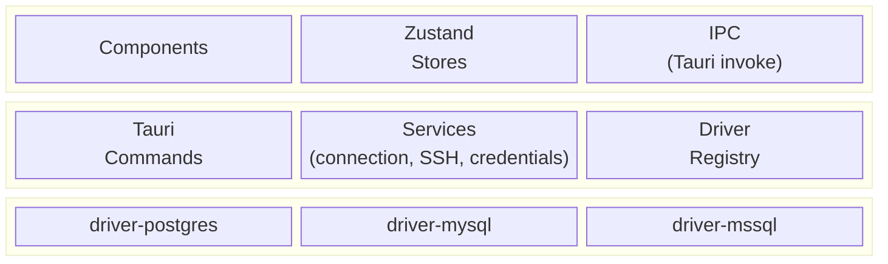
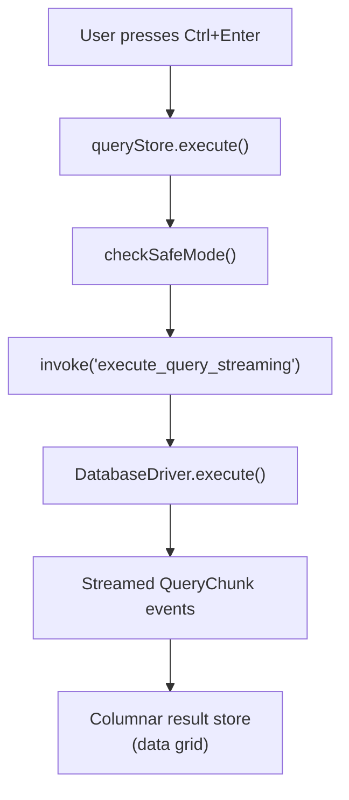

# Architecture

TablePro Windows is built with:

- **Tauri v2** as the desktop shell (Rust backend + WebView2 frontend)
- **Rust** for the backend: connection management, query execution, SSH tunneling
- **React + TypeScript** for the frontend, state via **Zustand** stores
- **CodeMirror** (with `@replit/codemirror-vim`) for the SQL editor


```mermaid
block-beta
    columns 3

    block:ui["Frontend (React/TS)"]:3
        Components["Components"]
        Stores["Zustand<br>Stores"]
        IPC["IPC<br>(Tauri invoke)"]
    end

    block:backend["Backend (Rust)"]:3
        Commands["Tauri<br>Commands"]
        Services["Services<br>(connection, SSH, credentials)"]
        Registry["Driver<br>Registry"]
    end

    block:drivers["Compiled-in Drivers"]:3
        PG["driver-postgres"]
        MySQL["driver-mysql"]
        MSSQL["driver-mssql"]
    end
```

## Directory Structure

```
.
├── src/                      # React/TypeScript frontend
│   ├── components/
│   ├── stores/                # Zustand state
│   ├── ipc/                   # Tauri command wrappers
│   └── hooks/
└── src-tauri/
    ├── src/
    │   ├── commands/          # #[tauri::command] handlers
    │   ├── drivers/            # registry.rs, driver_trait.rs, adapter.rs
    │   ├── services/           # connection_manager, ssh_tunnel, credential_store, sql_generator
    │   ├── storage/            # connection_store, history_store, settings_store
    │   └── models/
    ├── driver-common/          # shared driver types
    ├── driver-postgres/
    ├── driver-mysql/
    ├── driver-mssql/
    ├── driver-sqlite/
    ├── driver-mongodb/
    ├── driver-redis/
    └── driver-capabilities/    # *.capabilities.json sidecars
```

## Driver Model

There is no plugin/DLL loader. Each of the 6 drivers is a separate Rust crate implementing a shared `DatabaseDriver` trait (`src-tauri/src/drivers/driver_trait.rs`), compiled directly into the app binary and instantiated via `src-tauri/src/drivers/registry.rs`.

```rust
pub trait DatabaseDriver: Send + Sync {
    async fn connect(&self) -> Result<(), DriverError>;
    async fn execute(&self, sql: &str) -> Result<QueryResult, DriverError>;
    fn cancel_query(&self) -> Result<(), DriverError>;
    fn supports_schemas(&self) -> bool;
    fn database_type_id(&self) -> &str;
    // ...
}
```

| Driver | Crate | Underlying library |
|--------|-------|---------------------|
| PostgreSQL | `driver-postgres` | `tokio-postgres` |
| MySQL / MariaDB | `driver-mysql` | `mysql_async` (rustls) |
| SQL Server | `driver-mssql` | `tiberius` (rustls) |
| SQLite | `driver-sqlite` | `rusqlite` (bundled) |
| MongoDB | `driver-mongodb` | `mongodb` |
| Redis | `driver-redis` | `redis` (tokio-rustls) |

<Note>
`cancel_query` is implemented for PostgreSQL (out-of-band `CancelRequest`), MySQL (`KILL QUERY` on a side connection), and SQLite (`interrupt()`). SQL Server, Redis, and MongoDB return `Unsupported` -- each for a documented driver-specific reason (see the `cancel_query` doc comments in each driver crate).
</Note>

Each driver has a capability sidecar (`driver-capabilities/driver-<name>.capabilities.json`) declaring flags like `supportsSchemas`, `supportsDdl`, `supportsImportExport` — the frontend gates UI on these.

## Connection Lifecycle

1. Frontend calls `connect` with a `ConnectionConfig`
2. `ConnectionManager` (`services/connection_manager.rs`) opens the driver connection and returns a `session_id`
3. All subsequent commands (`execute_query`, `fetch_tables`, ...) are keyed by `session_id`, not the saved connection's ID — this keeps runtime identity independent of storage
4. SSH tunneling, when enabled, goes through a built-in Rust SSH client (`russh`) — no external `ssh` binary or OpenSSH install required

Reconnect is user-initiated (a **Reconnect** button appears on failure) — there is no automatic background health-check ping or retry-with-backoff loop.

## Credential Storage

Saved connection passwords are DPAPI-encrypted at rest by default (`services/credential_store.rs`, Windows Data Protection API). Enabling **Remember credentials in OS keychain** in Settings additionally mirrors them into Windows Credential Manager (`services/credential_manager.rs`).

## Safe Mode

A global (not per-connection) setting gates query execution before it reaches the driver, classified by regex against the SQL text — see [Safe Mode](/features/safe-mode) for the exact rules per level.

## Query Execution Flow


```mermaid
flowchart TB
    User["User presses Ctrl+Enter"]
    User --> Store["queryStore.execute()"]
    Store --> SafeMode["checkSafeMode()"]
    SafeMode --> Invoke["invoke('execute_query_streaming')"]
    Invoke --> Driver["DatabaseDriver.execute()"]
    Driver --> Stream["Streamed QueryChunk events"]
    Stream --> Grid["Columnar result store<br>(data grid)"]
```

Each run mints a monotonic generation; stale streamed chunks from a superseded run are dropped by generation check.

In-flight cancel handles are keyed per tab, so starting a query in one editor tab does not cancel an in-flight query in another tab.

## Testing

Rust: `cargo test --workspace` from `src-tauri/`. Frontend: `npx vitest run` from the project root.
