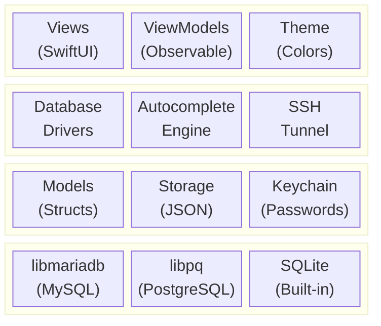
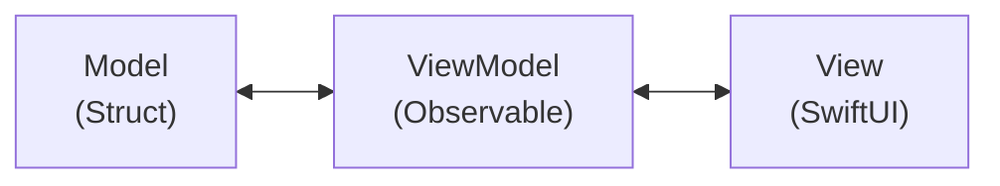
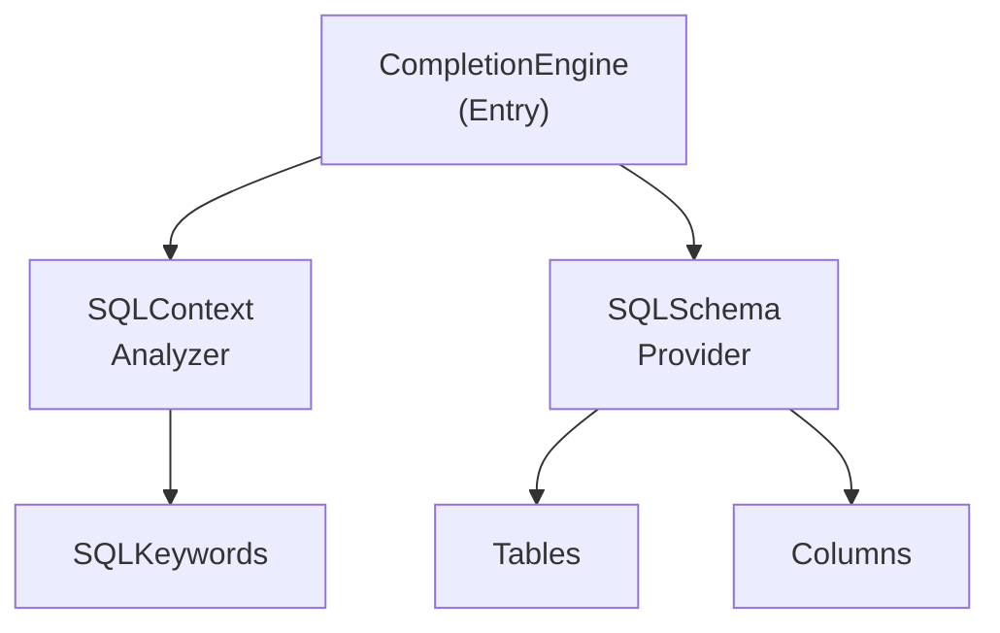
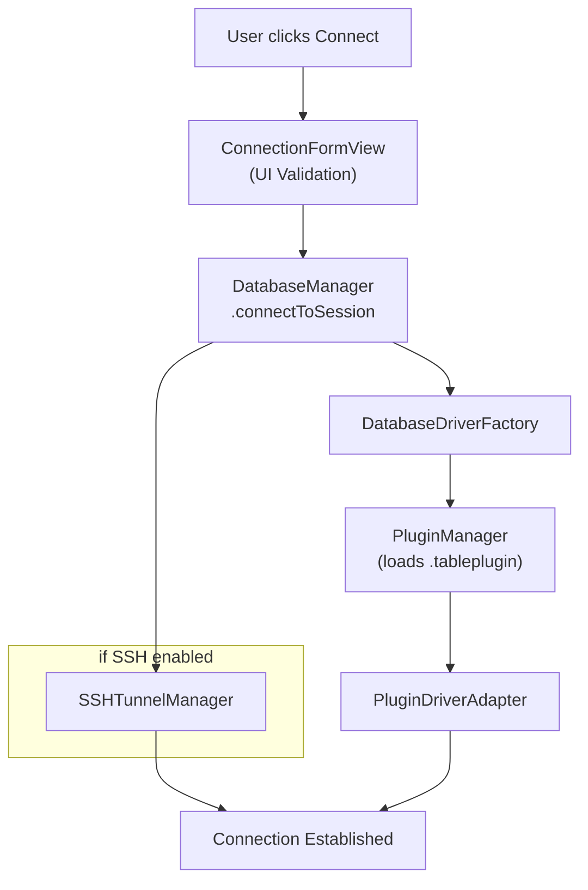
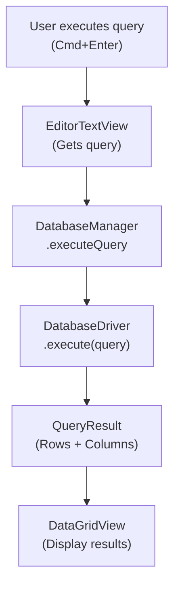

# Kiến trúc

TablePro được xây dựng với:

- **SwiftUI** cho giao diện
- **AppKit** cho tích hợp macOS cấp thấp
- **Swift Concurrency** (async/await, actors) cho thao tác đồng thời
- **Thư viện C native** cho kết nối database



## Dependencies

Dependencies SPM:

| Package | Phiên bản | Mục đích |
|---------|---------|---------|
| **CodeEditSourceEditor** | 0.15.2+ | Code editor dựa trên tree-sitter cho SQL editor |
| **Sparkle** | 2.x | Framework cập nhật tự động với chữ ký EdDSA |

<Note>
CodeEditSourceEditor kèm plugin SwiftLint yêu cầu `-skipPackagePluginValidation` cho CLI builds. Xem [Build](/vi/development/building).
</Note>

## Cấu trúc thư mục

<Tree>
  <Tree.Folder name="TablePro" defaultOpen>
    <Tree.Folder name="Core">
      <Tree.Folder name="Database">
        <Tree.File name="DatabaseDriver.swift" />
        <Tree.File name="DatabaseManager.swift" />
      </Tree.Folder>
      <Tree.Folder name="Plugins">
        <Tree.File name="PluginManager.swift" />
        <Tree.File name="PluginDriverAdapter.swift" />
      </Tree.Folder>
      <Tree.Folder name="Autocomplete" />
      <Tree.Folder name="Services" />
      <Tree.Folder name="SSH" />
    </Tree.Folder>
    <Tree.Folder name="Views" />
    <Tree.Folder name="Models" />
    <Tree.Folder name="ViewModels" />
    <Tree.Folder name="Extensions" />
    <Tree.Folder name="Theme" />
    <Tree.Folder name="Resources" />
  </Tree.Folder>
  <Tree.Folder name="Plugins" defaultOpen>
    <Tree.Folder name="TableProPluginKit" />
    <Tree.Folder name="MySQLDriverPlugin" />
    <Tree.Folder name="PostgreSQLDriverPlugin" />
    <Tree.File name="..." />
  </Tree.Folder>
  <Tree.Folder name="Libs" />
  <Tree.Folder name="TableProTests" />
  <Tree.Folder name="scripts" />
</Tree>

## Các mẫu thiết kế

### Kiến trúc MVVM



**Models**: Cấu trúc dữ liệu thuần (structs, enums)
```swift
struct DatabaseConnection: Codable, Identifiable {
    let id: UUID
    var name: String
    var host: String
    var port: Int
    var type: DatabaseType
}
```

**ViewModels**: Container trạng thái observable
```swift
@MainActor
class DatabaseManager: ObservableObject {
    @Published var sessions: [DatabaseSession] = []
    @Published var activeSessionId: UUID?

    func connect(to connection: DatabaseConnection) async throws {
        // Logic nghiệp vụ
    }
}
```

**Views**: SwiftUI declarative
```swift
struct ConnectionFormView: View {
    @StateObject private var dbManager = DatabaseManager.shared

    var body: some View {
        Form {
            // Các phần tử UI
        }
    }
}
```

### Thiết kế hướng Protocol

Tất cả database drivers conform một protocol:

```swift
protocol DatabaseDriver: AnyObject {
    var connection: DatabaseConnection { get }
    var status: ConnectionStatus { get }

    func connect() async throws
    func disconnect()
    func execute(query: String) async throws -> QueryResult
    func fetchTables() async throws -> [TableInfo]
    // ...
}
```

Các database driver được triển khai dưới dạng bundle `.tableplugin` và được tải tại runtime. Mỗi plugin implement `DriverPlugin` và `PluginDatabaseDriver` từ framework `TableProPluginKit`. `PluginDriverAdapter` kết nối `PluginDatabaseDriver` với protocol `DatabaseDriver` của core.

### Actor Isolation

Thao tác đồng thời dùng Swift actors:

```swift
actor SSHTunnelManager {
    static let shared = SSHTunnelManager()

    private var tunnels: [UUID: SSHTunnel] = [:]

    func createTunnel(
        connectionId: UUID,
        sshHost: String,
        // ...
    ) async throws -> Int {
        // Quản lý tunnel thread-safe
    }
}
```

### Plugin System

Tạo driver dùng hệ thống plugin. `PluginManager` tìm và tải các bundle `.tableplugin` tại runtime. `DatabaseDriverFactory` tra cứu plugin qua `DatabaseType.pluginTypeId` và bọc chúng bằng `PluginDriverAdapter` để conform protocol `DatabaseDriver` của core. Không cần switch statement hay danh sách driver cố định.

## Các thành phần chính

### DatabaseManager

Quản lý trung tâm mọi thao tác database:

- Quản lý sessions đang hoạt động
- Điều phối kết nối/ngắt kết nối
- Xử lý vòng đời SSH tunnel
- Phát thay đổi trạng thái cho UI

```swift
@MainActor
class DatabaseManager: ObservableObject {
    static let shared = DatabaseManager()

    @Published var sessions: [DatabaseSession] = []
    @Published var activeSessionId: UUID?

    func connectToSession(_ connection: DatabaseConnection) async throws
    func disconnectSession(_ id: UUID) async
    func executeQuery(_ query: String) async throws -> QueryResult
}
```

### Database Driver Plugins

Mỗi driver là một bundle `.tableplugin` trong `Plugins/`:

| Plugin | Database Types | C Bridge |
|--------|---------------|----------|
| MySQLDriverPlugin | MySQL, MariaDB | CMariaDB (libmariadb) |
| PostgreSQLDriverPlugin | PostgreSQL, Redshift | CLibPQ (libpq) |
| SQLiteDriverPlugin | SQLite | Foundation sqlite3 |
| ClickHouseDriverPlugin | ClickHouse | URLSession HTTP |
| MSSQLDriverPlugin | SQL Server | CFreeTDS |
| MongoDBDriverPlugin | MongoDB | CLibMongoc |
| RedisDriverPlugin | Redis | CRedis |
| OracleDriverPlugin | Oracle | OracleNIO (SPM) |

### Autocomplete Engine



- **CompletionEngine**: Điểm vào chính
- **SQLContextAnalyzer**: Phân tích ngữ cảnh query
- **SQLSchemaProvider**: Cung cấp thông tin schema
- **SQLKeywords**: Định nghĩa từ khóa SQL

### SSH Tunnel Manager

Quản lý SSH tunnel dạng actor:

```swift
actor SSHTunnelManager {
    private var tunnels: [UUID: SSHTunnel] = [:]

    func createTunnel(...) async throws -> Int
    func closeTunnel(connectionId: UUID) async throws
    func hasTunnel(connectionId: UUID) -> Bool
}
```

Tính năng:
- Port forwarding qua `ssh` hệ thống
- Xác thực password và key
- Giám sát trạng thái
- Tự động dọn dẹp

## Luồng dữ liệu

### Luồng kết nối



### Luồng thực thi query



## Quản lý trạng thái

### Published Properties

Trạng thái UI dùng `@Published`:

```swift
@MainActor
class DatabaseManager: ObservableObject {
    @Published var sessions: [DatabaseSession] = []
    @Published var activeSessionId: UUID?
    @Published var isConnecting = false
}
```

### App Storage

Settings lưu qua `@AppStorage`:

```swift
@AppStorage("appearance.theme") var theme: AppTheme = .system
@AppStorage("editor.fontSize") var fontSize: Int = 13
```

### Environment

Trạng thái chia sẻ qua SwiftUI environment:

```swift
@main
struct TableProApp: App {
    @StateObject private var dbManager = DatabaseManager.shared

    var body: some Scene {
        WindowGroup {
            ContentView()
                .environmentObject(dbManager)
        }
    }
}
```

## Xử lý lỗi

### Driver Errors

Mỗi driver định nghĩa lỗi riêng:

```swift
enum MySQLError: Error, LocalizedError {
    case connectionFailed(String)
    case queryFailed(String)
    case authenticationFailed

    var errorDescription: String? {
        switch self {
        case .connectionFailed(let msg): return "Connection failed: \(msg)"
        case .queryFailed(let msg): return "Query failed: \(msg)"
        case .authenticationFailed: return "Authentication failed"
        }
    }
}
```

### Error Propagation

Lỗi truyền qua async/await:

```swift
func executeQuery(_ query: String) async throws -> QueryResult {
    guard let driver = activeDriver else {
        throw DatabaseError.notConnected
    }
    return try await driver.execute(query: query)
}
```

## Testing

### Unit Tests

Tests trong `TableProTests/`:

```swift
final class MySQLDriverTests: XCTestCase {
    func testConnectionString() throws {
        let connection = DatabaseConnection(...)
        let driver = MySQLDriver(connection: connection)
        XCTAssertEqual(driver.connectionString, "expected")
    }
}
```

### Integration Tests

```swift
func testExecuteQuery() async throws {
    let driver = MySQLDriver(connection: testConnection)
    try await driver.connect()
    defer { driver.disconnect() }

    let result = try await driver.execute(query: "SELECT 1")
    XCTAssertEqual(result.rowCount, 1)
}
```

## Bước tiếp theo

<CardGroup cols={2}>
  <Card title="Code Style" icon="code" href="/vi/development/code-style">
    Quy ước và hướng dẫn code
  </Card>
  <Card title="Build" icon="hammer" href="/vi/development/building">
    Quy trình build và release
  </Card>
  <Card title="Thiết lập" icon="wrench" href="/vi/development/setup">
    Thiết lập môi trường phát triển
  </Card>
  <Card title="GitHub" icon="github" href="https://github.com/datlechin/tablepro">
    Repository mã nguồn
  </Card>
</CardGroup>
