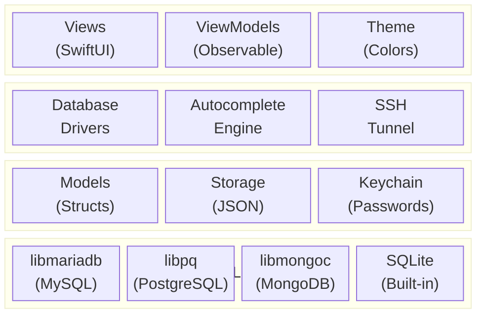
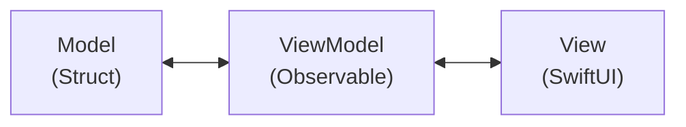
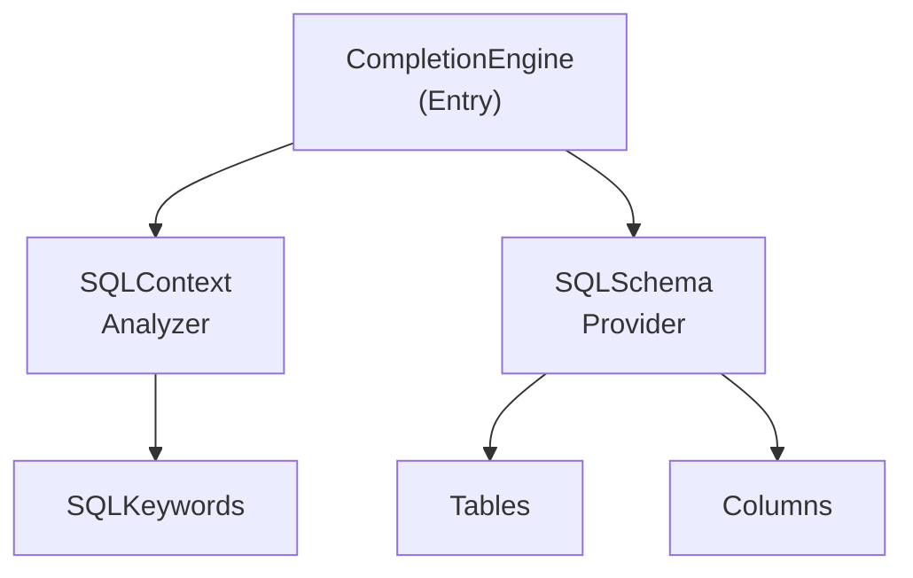
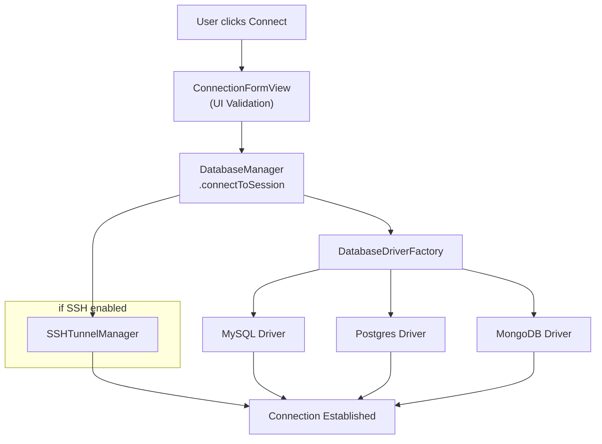
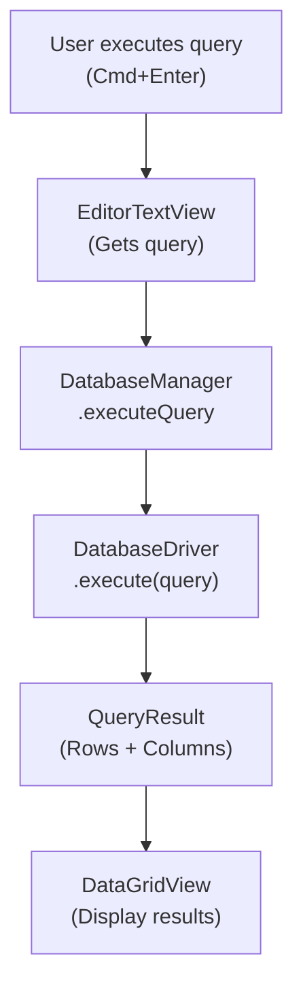

# Kiến trúc

Hướng dẫn này giải thích về kiến trúc, các mẫu thiết kế và cách các thành phần của TablePro hoạt động cùng nhau.

## Tổng quan

TablePro được xây dựng với:

- **SwiftUI** cho giao diện người dùng
- **AppKit** cho tích hợp macOS cấp thấp
- **Swift Concurrency** (async/await, actors) cho các thao tác đồng thời
- **Thư viện database native** cho kết nối database



## Dependencies

TablePro sử dụng Swift Package Manager (SPM) cho các dependencies bên thứ ba:

| Package | Phiên bản | Mục đích |
|---------|---------|---------|
| **CodeEditSourceEditor** | `main` branch | Component code editor dựa trên tree-sitter cho trình soạn thảo SQL |
| **Sparkle** | 2.x | Framework cập nhật tự động với chữ ký EdDSA |

<Note>
CodeEditSourceEditor đi kèm một plugin SwiftLint yêu cầu `-skipPackagePluginValidation` cho CLI builds. Xem hướng dẫn [Build](/vi/development/building) để biết chi tiết.
</Note>

## Cấu trúc thư mục

<Tree>
  <Tree.Folder name="TablePro" defaultOpen>
    <Tree.Folder name="Models">
      <Tree.File name="DatabaseConnection.swift" />
      <Tree.File name="QueryResult.swift" />
      <Tree.File name="TableInfo.swift" />
      <Tree.File name="AppSettings.swift" />
    </Tree.Folder>
    <Tree.Folder name="Views">
      <Tree.Folder name="Main" />
      <Tree.Folder name="Connection" />
      <Tree.Folder name="Editor" />
      <Tree.Folder name="Results" />
      <Tree.Folder name="Structure" />
      <Tree.Folder name="Settings" />
      <Tree.Folder name="Welcome" />
    </Tree.Folder>
    <Tree.Folder name="ViewModels">
      <Tree.File name="DatabaseManager.swift" />
    </Tree.Folder>
    <Tree.Folder name="Core">
      <Tree.Folder name="Database">
        <Tree.Folder name="CMariaDB" />
        <Tree.Folder name="CLibPQ" />
        <Tree.Folder name="CLibMongoc" />
        <Tree.File name="DatabaseDriver.swift" />
        <Tree.File name="MySQLDriver.swift" />
        <Tree.File name="PostgreSQLDriver.swift" />
        <Tree.File name="SQLiteDriver.swift" />
        <Tree.File name="MongoDBDriver.swift" />
        <Tree.File name="ConnectionHealthMonitor.swift" />
      </Tree.Folder>
      <Tree.Folder name="Autocomplete">
        <Tree.File name="CompletionEngine.swift" />
        <Tree.File name="SQLContextAnalyzer.swift" />
        <Tree.File name="SQLKeywords.swift" />
      </Tree.Folder>
      <Tree.Folder name="MongoDB">
        <Tree.File name="BsonFlattener.swift" />
        <Tree.File name="QueryBuilder.swift" />
        <Tree.File name="StatementGenerator.swift" />
        <Tree.File name="ShellParser.swift" />
      </Tree.Folder>
      <Tree.Folder name="SSH">
        <Tree.File name="SSHTunnelManager.swift" />
      </Tree.Folder>
      <Tree.Folder name="Storage" />
      <Tree.Folder name="SchemaTracking" />
      <Tree.Folder name="Vim">
        <Tree.File name="VimEngine.swift" />
      </Tree.Folder>
    </Tree.Folder>
    <Tree.Folder name="Extensions" />
    <Tree.Folder name="Theme">
      <Tree.File name="Theme.swift" />
    </Tree.Folder>
    <Tree.Folder name="Resources" />
  </Tree.Folder>
</Tree>

## Các mẫu thiết kế

### Kiến trúc MVVM

TablePro sử dụng mô hình Model-View-ViewModel (MVVM):



**Models**: Cấu trúc dữ liệu thuần túy (structs, enums)
```swift
struct DatabaseConnection: Codable, Identifiable {
    let id: UUID
    var name: String
    var host: String
    var port: Int
    var type: DatabaseType
}
```

**ViewModels**: Container trạng thái có thể quan sát
```swift
@MainActor
class DatabaseManager: ObservableObject {
    @Published var sessions: [DatabaseSession] = []
    @Published var activeSessionId: UUID?

    func connect(to connection: DatabaseConnection) async throws {
        // Logic nghiệp vụ
    }
}
```

**Views**: UI khai báo SwiftUI
```swift
struct ConnectionFormView: View {
    @StateObject private var dbManager = DatabaseManager.shared

    var body: some View {
        Form {
            // Các thành phần UI
        }
    }
}
```

### Thiết kế hướng Protocol

Database drivers tuân theo một protocol:

```swift
protocol DatabaseDriver: AnyObject {
    var connection: DatabaseConnection { get }
    var status: ConnectionStatus { get }

    func connect() async throws
    func disconnect()
    func execute(query: String) async throws -> QueryResult
    func fetchTables() async throws -> [TableInfo]
    // ...
}
```

Các triển khai:

```swift
class MySQLDriver: DatabaseDriver { ... }
class PostgreSQLDriver: DatabaseDriver { ... }
class SQLiteDriver: DatabaseDriver { ... }
class MongoDBDriver: DatabaseDriver { ... }
```

### Actor Isolation

Các thao tác đồng thời sử dụng Swift actors:

```swift
actor SSHTunnelManager {
    static let shared = SSHTunnelManager()

    private var tunnels: [UUID: SSHTunnel] = [:]

    func createTunnel(
        connectionId: UUID,
        sshHost: String,
        // ...
    ) async throws -> Int {
        // Quản lý tunnel an toàn luồng
    }
}
```

### Factory Pattern

Tạo driver sử dụng factory:

```swift
enum DatabaseDriverFactory {
    static func createDriver(for connection: DatabaseConnection) -> DatabaseDriver {
        switch connection.type {
        case .mysql, .mariadb:
            return MySQLDriver(connection: connection)
        case .postgresql:
            return PostgreSQLDriver(connection: connection)
        case .sqlite:
            return SQLiteDriver(connection: connection)
        case .mongodb:
            return MongoDBDriver(connection: connection)
        }
    }
}
```

## Các thành phần chính

### DatabaseManager

Bộ quản lý trung tâm cho các thao tác database:

- Quản lý các session đang hoạt động
- Điều phối kết nối/ngắt kết nối
- Xử lý vòng đời SSH tunnel
- Công bố thay đổi trạng thái cho UI

```swift
@MainActor
class DatabaseManager: ObservableObject {
    static let shared = DatabaseManager()

    @Published var sessions: [DatabaseSession] = []
    @Published var activeSessionId: UUID?

    func connectToSession(_ connection: DatabaseConnection) async throws
    func disconnectSession(_ id: UUID) async
    func executeQuery(_ query: String) async throws -> QueryResult
}
```

### Database Drivers

Mỗi driver đóng gói logic đặc thù cho database:

| Driver | Library | Protocol |
|--------|---------|----------|
| MySQLDriver | libmariadb | MySQL wire protocol |
| PostgreSQLDriver | libpq | PostgreSQL protocol |
| SQLiteDriver | Built-in SQLite3 | File-based |
| MongoDBDriver | libmongoc (CLibMongoc) | MongoDB wire protocol |

### Autocomplete Engine

Hệ thống autocomplete:



- **CompletionEngine**: Điểm vào chính
- **SQLContextAnalyzer**: Phân tích ngữ cảnh truy vấn
- **SQLSchemaProvider**: Cung cấp thông tin schema
- **SQLKeywords**: Định nghĩa từ khóa SQL

### SSH Tunnel Manager

Quản lý SSH tunnels như một actor:

```swift
actor SSHTunnelManager {
    private var tunnels: [UUID: SSHTunnel] = [:]

    func createTunnel(...) async throws -> Int
    func closeTunnel(connectionId: UUID) async throws
    func hasTunnel(connectionId: UUID) -> Bool
}
```

Tính năng:
- Chuyển tiếp port qua `ssh` hệ thống
- Xác thực bằng password và key
- Giám sát trạng thái
- Tự động dọn dẹp

### ConnectionHealthMonitor

Giám sát các kết nối database đang hoạt động với chu kỳ ping 30 giây. Tự động kết nối lại khi thất bại sử dụng exponential backoff. Chạy theo từng session và dọn dẹp khi session ngắt kết nối.

### MainContentCoordinator

Coordinator trung tâm cho vùng nội dung chính, được chia thành 14 file extension trong `Views/Main/Extensions/`:

`+Alerts`, `+Filtering`, `+FKNavigation`, `+MongoDB`, `+MultiStatement`, `+Navigation`, `+Pagination`, `+QueryAnalysis`, `+Refresh`, `+RowOperations`, `+SidebarSave`, `+SQLPreview`, `+TabSwitch`, `+TableOperations`

Khi thêm chức năng coordinator, hãy thêm file extension mới thay vì mở rộng file chính.

### Storage Patterns

| Dữ liệu | Cách lưu | Vị trí |
|------|-----|----------|
| Mật khẩu kết nối | Keychain | `ConnectionStorage` |
| Tùy chọn người dùng | UserDefaults | `AppSettingsStorage` / `AppSettingsManager` |
| Lịch sử truy vấn | SQLite FTS5 | `QueryHistoryStorage` |
| Trạng thái tab | JSON files (App Support) | `TabPersistenceService` / `TabStateStorage` |
| Filter presets | JSON | `FilterSettingsStorage` |
| Nhóm kết nối | JSON | `GroupStorage` |
| Tag kết nối | JSON | `TagStorage` |

## Luồng dữ liệu

### Luồng kết nối



### Luồng thực thi truy vấn



## Quản lý trạng thái

### Published Properties

Trạng thái UI được quản lý với `@Published`:

```swift
@MainActor
class DatabaseManager: ObservableObject {
    @Published var sessions: [DatabaseSession] = []
    @Published var activeSessionId: UUID?
    @Published var isConnecting = false
}
```

### App Storage

Settings sử dụng `@AppStorage` để lưu trữ:

```swift
@AppStorage("appearance.theme") var theme: AppTheme = .system
@AppStorage("editor.fontSize") var fontSize: Int = 13
```

### Environment

Trạng thái chia sẻ qua SwiftUI environment:

```swift
@main
struct TableProApp: App {
    @StateObject private var dbManager = DatabaseManager.shared

    var body: some Scene {
        WindowGroup {
            ContentView()
                .environmentObject(dbManager)
        }
    }
}
```

## Xử lý lỗi

### Driver Errors

Mỗi driver định nghĩa các lỗi cụ thể:

```swift
enum MySQLError: Error, LocalizedError {
    case connectionFailed(String)
    case queryFailed(String)
    case authenticationFailed

    var errorDescription: String? {
        switch self {
        case .connectionFailed(let msg): return "Connection failed: \(msg)"
        case .queryFailed(let msg): return "Query failed: \(msg)"
        case .authenticationFailed: return "Authentication failed"
        }
    }
}
```

### Error Propagation

Lỗi được truyền lên qua async/await:

```swift
func executeQuery(_ query: String) async throws -> QueryResult {
    guard let driver = activeDriver else {
        throw DatabaseError.notConnected
    }
    return try await driver.execute(query: query)
}
```

## Testing

### Unit Tests

Tests nằm trong `TableProTests/`:

```swift
final class MySQLDriverTests: XCTestCase {
    func testConnectionString() throws {
        let connection = DatabaseConnection(...)
        let driver = MySQLDriver(connection: connection)
        XCTAssertEqual(driver.connectionString, "expected")
    }
}
```

### Integration Tests

Cho các test database:

```swift
func testExecuteQuery() async throws {
    let driver = MySQLDriver(connection: testConnection)
    try await driver.connect()
    defer { driver.disconnect() }

    let result = try await driver.execute(query: "SELECT 1")
    XCTAssertEqual(result.rowCount, 1)
}
```

## Bước tiếp theo

<CardGroup cols={2}>
  <Card title="Phong cách Code" icon="code" href="/vi/development/code-style">
    Quy ước và hướng dẫn code
  </Card>
  <Card title="Build" icon="hammer" href="/vi/development/building">
    Quy trình build và release
  </Card>
  <Card title="Thiết lập" icon="wrench" href="/vi/development/setup">
    Thiết lập môi trường phát triển
  </Card>
  <Card title="GitHub" icon="github" href="https://github.com/datlechin/tablepro">
    Repository mã nguồn
  </Card>
</CardGroup>
